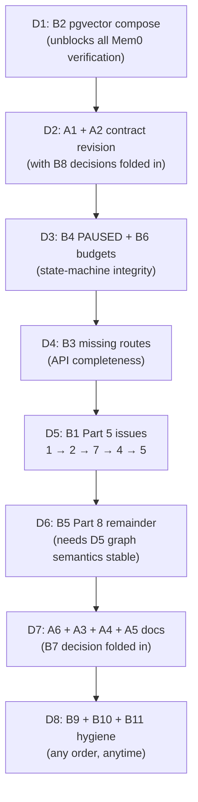

# AP Implementation Issues Parts 1–8: Final Task List with Plan

Consolidated from every `docs/IAP*part*.md` design, the per-part issues files, `docs/IAP-implementation-plan-v1.md`, and a line-level design-vs-code verification pass (see Method). Items already complete are summarized once at the bottom and not repeated as tasks.

## Method

Three read-only extraction tracks plus direct reads of `IAP-implemenation-part5-issues.md` (ISSUE-1/2 open; 3/6 implemented; 4/5/7 open), `IAP-implementation-part6-issues.md` (ISSUE-8–12 all fixed), and `IAP-implementation-part7-8-issues.md` (deferred triggers live there — referenced, not duplicated). Status values: `open` (verified gap), `stale-doc` (doc contradicts code), `deferred` (trigger-gated, tracked in part7-8-issues).

## A. Design-debt tasks (docs contradict code — fix the docs)

### A1. Parts 1–4 port and model contracts are stale (high)

The tenant-isolation retrofit changed every signature, but Part 1 §4, Part 3, and Part 4 still print the originals: `InvestigationTriggerPort` (design has start/get/resume/cancel, code has `trigger()->UUID` only); provider signatures missing `tenant_id`/`investigation_id` and the `EvidenceQueryResult` envelope; `InvestigationReasoner` returns `InvestigationDecision`, not `InvestigationAction`; `InvestigationExecutionContext` lost `open_questions`/`pending_actions`; `ActionType` values, table names (`timeline_events` vs `investigation_timeline_events`, no `application_profile_versions`), and Part 4 §2 `InvestigationPhase` names vs code `InvestigationStatus` all diverge. Scope: revise Part 1 §4–§5, Part 3 §3 layout, Part 4 §2/§4.1/§5 to match code, or mark each divergence deliberate. Acceptance: every protocol, enum, and table name in the docs imports clean against `src/`.

### A2. Part 5 phantom components (medium)

`UserWorkspaceContextPort`, `TemporalIncidentProjectionPort`, and `ContextOrchestrator` (with per-request execution budgets) appear in the Part 5 design but have zero matches in `src/`; `TopologyConfig.max_lookup_nodes/edges` exist with no consumer. Scope: record the substitution (Part 6 ports cover L1/L2) and either schedule the orchestrator or remove it from the design with a trigger. Acceptance: no named component in Part 5 without a code target or an explicit deferral.

### A3. Knowledge-artifacts doc contradicts `TENANT_ONLY_KINDS` (low)

`docs/dev/knowledge-artifacts.md` lists `interpretation` as envelope-projected while code adds it to the never-share set. Scope: one-paragraph correction in the doc. Acceptance: doc kind lists match the code constants.

### A4. knowledge-ops.md stale module path (low)

Cites `application/worker/retention.py` for `TopologyRetentionWorkflow`; the policy lives in `application/topology/retention.py` with no such workflow under `application/worker/`. Scope: correct the path or record the drift. Acceptance: every path in ops docs resolves.

### A5. REVIEW_GAPS.md is stale (low)

Claims 303 ruff errors, blocked mypy, empty test dirs, zero-file docker/migrations, and missing `tenacity`/`mcp`/`tree-sitter`/`temporalio`/`minio`/`fsspec`/`faststream` — all resolved (deps present, trees populated). Scope: refresh the completion matrix or archive the file. Acceptance: no claim in the file contradicts `pyproject.toml` or the tree.

### A6. Missing required docs (medium)

`docs/dev/architecture.md` (owed sections from Parts 5, 6, 7, 8), `docs/dev/domain-attribution.md` (Part 5 dual-frame policy + examples), and the `docs/dev/topology.md` "Cognee pilot" section (Part 8 runbook). Scope: write all three in one pass now that Tracks A and B have landed. Acceptance: each design doc's Documentation Plan checklist is satisfiable.

## B. Open implementation tasks

### B1. Part 5 open issues: ISSUE-1, ISSUE-2, ISSUE-4, ISSUE-5, ISSUE-7 (high, in priority order)

Per `IAP-implemenation-part5-issues.md`, still open: (1) automatic code→table linking from runtime evidence (medium); (2) production callers for `link_code_to_tables`, blocked by 1 (low); (4) snapshot retention/GC policy + background collection (medium); (5) cross-repo hops via trace evidence (medium); (7) Neo4j ownership chain — `Domain`/`GitOrganization`/`BELONGS_TO` never written on ingest, so Neo4j attribution leans entirely on the CODEOWNERS tier (medium). Note: the Part 7 loader's `register_ownership` now writes Repository + org nodes, which partially answers ISSUE-7's "authoritative source" question — re-scope ISSUE-7 around completing the lookup traversal rather than sourcing. Acceptance: each issue's own acceptance criteria, in that file.

### B2. Compose Postgres is not pgvector-ready (high)

Part 6 D2 promises `pgvector/pgvector:pg16` but compose runs plain `postgres:16`, so the Mem0 path fails on fresh `compose up` without operator intervention despite migration `006_pgvector_extension`. Scope: switch the compose image (one line) and verify the extension migration runs. Acceptance: `start-platform.sh` on a clean checkout yields a vector-capable database.

### B3. Part 4 routes missing from the API (medium)

Absent: `GET /api/v1/investigations` (list), `POST .../retry`, `GET .../evidence/{id}/source`, `GET .../graph`, `POST .../hypotheses/{id}/request-verification`, `GET .../conclusion`, `GET .../events` (SSE), and application CRUD (only `GET /profiles` exists). Also the `approve-action` path is duplicated (`investigations.py:394` without prefix vs `events.py:173` with prefix). Scope: implement the missing routes or downgrade the §4.1 matrix; deduplicate `approve-action`. Acceptance: every route in §4.1 answers or is struck with rationale.

### B4. PAUSED has no domain status (medium)

`events.py:101` writes a `"PAUSED"` transition string with no corresponding `InvestigationStatus` value, while Part 4 §2 names PAUSED explicitly. Scope: add the status with transition edges or remove pause semantics. Acceptance: no transition string outside the status enum, covered by lifecycle tests.

### B5. Part 8 remainder: edges, reads, guardrail, deletion (medium)

`project_snapshot` writes nodes only (`edge_count` is tallied, not projected); `drop_projection` logs without deleting; no gateway-routed retrieval-only reads exist; the `IAP_COGNEE_ALLOW_COMPLETION=false` guardrail constant is absent from `src/` and `TopologyConfig`. Scope: implement `custom_edges`/edge-field projection, one retrieval-only read path through `DomainAttributionPort`, real deletion in `drop_projection`, and the guardrail constant. Acceptance: Part 8 D2/D5 tests (determinism, completion containment, tenant isolation) pass against live Neo4j.

### B6. Single source of truth for budgets (medium)

Part 1 limits (100 calls/25 evidence) vs Part 2 policy (50/250) vs Part 4 budget (25 steps/30k tokens) vs `max_iterations=10` hardcoded in `workflows.py:134`, plus `KnowledgeConfig.max_episodes_per_investigation` wired separately. Scope: one documented budget owner with the others derived or removed. Acceptance: changing one number changes behavior everywhere; the doc names the owner.

### B7. Contradiction entity gap (low)

Part 1 §3 diagrams a Contradiction entity and Part 2 §7 defines it, but no `domain/contradiction` module exists and activities thread empty contradiction lists (with a code comment admitting causal chains/contradictions aren't produced end to end). Scope: implement the entity or downgrade the model. Acceptance: the comment is resolved either way.

### B8. Resume/Cancel service gaps (low)

Resume reconstructs investigation + profile + evidence + timeline but not facts/hypotheses/relationships per the Part 1 §5 contract; Cancel persists the transition while actual cancellation is Temporal-signal-based with no task-group cancel in the service. Scope: align code to contract or contract to code. Acceptance: A1's revision covers the decision.

### B9. Loader CLI drift vs Part 7 contract (low)

`RepoListing` lacks specified `pushed_at`; `LoaderConfig` was inlined into argparse; `--include-private` missing; `--resume` is an adjunct flag, not the specified standalone command. Scope: add the field/flag, document the two intentional deviations (inlined config, adjunct resume). Acceptance: contract table matches `--help` output.

### B10. Dependency hygiene (low)

Duplicate `psycopg[binary]` lines in `pyproject.toml` (lines 19, 40). Scope: delete one. Acceptance: `uv lock --check` clean.

### B11. Pre-existing test failure (low, tracked)

`tests/unit/test_infra_coverage.py::TestBootstrap::test_build_app_context_production` fails on clean HEAD (verified via stash; also logged in part7-8-issues). Scope: diagnose and fix separately from all phases above. Acceptance: full `tests/unit` green.

## C. Deferred triggers (pointers, not tasks)

All trigger-gated work lives in `docs/IAP-implementation-part7-8-issues.md`: GitHub App + scheduled sync, multi-branch mining, parallel-repo ingest, Cognee vectors, FalkorDB, cross-repo same-dataset paths, Cognee multi-user mode, Enterprise/Aura eval, pygit2 license review, `docs/dev/architecture.md` creation timing. Do not implement without the trigger firing.

## D. Execution plan

Phase rationale: B2 first because it unblocks verification of everything Mem0; A1/A2 second because every later change must land against true contracts; state-machine integrity (B4/B6) before API completeness (B3); Part 5 graph issues before Part 8 enrichment (enrichment over shifting semantics is rework); docs last so they describe the final state; hygiene floating. C triggers fire independently of all phases.

## Complete (context only, not tasks)

Parts 1–4 core (domain, services, validator, Temporal workflows/activities, evidence adapters, gateway, routers, persistence, RLS); Part 5 topology core + ISSUE-3/6; Part 6 all slices + ISSUE-8–12; Part 7 loader + start script + fixtures + 40 tests; Part 8 pilot (live-projected 5,153/5,153 on TENANT-1) + benchmark harness; TENANT-1 live partition (47 repos, 87,991 nodes, 0 FAILED).
