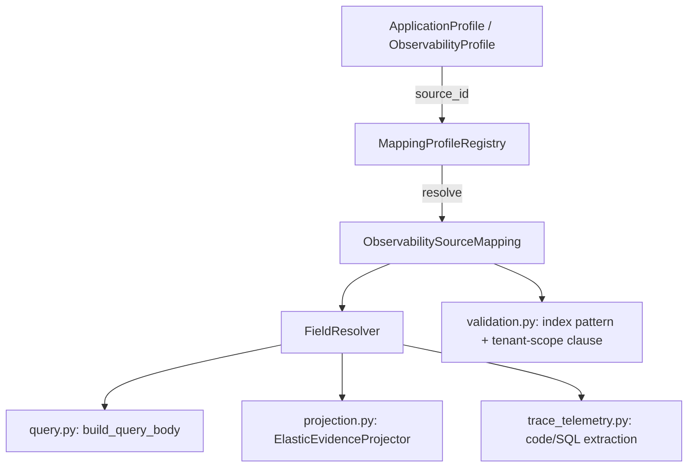

# IAP Implementation Part 10: Dynamic Field-Mapping Design v1.0

Design for replacing hard-coded ECS field assumptions in the Elastic runtime evidence layer with an externally-configured, per-source meta-mapping. Triggered by real mapping data captured from a live cluster (`docs/scratchpad/elastic_info_sample.txt`), which shows the actual schema is **not ECS** and the actual index-naming convention is **not what the code assumes**. This is a design document only — no code changes are included here.

---

## 1. Findings from real mapping data

### 1.1 Index naming does not match the code's assumption

Current code (`build_index_pattern` in `infrastructure/evidence/runtime/validation.py`):

```python
f"logs-{tenant_id}-*-{environment}-*"
```

Real cluster (via `cat.indices`, 1023 indices sampled):

```text
logz-gen-verbose-prod-blue-es-001108
logz-gen-verbose-prod-cloud-es-000973
logz-gen-verbose-prod-micro-es-000847
logz-gen-fault-alerts-es-000245
logz-gen-root_cause-prod-es-000164
logz-ui-buyflow-err-grp-es-000016
logz-gen-buyflow-order-details-es-000030
```

(App prefix de-branded from the captured sample; unredacted originals in
`docs/scratchpad/elastic_info_sample.txt`. Stream shapes below are exact.)

Pattern is `logz-{app}-{stream}[-{variant}]-es-{sequence}`. Differences:

- Prefix is `logz`, not `logs`.
- No tenant segment anywhere in the name. Segments are app (`gen`, `ui`) and stream (`verbose`, `root_cause`, `fault-alerts`, `buyflow-order-details`, …).
- Sequence suffix is `-es-{n}` (ILM rollover), not a trailing wildcard segment.
- Each stream is its own index family with its own document schema (see below) — a single wildcard pattern cannot span streams meaningfully; querying `logz-gen-*` would mix HTTP-transaction logs, alert records, and root-cause records with completely different fields into one query.

**Consequence:** `build_index_pattern(tenant_id, environment)` cannot work against this cluster. There is no `tenant_id` token to interpolate, and "the index" isn't one pattern — it's a specific stream family the caller/profile must select explicitly.

### 1.2 Field schema is not ECS, and differs per stream

Comparing four sampled streams:

| Concept | `verbose-prod*` (HTTP transaction log) | `fault-alerts` | `root_cause-prod` | `ui-buyflow-err-grp` (frontend) | `buyflow-order-details` |
|---|---|---|---|---|---|
| Timestamp | `@timestamp` (date) + `requestStartTimestamp`/`requestEndTimestamp` (long epoch) + `requestStartTimestampText`/`requestEndTimestampText` (date) | `@timestamp`, `requestStartTimestampText` | *(none — only `createdAt`/`updatedAt` as raw `long`)* | `@timestamp`, `startTime`, `endTime` | `@timestamp`, `creation_date`, `last_update` |
| Message | `message` (`match_only_text`) | `message` (**`keyword`**, different type!) | `message` (`match_only_text`) | *(none)* | `message` (`match_only_text`) |
| Service/app name | `appName`, `Service`, `System`, `originServiceName` (4 candidates, no ECS `service.name`) | `appName`, `Service` | *(none)* | *(none)* | *(none — has `channel_name`, `division`)* |
| Severity/level | **no field at all** — closest signal is `error` (boolean) + `errorCode` (long) + `errorMessage` (keyword) | same pattern | `errorReason`/`errorSource`/`itemLevelException` (free text, not enum) | `errorInfo.{name,reason,status}` (nested, different shape) | `error_code`/`error_description` |
| Trace/correlation | `traceId`, `trackingId`, `TransactionKey`, `Tracking`, `messageId`, `SourceKey` (6 candidates) | `Tracking`, `TransactionKey` | `requestId`, `XCOSSessionId` | `ctpSessionID`, `sessionIDs` (plural) | `session_id` (snake_case!) |
| Session | *(see trace row — overlaps)* | — | `XCOSSessionId` | `ctpSessionID` | `session_id` |
| Code location | **no field anywhere in any sampled stream** | — | — | — | — |
| DB statement | **no field anywhere in any sampled stream** | — | — | — | — |
| Business context | `extract.request.{ACCOUNT_NUMBER,ORDERID,CHANNEL,...}` (nested, camel/SCREAMING_SNAKE mixed) | — | — | — | `account_number`, `order_ref_id`, `order_type` (snake_case, flat) |
| Casing convention | PascalCase (`Action`,`Method`,`Service`) + camelCase (`appName`) mixed | same | camelCase/PascalCase mixed | camelCase | **snake_case** (different family entirely) |
| Infra metadata | `hubble.ingester.{hostname,type,version}` | same | same | same | same (only common field across all 5!) |

**Consequences:**

1. **No field is universal** except `hubble.ingester.*`. Not even `message` — it's absent in `ui-buyflow-err-grp` and typed differently (`keyword` vs `match_only_text`) between `verbose-prod` and `fault-alerts`.
2. **Severity has no source field anywhere sampled.** The current query builder's `{"terms": {"log.level": [...]}}` clause would match nothing on every sampled index — an agent-supplied severity filter silently returns zero results, which is exactly the "invalid restrictive filter silently narrows to nothing" failure mode the Phase 1–3 hardening was built to prevent, just from the opposite direction (field doesn't exist, not that the value was invalid).
3. **Code-location and SQL-statement extraction have nothing to extract.** `trace_telemetry.py`'s `_extract_code_fields`/`_extract_sql_field` will always return `None` against this real data — not wrong, but silently useless; `investigate_trace` would report empty code/SQL findings for every trace on this cluster, indistinguishable from "the derivation succeeded but found nothing."
4. **Casing/family divergence** (`buyflow-order-details` is entirely snake_case) means even a single "fix the field names" pass across one constant set cannot work — different streams need genuinely different field maps, some sharing candidates, some not.

### 1.3 Tenant isolation has no index-level signal in this cluster

Because there's no tenant segment in the index name, **whatever "tenant" means in this deployment is not expressed by which index is queried.** Two structural possibilities existed pending clarification — resolved below.

- **(a) App-as-tenant / no tenant boundary needed here**: each app family (`gen`, `ui`, …) *is* the operational boundary today; there is no per-customer/per-org tenant concept in this organization's Elastic data at this point in time.
- **(b) Field-level tenant**: multiple tenants' data coexists in the *same* index and a query without an explicit tenant-scoping filter clause returns cross-tenant data.

**Resolved (2026-09-28): (a) applies to this deployment.** Tenant is confirmed **not a first-class concept in this organization today**. `gen-*` sources ship with `tenant_scope.strategy = NONE_REQUIRED`, explicit and logged at startup, not silently defaulted.

This does **not** mean the platform's tenant model is removed or weakened — the opposite: the whole point of `ObservabilitySourceMapping.tenant_scope` being a per-source, pluggable strategy (§3.2) is to **future-proof** the platform for other apps/orgs that *do* have tenant principles. A future source with real per-customer data ships with `tenant_scope.strategy = FIELD` + the physical field, and the query builder enforces the mandatory filter clause (§3.6) for that source only — zero changes to `query.py`/`projection.py`/`validation.py` required, because the enforcement logic already branches on `strategy`, not on which deployment it's running in. The domain's `tenant_id` (from verified JWT, per Part 9 Phase 1–6) continues to select *which* `ApplicationProfile`/`ObservabilitySourceMapping` applies; for `gen` sources today that selection is the entire isolation boundary (app/profile-level), and for a future FIELD-strategy source it becomes belt-and-suspenders (profile selection *and* an in-query filter).

---

## 2. Every hard-coded field/pattern reference today (exhaustive)

| Location | Hard-coded assumption | Real-data status |
|---|---|---|
| `validation.py::build_index_pattern` | `logs-{tenant}-*-{environment}-*` | Wrong pattern entirely; no tenant token exists |
| `query.py::build_query_body` — identifiers | `f"labels.{key}.keyword"` | No `labels.*` namespace in any sampled stream |
| `query.py::build_query_body` — severities | `"log.level"` | No such field in any sampled stream |
| `query.py::build_query_body` — services | `"service.name"` | Real candidates: `appName`/`Service`/`System`/`originServiceName`, none named `service.name` |
| `query.py::build_query_body` — keywords | `["message", "error.message"]` | `error.message` doesn't exist; `message` absent in one stream, wrong type in another |
| `query.py` — time range | `"@timestamp"` | Present in most streams (lucky), absent in `root_cause` |
| `projection.py::ALLOWED_TOP_LEVEL_FIELDS` | ECS namespace set (`service`, `log`, `labels`, `code`, `db`, `trace`, `span`, …) | None of these top-level keys exist in the sampled data except as coincidental prefixes |
| `projection.py::_parse_observed` | `src.get("@timestamp")`, ISO-string parse only | Some streams need epoch-millis (`createdAt`/`updatedAt` as raw `long`) — current parser would treat these as `TIMESTAMP_INVALID` today (not crash, but always "unknown observed time" for `root_cause`) |
| `projection.py::_derive_classification` | `labels.data_classification` / `labels.classification` / `event.classification` | None exist; classification is always the `INTERNAL` default today, silently, for every real record |
| `domain/evidence/requests.py::ALLOWED_IDENTIFIER_KEYS` | `{trace_id, span_id, service_name, user_id, session_id, container_id}` | None of these exact keys exist; real correlation fields are `traceId`/`trackingId`/`sessionId`/`XCOSSessionId`/`ctpSessionID`/etc. |
| `trace_telemetry.py::_extract_code_fields` | `code.function`, `log.origin.function`, `code.file.name`/`lineno` | No such fields in any sampled stream |
| `trace_telemetry.py::_extract_sql_field` | `db.statement`, `db.dialect`/`db.system` | No such fields in any sampled stream |

Nothing here is a bug in the Phase 1–6 work — it was built correctly against the ECS assumption the target-architecture documents specified. The real cluster simply isn't ECS-shaped. The fix is architectural: stop assuming one schema and make the schema itself configuration.

---

## 3. Design: externally-configured field mapping

### 3.1 Principle

Every place a physical field name currently appears as a Python literal becomes a **lookup against a resolved mapping profile**, keyed by the observability source the request targets. The mapping profile is **operator-authored configuration**, loaded and validated at startup like every other config in this platform (`load_application_config_from_yaml` precedent) — never agent input, never inferred at request time from `_source` inspection.



### 3.2 Domain additions

Reuses the existing (currently-unused) `ObservabilityProfile.indices` field as the anchor — it already exists in `domain/profile/models.py` for exactly this purpose and simply isn't consumed yet.

```python
# domain/observability/mapping.py  (new)

class FieldValueType(StrEnum):
    DATE_ISO = "date_iso"
    DATE_EPOCH_MILLIS = "date_epoch_millis"
    DATE_EPOCH_SECONDS = "date_epoch_seconds"
    KEYWORD = "keyword"
    TEXT = "text"
    BOOLEAN = "boolean"
    LONG = "long"
    FLOAT = "float"

class FieldMapping(BaseModel):
    """Ordered candidate physical paths for one logical concept.
    First present-and-non-empty candidate wins; never merges values
    across candidates."""
    candidates: list[str] = Field(..., min_length=1, max_length=10)
    value_type: FieldValueType

class SeverityStrategy(StrEnum):
    FIELD = "field"            # a real enum/keyword severity field exists
    ERROR_FLAG = "error_flag"  # derive from boolean + optional code field
    UNSUPPORTED = "unsupported"  # no signal; severity filters rejected, not ignored

class SeverityDerivation(BaseModel):
    strategy: SeverityStrategy
    field: FieldMapping | None = None            # required if strategy=FIELD
    error_field: str | None = None               # required if strategy=ERROR_FLAG
    error_code_field: str | None = None          # optional detail for ERROR_FLAG
    true_severity: LogSeverity = LogSeverity.ERROR
    false_severity: LogSeverity = LogSeverity.INFO

class TenantScopeStrategy(StrEnum):
    INDEX_PATTERN = "index_pattern"   # index selection alone provides isolation
    FIELD = "field"                   # mandatory filter term required
    NONE_REQUIRED = "none_required"   # single-tenant source, explicit and audited

class TenantScope(BaseModel):
    strategy: TenantScopeStrategy
    field: str | None = None  # physical field carrying tenant identity, if FIELD

class ObservabilitySourceMapping(BaseModel):
    """One index-family's complete field contract. Config-only; never
    agent-influenced. Validated at startup (fail-closed on malformed entries,
    same posture as EvidenceConfig)."""
    source_id: str = Field(..., max_length=128)
    index_patterns: list[str] = Field(..., min_length=1, max_length=10)
    tenant_scope: TenantScope
    timestamp: FieldMapping
    message: FieldMapping | None = None
    service: FieldMapping | None = None
    severity: SeverityDerivation
    identifiers: dict[str, FieldMapping] = Field(default_factory=dict, max_length=20)
    classification: FieldMapping | None = None
    code_location: "CodeLocationMapping | None" = None
    sql_statement: FieldMapping | None = None
    top_level_allowlist: frozenset[str] = Field(..., min_length=1, max_length=100)

class CodeLocationMapping(BaseModel):
    function: FieldMapping
    file_path: FieldMapping | None = None
    line: FieldMapping | None = None
```

`identifiers` keys are the *logical* names the MCP/domain contract already exposes (`trace_id`, `session_id`, …) — the physical candidates live entirely in config, so `domain/evidence/requests.py::ALLOWED_IDENTIFIER_KEYS` becomes "the set of logical keys any currently-loaded mapping declares," resolved once at startup, not a hard module constant. (`RuntimeEvidenceRequest`'s identifier-key check moves from a static pydantic validator to the provider boundary where the resolved mapping is in scope — same layering precedent Phase 2/3 already established for provider-side re-validation.)

### 3.3 Example configuration (illustrative, using real captured fields)

```yaml
# config/observability-mappings/gen-verbose.yaml
source_id: gen-verbose
index_patterns:
  - "logz-gen-verbose-prod-es-*"
  - "logz-gen-verbose-prod-blue-es-*"
  - "logz-gen-verbose-prod-cloud-es-*"
  - "logz-gen-verbose-prod-micro-es-*"
tenant_scope:
  strategy: none_required   # tenant is not a first-class concept for gen today;
                            # app/profile selection is the isolation boundary.
                            # Logged distinctly at startup per §3.6.
timestamp:
  candidates: ["@timestamp"]
  value_type: date_iso
message:
  candidates: ["message"]
  value_type: text
service:
  candidates: ["appName", "Service", "System", "originServiceName"]
  value_type: keyword
severity:
  strategy: error_flag
  error_field: error
  error_code_field: errorCode
identifiers:
  trace_id:
    candidates: ["traceId", "trackingId"]
    value_type: keyword
  session_id:
    candidates: ["sessionId", "XCOSSessionId"]
    value_type: keyword
  transaction_key:
    candidates: ["TransactionKey", "Tracking"]
    value_type: keyword
code_location: null      # not present in this stream — explicit, not omitted
sql_statement: null
top_level_allowlist:
  - Action
  - Method
  - Service
  - System
  - appName
  - httpMethod
  - responseStatusCode
  - requestDuration
  - error
  - errorCode
  - errorMessage
  - traceId
  - trackingId
  - sessionId
  - extract
  - hubble
```

```yaml
# config/observability-mappings/gen-root-cause.yaml
source_id: gen-root-cause
index_patterns: ["logz-gen-root_cause-prod-es-*"]
tenant_scope: { strategy: none_required }
timestamp:
  candidates: ["updatedAt", "createdAt"]
  value_type: date_epoch_millis
message:
  candidates: ["message"]
  value_type: text
severity:
  strategy: unsupported   # no signal — severity filters rejected for this source
identifiers:
  session_id:
    candidates: ["XCOSSessionId"]
    value_type: keyword
  request_id:
    candidates: ["requestId"]
    value_type: keyword
code_location: null
sql_statement: null
top_level_allowlist:
  - errorReason
  - errorSource
  - errorDetails
  - failedServices
  - itemLevelException
  - triageToolException
  - requestId
  - hubble
```

A default `generic-ecs` profile ships unchanged, reproducing exactly today's hard-coded behavior (`@timestamp`/`message`/`service.name`/`log.level`/`labels.*`/`code.*`/`db.*`) — this is what all Phase 1–6 tests already exercise, so it becomes the **regression-safe fallback**, not a replaced default.

### 3.4 Runtime components

- **`infrastructure/configuration/mapping_registry.py`** (new): `load_mapping_profiles(dir) -> MappingProfileRegistry`, validated with pydantic at startup, fail-closed on malformed/duplicate `source_id` or `index_patterns` overlap across profiles (ambiguous routing must reject at boot, never silently pick one).
- **`infrastructure/evidence/runtime/field_resolver.py`** (new): pure functions —
  - `resolve_value(source: dict, mapping: FieldMapping) -> Any | None` (first-present-candidate, dotted-path traversal, reusing Phase 4's defensive dict/list guards)
  - `resolve_timestamp(source, mapping) -> tuple[datetime | None, list[EvidenceDataQuality]]` (dispatches on `value_type`; epoch variants convert via `datetime.fromtimestamp(..., tz=UTC)`; never fabricates `now()`, same invariant as today)
  - `resolve_severity(source, derivation) -> LogSeverity | None`
  - `resolve_identifier_field(logical_key, mapping) -> str | None` (returns the physical field name to filter on, keyword-subfield-qualified where the mapping's `value_type` is `text`)
- **`ObservabilitySourceMapping` resolution**: resolved once per `(tenant, application, environment)` at gateway/adapter construction or first-use (cached), not per MCP call — request-path overhead stays flat.

### 3.5 Module-by-module change list

| Module | Change |
|---|---|
| `validation.py::build_index_pattern` | Replaced by `resolve_index_pattern(mapping: ObservabilitySourceMapping) -> str`, sourced from `mapping.index_patterns` (config-authored, still charset-validated as defense in depth — never agent input either way) |
| `query.py::build_query_body` | Identifier/severity/service/keyword clauses resolve physical field names via `FieldResolver` against the request's `ObservabilitySourceMapping` instead of literals; `SeverityStrategy.UNSUPPORTED` + a caller-supplied severity filter → reject at `normalize_request` with `INVALID_REQUEST` (never silently drop the filter) |
| `projection.py::ALLOWED_TOP_LEVEL_FIELDS` / `_parse_observed` / `_derive_classification` | All become `mapping`-driven; `_parse_observed` dispatches on `FieldValueType` |
| `domain/evidence/requests.py::ALLOWED_IDENTIFIER_KEYS` | Static constant removed; identifier-key allowlist check moves to the provider boundary (`normalize_request`), validated against the resolved mapping's `identifiers` keys |
| `trace_telemetry.py::_extract_code_fields` / `_extract_sql_field` | Gated by `mapping.code_location`/`mapping.sql_statement` being non-null; when null, extraction is skipped explicitly and `TraceTelemetry` gains a `code_location_supported: bool` / `sql_supported: bool` flag so "not supported by this source" is distinguishable from "supported, found nothing" |
| `ObservabilityProfile` (domain) | `indices` field finally consumed; add `mapping_source_id: str` so a profile names which `ObservabilitySourceMapping` it uses (many-tenant-profiles-to-one-mapping is the common case, per §3.3) |

### 3.6 Tenant-isolation requirement (security-critical, not optional)

Every `ObservabilitySourceMapping` with `tenant_scope.strategy = FIELD` **must** cause the query builder to append a mandatory `{"term": {tenant_scope.field: tenant_id}}` clause to every request against that source, unconditionally, regardless of what the agent-supplied filters contain. This clause is not agent-visible, not agent-overridable, and added at the same trust tier as the existing tenant/environment index validation. `strategy = INDEX_PATTERN` or `NONE_REQUIRED` skip this — but `NONE_REQUIRED` must be an explicit, reviewed config choice per source, never a default, and should log/alert distinctly at startup ("source X has no tenant isolation clause — verify this is intentional").

**Today's `gen-*` sources use `NONE_REQUIRED`** (confirmed: tenant is not a first-class concept in this organization yet). This is the entire reason the strategy is a per-source enum rather than a global switch: the day another app or organization onboards with genuine per-customer data in a shared index, that source's mapping ships with `strategy = FIELD`, and every enforcement path (`query.py`, startup logging, the "never agent-overridable" guarantee) already exists and requires no code change — only a new YAML file. Nothing about (a) being correct for `gen` today should be read as "tenant scoping was descoped"; it is the explicitly-chosen, explicitly-logged value of a field that exists specifically so it can be something else for a different source tomorrow.

---

## 4. Backward compatibility

- Default `generic-ecs` mapping profile reproduces current hard-coded field names exactly — all Phase 1–6 unit/contract/integration tests continue to pass unmodified against it.
- `RuntimeEvidenceRequest` domain shape (agent-facing contract, MCP schemas) is **unchanged** — this is purely an internal field-resolution swap; agents still ask for `trace_id`/`session_id`/etc. by logical name.
- Migration is additive: new mapping YAML files land in `config/observability-mappings/`, existing `ApplicationProfile` YAML gains one new field (`mapping_source_id`, defaulting to `generic-ecs` if absent — no existing profile breaks).

---

## 5. Testing plan

- **Fixtures from real data**: `tests/fixtures/elastic_mappings/{gen_verbose_prod,fault_alerts,gen_root_cause_prod,ui_buyflow_err_grp,buyflow_order_details}.json` — the captured mapping shapes (app prefix de-branded; unredacted source in the scratchpad sample), used to build representative `_source` sample documents for resolver/projection tests (never live-cluster access in CI).
- **Mapping-registry tests**: config validation (malformed entries reject at load), duplicate/overlapping `index_patterns` across profiles reject at load, unknown `mapping_source_id` referenced by a profile rejects at gateway composition.
- **FieldResolver tests**: candidate fallback order, all `FieldValueType` timestamp variants (including the `root_cause` epoch-millis case), `SeverityStrategy.ERROR_FLAG` derivation, `SeverityStrategy.UNSUPPORTED` rejecting a severity filter at the request boundary.
- **Projection tests**: per-mapping `top_level_allowlist` enforcement against the real sampled documents (i.e., prove `verbose-prod`'s allowlist actually admits everything a real `verbose-prod` document contains and nothing else).
- **Trace extraction tests**: `code_location_supported=False`/`sql_supported=False` reported correctly for `gen-verbose`/`gen-root-cause` (matching reality — these streams have no such data).
- **Regression**: entire Phase 1–6 suite (712 tests) re-run unchanged against the `generic-ecs` default profile.

---

## 6. Tenant-scope decision — resolved

**Answer (2026-09-28):** Tenant is not a first-class concept in this organization at this point in time. `gen-*` sources use `tenant_scope.strategy = NONE_REQUIRED` (§3.6), with app/profile selection as the operational isolation boundary. The `TenantScope`/`SeverityDerivation`-style per-source strategy design exists precisely so other apps that *do* require tenant principles — expected in the future — can onboard with `strategy = FIELD` without touching enforcement code, only adding a mapping YAML. No implementation is blocked on this question anymore.

## 7. Implementation review amendments (2026-09-28)

Review against the current tree (`validation.py`, `query.py`, `projection.py`, `trace_telemetry.py`, `elastic_bridge.py`, application services, MCP schemas/tests) confirmed the design's findings and change list. The following gaps were found and are decided here — they are binding on the implementation plan (`docs/IAP-implementation-part10-plan-todo.md`):

### 8.1 Mapping-resolution plumbing (design §3.4 was unspecified)

The adapter is a shared singleton whose `search_runtime_evidence(tenant_id, investigation_id, request, profile, correlation_id)` has no mapping parameter, so "resolved once per (tenant, application, environment)" needs an explicit carrier:

- `RuntimeEvidenceRequest` (and `TraceTelemetryRequest`) gain an **internal** `mapping_source_id: str | None` field. It is never an MCP/tool argument — handlers build requests field-by-field and simply never set it from agent input — and Phase-5 services stamp it from the investigation's `ApplicationProfile` (`observability.mapping_source_id`, new field, default `"generic-ecs"`); the bridge stamps it from its `ObservabilityProfile` parameter.
- `AsyncElasticAdapter` takes an optional `MappingProfileRegistry` (default `None` = generic-ECS-only mode, which keeps all 712 existing tests passing unmodified). Per request it resolves `request.mapping_source_id` (`None` → built-in generic-ECS; unknown id → fail closed), then passes the resolved mapping into `normalize_request`, `build_query_body`, and the projector.
- The cursor fingerprint canonical form **includes `mapping_source_id`** — different mappings can produce different physical queries from the same logical request, so pagination state must bind it (prevents cross-mapping cursor reuse after config reloads).

### 8.2 `ERROR_FLAG` severity predicate semantics (design §3.2 was unspecified)

For `strategy = error_flag` with `true_severity`/`false_severity`, a requested severity set S translates to: include an `error:true` term clause iff `true_severity ∈ S`; include an `error:false` clause iff `false_severity ∈ S`; if neither is in S, the query becomes `match_none` (honest empty result, `complete: true`) — never a dropped filter, never a broadened query. A requested severity outside the pair (e.g. `WARN` when the pair is `ERROR`/`INFO`) simply matches nothing, which is exact semantics, not truncation.

### 8.3 MCP error-code contract is preserved, not renegotiated

All mapping-driven rejections of agent-controlled input (unknown identifier key for the resolved mapping, severity filter against an `UNSUPPORTED` source, keyword filter with `mapping.message = null`, service filter with `mapping.service = null`) raise `DomainValidationException`, which the existing MCP error map renders as `INVALID_REQUEST` — the same code agents see today. `SecurityPolicyViolationException` stays reserved for scope violations (tenant/environment shape, tenant FIELD-clause integrity), which map to `FORBIDDEN`. Rationale: the existing adversarial contract (`test_unauthorized_identifier_key_rejected_at_envelope_tier`) asserts `INVALID_REQUEST` with the service uncalled, and there is no reason to renegotiate it.

### 8.4 `request.environment` changes meaning; stays enforced

With config-authored index patterns, `environment` no longer interpolates into index names — it **selects** the profile/mapping. To keep the contract meaningful (and prevent an agent labeling prod data `"staging"`), Phase-5 services must reject `request.environment != profile.environment` with `DomainValidationException` (`INVALID_REQUEST`) before any provider I/O, in `RuntimeEvidenceService.search`, `TraceInvestigationService.investigate_trace` (comparing against the `TraceTelemetryRequest` environment), and the `EvidenceDetailService.get` fetch path.

### 8.5 TraceTelemetry support flags propagate to the MCP contract

The `code_location_supported: bool` / `sql_supported: bool` flags (§3.5) are added to the domain `TraceTelemetry` model **and** to `mcp/schemas/trace.py` output plus the MCP contract tests — otherwise "not supported by this source" is indistinguishable from "supported, found nothing" at exactly the layer (the agent) where the distinction matters most.

### 8.6 Relationship to the existing `ObservabilityProfile` field mappings

`ObservabilityProfile` already declares singular field mappings (`timestampField`, `serviceField`, `traceField`, …) that the adapter accepts but ignores (§61 non-enforcement, documented in code). This design does **not** delete or repurpose those fields (other consumers may rely on them); the new `ObservabilitySourceMapping` supersedes them **for the Elastic runtime path only**, linked by the new `mapping_source_id` field. A future cleanup may consolidate, but it is out of scope here.

### 8.7 Test migration inventory (binding on the plan)

- `tests/unit/test_part9_phase1.py` identifier-allowlist construction tests (asserting `ValidationError` from `RuntimeEvidenceRequest(...)`) move to provider-boundary tests (`normalize_request` + generic-ECS mapping asserting `DomainValidationException`).
- `tests/contract/test_mcp_adversarial.py::test_unauthorized_identifier_key_rejected_at_envelope_tier` can no longer pass through mocked services (domain construction will succeed); it relocates to integration with a real adapter + mocked ES, asserting `INVALID_REQUEST` envelope **and** zero provider I/O.
- All other Phase 1–6 suites must pass unmodified (generic-ECS default path); any other breakage is a regression, not an expected migration.

## 8. Suggested next steps (not started)

1. Confirm which streams (beyond the 5 sampled) need mapping profiles for the current MCP tool surface — likely just the primary "verbose" transaction-log family for `search_runtime_evidence`/`investigate_trace` to be useful; alert/root-cause streams may be a later addition.
2. Implement per the module-by-module list in §3.5, in the same phased/tested style as Parts 1–9.
3. When the first tenant-bearing app/org onboards, add its `ObservabilitySourceMapping` with `tenant_scope.strategy = FIELD` and the real physical field — this is the point at which the `FIELD` enforcement path (§3.6) gets its first real exercise; consider a synthetic/fixture-based test for it now, ahead of need, since the code path exists today but is currently untested against any real `FIELD`-strategy source.
