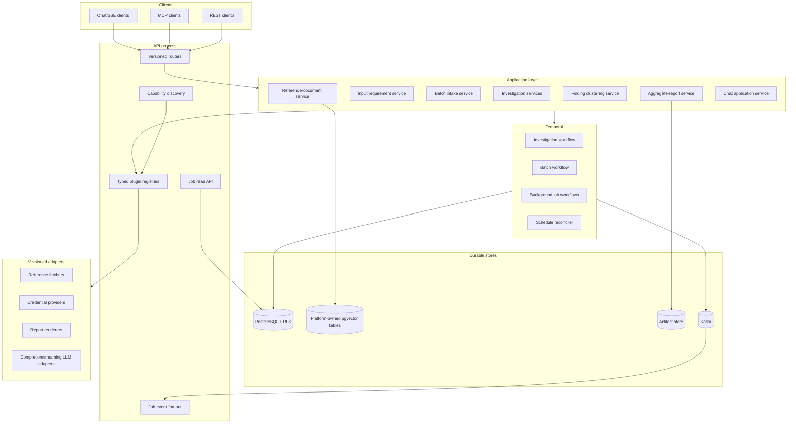
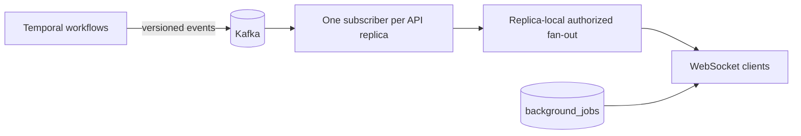
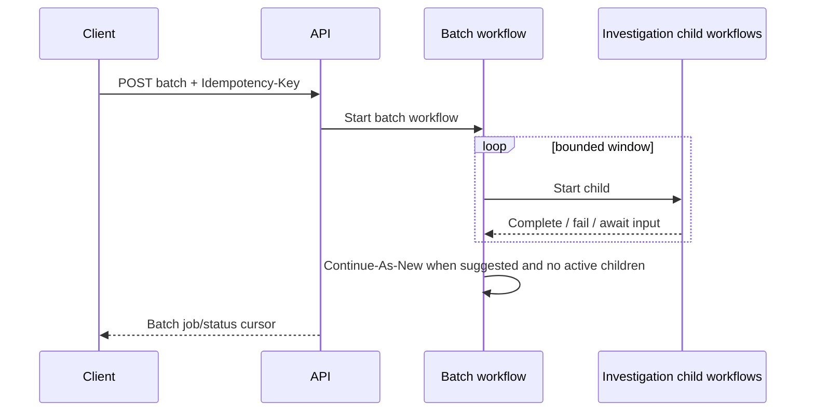

# IAP Implementation Part 11: Knowledge and Extensibility Architecture v1.1

This document supersedes `docs/IAP-implementation-part11-knowledge-v1.0.md`. It combines the original gap analysis against `prism-agent` with the subsequent critical review of IAP's current implementation and current Temporal, PostgreSQL, and pgvector guidance.

The goal is not to reproduce `prism-agent`. The goal is to add reusable platform capabilities that make future investigation features easy to introduce without repeatedly modifying composition roots, persistence wiring, MCP registration, workflow code, and configuration models.

No source code from `prism-agent` is copied. The source application is used only as evidence that the identified user workflows are valuable.

---

## 1. Scope and system class

IAP is a customer-facing investigation platform with tenant isolation, durable workflows, potentially sensitive evidence, and LLM-assisted decisions. It is not a prototype, but it also does not need an enterprise plugin marketplace on day one.

Part 11 therefore uses a proportional design:

- Establish a small, versioned extension contract before adding multiple new plugin types.
- Reuse PostgreSQL, pgvector, Temporal, Kafka, and S3-compatible storage already selected by the platform.
- Keep a modular monolith and one deployment boundary initially.
- Separate task queues and adapters where workloads or failure modes differ; do not split into microservices prematurely.
- Require tenant isolation, idempotency, provenance, quotas, and lifecycle semantics at the architectural boundary rather than retrofitting them into each feature.
- Defer a bundled frontend, a public third-party plugin ecosystem, and multi-region operation until there is a demonstrated need.

### 1.1 Goals

1. Close nine functional gaps identified from `prism-agent`:
   - Structured input-required suspension.
   - Bulk investigation intake and fan-out.
   - Cross-investigation finding clustering.
   - External reference-document search.
   - Aggregate reports.
   - Conversational investigation chat.
   - Generic background jobs and progress.
   - Outbound credential providers.
   - Defensive LLM JSON recovery.
2. Make those capabilities extensible through shared contracts and registries.
3. Correct current IAP prerequisites that would otherwise invalidate the feature designs.
4. Define safe evolution for persisted records, Temporal histories, API clients, events, MCP tools, and plugin configuration.

### 1.2 Non-goals

- Copying LangGraph workflows, Comcast-specific prompts, account schemas, or SAT libraries.
- Introducing ChromaDB, APScheduler, or local report files into production.
- Building a dynamic code-loading marketplace for untrusted plugins.
- Bundling a frontend in Part 11.
- Designing a distributed microservice topology before workload measurements justify it.

---

## 2. Review method and findings

The review covered every Python file under `prism-agent/src` and compared the observed capabilities against IAP's domain, application, infrastructure, API, MCP, and worker layers.

The original nine feature gaps remain valid, but the review found that several v1.0 assumptions about the current IAP baseline were incomplete or incorrect.

### 2.1 Feature-gap inventory

| # | Capability demonstrated by `prism-agent` | Generalized IAP capability |
|---|---|---|
| 1 | Structured LangGraph interrupt for missing transcripts | Durable `InputRequirement` and `AWAITING_INPUT` workflow state |
| 2 | CSV bulk fan-out | Generic batch intake with bounded Temporal child workflows |
| 3 | LLM-assisted issue clustering | Tenant-scoped incremental clustering over persisted findings |
| 4 | ChromaDB search over cloned documentation | Platform-owned reference-document retrieval layer |
| 5 | Aggregate JSON and HTML reports | Versioned aggregate-report service and artifact store |
| 6 | SSE conversational analysis | Durable investigation chat with typed streaming events |
| 7 | In-process generic job queue | Temporal-backed jobs with a PostgreSQL read model |
| 8 | SAT/OAuth token retrieval | Scoped outbound-credential provider registry |
| 9 | Defensive truncated JSON parsing | Schema-gated, provenance-recorded JSON recovery |

### 2.2 Current IAP prerequisites that must be corrected

| Prerequisite | Current gap | Part 11 correction |
|---|---|---|
| Composition root | FastAPI lifespan can replace the bootstrapped context with a new in-memory context | Preserve one typed `AppContext` through API and worker lifecycles |
| Findings and conclusions | ORM tables exist, but write/read composition is incomplete | Implement and wire repositories, persistence calls, and hydration/query paths |
| Artifact storage | Configuration and a narrow upload protocol exist, but no reusable store is wired | Add an artifact-store port, S3 adapter, local-dev adapter, and lifecycle wiring |
| Kafka consumption | Publication exists; generic subscription/fan-out does not | Add topic-aware events and one subscriber/fan-out bridge per API replica |
| Temporal schedules | SDK supports schedules, but IAP has no schedule reconciler | Add explicit provisioning, overlap, jitter, and reconciliation policies |
| LLM streaming | `LLMGateway` supports completion only | Add a separate streaming capability contract |
| Application profiles | Latest-only JSONB storage, globally unique ID, silent unknown fields | Add tenant-aware immutable revisions and fail-closed config parsing |

These are not incidental cleanup tasks. They are architectural dependencies for the feature phases.

---

## 3. Target architecture



### 3.1 Architectural boundaries

- Domain models define durable semantics and validation; they do not fetch, render, embed, or publish.
- Application services coordinate ports and enforce tenant/application scope, idempotency, quotas, and policy.
- Temporal owns durable execution state; PostgreSQL is the queryable read model for jobs and investigation artifacts.
- Plugin registries resolve trusted, built-in adapter implementations by manifest and configuration. Part 11 does not dynamically import arbitrary code from tenant input.
- PostgreSQL/pgvector stores platform-owned retrieval data. Mem0 remains an independent consumer-owned store for investigation-derived memory.
- Kafka carries versioned progress events; PostgreSQL remains authoritative for current job state.
- Object storage carries report artifacts and other large outputs through an authorization-aware artifact-store port.

---

## 4. Shared extension foundation

The v1.0 designs used ports but still required direct edits throughout platform wiring. v1.1 adds a deliberately small extension model.

### 4.1 Capability scope

Every extension call carries an explicit scope:

```python
class CapabilityScope(BaseModel):
    model_config = ConfigDict(frozen=True, extra="forbid")

    tenant_id: str
    application_id: str | None = None
```

Scope is required for:

- Reference-document indexing and search.
- Credential resolution and caching.
- Clustering and reports.
- Chat sessions and actions.
- Background jobs.
- Artifacts and event streams.

No cache, table key, object path, topic, or plugin instance may be keyed only by a caller-controlled `provider_id`, `source_id`, or tenant string.

### 4.2 Plugin manifest

```python
class PluginManifest(BaseModel):
    model_config = ConfigDict(frozen=True, extra="forbid")

    plugin_id: str
    plugin_kind: PluginKind
    contract_version: str
    implementation_version: str
    config_schema_version: str
    capabilities: frozenset[str]
    config_schema: dict[str, Any]
```

Initial plugin kinds:

- `REFERENCE_FETCHER`
- `CREDENTIAL_PROVIDER`
- `REPORT_RENDERER`
- `LLM_COMPLETION`
- `LLM_STREAMING`
- `BACKGROUND_JOB_KIND`

Each registry accepts only trusted implementations installed with the platform. Tenant/application profiles select a registered plugin and supply configuration validated against its manifest schema.

### 4.3 Plugin lifecycle

```python
class PluginLifecycle(Protocol):
    async def initialize(self) -> None: ...
    async def health(self) -> PluginHealth: ...
    async def close(self) -> None: ...
```

Bootstrap initializes selected plugins, records health without secrets, and closes owned clients during lifespan shutdown. Required plugins fail startup; optional plugins disable only their declared capability and surface that status through capability discovery.

### 4.4 Capability discovery

`GET /api/v1/capabilities` returns:

- Capability name.
- Contract version.
- Availability status.
- Supported media/transport modes.
- Relevant limits that are safe to expose.

It never returns endpoints, client secrets, environment-variable names, object paths, or raw plugin configuration.

MCP tool registration uses the same capability registry to prevent API/MCP drift, while contract tests continue to pin the exact public tool set and schemas.

---

## 5. Contract versioning and compatibility

### 5.1 Versioned records

The following carry an explicit `schema_version` or `contract_version`:

- Plugin configuration.
- Background-job input, progress events, and result payloads.
- Kafka event envelopes.
- MCP tool input/output schemas.
- Input requirements and fulfillments.
- Reference-document chunks and index generations.
- Cluster assignments and reports.
- Chat stream events and suggested actions.
- Provenance records.

### 5.2 Compatibility policy

- Public HTTP APIs remain under `/api/v1` for backward-compatible additions.
- Breaking field or semantic changes require a new API/tool contract version.
- Unknown enum values are preserved or surfaced as `UNKNOWN`; they are not silently coerced.
- Persisted polymorphic payloads use upcasters so jobs and Temporal histories survive rolling deployments.
- Each plugin declares a compatible contract-version range.
- Compatibility fixtures verify that the oldest supported client can parse current additive responses.

### 5.3 Profile revisions

Application profiles become immutable revisions identified by `(tenant_id, application_id, version)`. Investigations and jobs record the resolved profile revision or a canonical snapshot digest. Configuration models use `extra="forbid"` unless an explicit forward-compatible preservation strategy is documented.

This prevents older binaries from silently discarding new `reference_docs` configuration.

---

## 6. Shared operational foundations

### 6.1 Idempotency

Every mutating endpoint requires or generates an idempotency key:

```text
(tenant_id, operation, idempotency_key, request_hash, response_ref)
```

- Same key and same hash returns the original result.
- Same key and different hash returns `409 IDEMPOTENCY_KEY_CONFLICT`.
- Records have a documented retention window.
- Temporal workflow/update IDs derive from opaque server-generated IDs or stable hashes, never raw external keys.
- Fulfillment, cancellation, and terminal-state retries are no-ops when identical and conflicts when different.

### 6.2 Quotas and fairness

A `QuotaPolicy` is resolved by `CapabilityScope` and includes:

- Concurrent investigations and background jobs.
- Queued jobs and batch records.
- Reference source bytes, files, chunks, and vector rows.
- LLM token/cost limits.
- Active chat sessions and streams.
- Report-history and artifact-storage limits.
- Clustering/reindex frequency.

Quota checks occur atomically before workflow dispatch. `429` includes `Retry-After`; oversized payloads return `413`; stable error codes distinguish size, concurrency, rate, and cost limits.

### 6.3 Pagination

All growing collections use opaque, signed cursors:

```json
{
  "items": [],
  "next_cursor": null,
  "has_more": false
}
```

Every endpoint declares deterministic ordering, a unique tie-breaker, default and maximum limits, and snapshot-consistency behavior. Exact totals are optional for expensive vector-backed queries.

### 6.4 Provenance

```python
class ProvenanceRecord(BaseModel):
    source_revision: str | None
    input_digests: dict[str, str]
    plugin_id: str
    plugin_version: str
    model_id: str | None
    prompt_version: str | None
    schema_version: str
    parent_job_id: UUID | None
    workflow_id: str | None
    run_id: str | None
    generated_at: datetime
    metadata: dict[str, Any]
```

Reference chunks, cluster assignments, reports, suggested actions, and repaired LLM output link to provenance. Cluster assignments are versioned history with `valid_from`/`valid_to`; reports bind to exact cluster and reference-index generations rather than a moving `latest` view.

### 6.5 Lifecycle and retention

Where applicable, resources use:

```text
ACTIVE | DISABLED | DELETING | DELETED | FAILED
```

Retention, legal hold, soft deletion, hard purge, cascade behavior, artifact cleanup, vector cleanup, and active-workflow behavior are declared per resource class. Deletion is asynchronous when multiple stores must be reconciled.

### 6.6 Observability and audit

Required correlation fields include `trace_id`, `tenant_id`, `application_id`, `job_id`, `workflow_id`, `plugin_id`, and contract version. Tenant IDs are not used as unbounded metric labels.

Metrics cover queue latency, duration, retries, cancellation, source files/bytes/chunks, embedding and LLM latency/tokens/cost, credential refresh, streams, quota rejections, and purges. Security-sensitive operations produce immutable audit records distinct from diagnostic logs.

Every feature phase adds its metrics, spans, structured logs, and audit events during implementation rather than deferring instrumentation to final operations documentation. Tests assert required correlation fields and telemetry emissions without treating high-cardinality tenant/application values as metric labels.

---

## 7. Platform prerequisite corrections

### 7.1 Composition root

API lifespan must preserve the already-built `AppContext`; it must not replace production wiring with a default in-memory context. `AppContext` becomes a typed composition object for repositories, adapters, registries, and owned clients. API and worker contexts use the same builder and explicit lifecycle.

### 7.2 Finding and conclusion persistence

Before clustering:

- Implement concrete finding/conclusion repositories.
- Persist findings and conclusions from the conclusion application path.
- Add read methods by investigation, IDs, tenant, application, and pagination.
- Hydrate or explicitly join them for conclusion APIs.
- Define any recoverable backfill from existing checkpoints or knowledge artifacts.

### 7.3 Artifact storage

```python
class ArtifactStorePort(Protocol):
    async def put(self, scope, key, content, content_type, metadata) -> ArtifactRef: ...
    async def get(self, scope, ref) -> ArtifactObject: ...
    async def list(self, scope, prefix, cursor, limit) -> ArtifactPage: ...
    async def delete(self, scope, ref) -> None: ...
    async def signed_url(self, scope, ref, ttl_seconds) -> str: ...
```

Production uses an S3-compatible adapter. Development may use a path-confined local adapter. Adapters construct tenant/application prefixes internally; callers cannot provide absolute object keys.

### 7.4 Progress-event bridge



PostgreSQL is the current-state read model. A client receives a DB snapshot first, then live events. Reconnect reconciles from the DB. Kafka subscriber lifecycle is process-level, not one consumer per socket. Each API replica uses a stable, replica-unique consumer group so every replica receives every job-progress event and can serve its locally connected sockets; a shared consumer group would load-balance partitions across replicas and cause sockets on non-owning replicas to miss live events. Duplicate delivery across replicas is intentional, and event IDs make replica-local fan-out idempotent.

### 7.5 Temporal workload topology

Use separate task queues initially within the same deployable worker package:

- Investigation queue.
- Indexing queue.
- Analytics/reporting queue.

Each queue gets explicit workflow/activity concurrency limits. This isolates expensive indexing and clustering without premature service decomposition. Queue names and concurrency configuration are created with the shared operational foundations before any workflow targets them.

All long-running workflows declare history/event thresholds and a Continue-As-New policy, or an explicit proof that bounded inputs cannot approach those thresholds.

### 7.6 Temporal schedules

A schedule reconciler provisions stable schedule IDs, task queues, overlap policy, jitter, pause state, catch-up/backfill behavior, and deletion/update policy. Schedules are not assumed to exist merely because the SDK supports them.

---

## 8. Gap 1 — Structured input-required suspension

### 8.1 Domain model

`InputRequirement` gains durable identity, version, scope, validation schema, expiry, classification, and provenance:

```python
class InputRequirement(BaseModel):
    requirement_id: UUID
    requirement_version: int
    reason: str
    json_schema: dict[str, Any]
    classification: str
    requested_at: datetime
    expires_at: datetime | None
    resume_status: InvestigationStatus
```

`InvestigationStatus.AWAITING_INPUT` is additive but requires explicit lifecycle transitions from and back to the correct previous state.

### 8.2 Durable storage

Pending requirements and fulfillment records are persisted; they are not held only in workflow memory or an investigation metadata field that is not currently serialized. Fulfillment data is classified, size-limited, audited, and optionally promoted into evidence through an explicit policy.

### 8.3 Temporal interaction

Use a Temporal Update with a validator when the caller requires validation and a returned acceptance result. Signals remain suitable for fire-and-forget inputs, but an HTTP `provide-input` endpoint needs compare-and-set validation, so Update is preferred.

Rules:

- Identical fulfillment replay is a no-op.
- Different fulfillment for an already fulfilled version returns conflict.
- Cancellation remains possible while waiting.
- Expiry follows an application/profile policy.
- Continue-As-New carries pending requirement identity and version.

### 8.4 API

```text
GET  /api/v1/investigations/{id}
POST /api/v1/investigations/{id}/input-requirements/{requirement_id}/fulfill
```

The fulfillment endpoint requires an idempotency key and validates against the requirement's JSON Schema before invoking the Temporal Update.

---

## 9. Gap 2 — Bulk investigation intake

### 9.1 Contract

`BatchIntakeRecord` remains application-agnostic, but `parameters` is validated against an optional application-profile schema rather than being an unconstrained bag. Duplicate external keys in one batch are rejected.

### 9.2 Workflow execution

Use bounded worker coroutines or windows. A permit is held from child start through completion; limiting only `start_child_workflow()` does not limit running children.



The design declares:

- Deterministic opaque child workflow IDs.
- Parent close policy.
- Cancellation propagation.
- Child timeouts and retry policy.
- Treatment of `AWAITING_INPUT` children.
- Continue-As-New thresholds and state.
- Partial retry semantics.
- Maximum records per parent execution.

Temporal guidance suggests keeping concurrent operations around or below 500 and generally avoiding more than roughly 1,000 children in one parent history. The initial API limit remains 500; larger imports require partitioned batch jobs rather than raising the limit.

---

## 10. Gap 3 — Cross-investigation finding clustering

### 10.1 Source corpus

Clustering begins only after the finding/conclusion persistence prerequisite is complete. A `FindingRepository` supplies unassigned findings with tenant/application scope and pagination.

### 10.2 Cluster model

Clusters and assignments are normalized tables, not an array of member IDs embedded in one row. Assignments retain history, method, confidence, taxonomy revision, and provenance.

### 10.3 Incremental algorithm

1. Select unassigned or explicitly stale findings.
2. Retrieve semantically similar cluster candidates.
3. Request strict-schema LLM assignment.
4. Validate every input finding has exactly one output assignment.
5. Put malformed/unsupported assignments into explicit `UNASSIGNED`, never silently drop them.
6. Persist new clusters and assignment history transactionally.

### 10.4 Vector storage

Use platform-owned tables with fixed embedding dimensions per model/version. Do not reuse Mem0-owned tables or compare embeddings from different model versions.

Initial retrieval uses:

- HNSW cosine index.
- B-tree tenant/application/source filters.
- PostgreSQL full-text GIN index.
- Reciprocal-rank fusion of bounded vector and lexical candidates.

Re-embedding uses a blue/green generation: dual-write or durable capture, bounded backfill, quality validation, atomic query routing switch, and rollback window.

---

## 11. Gap 4 — External reference documents

### 11.1 Dedicated service boundary

Reference documents remain a sibling knowledge service, not an implicit method added to the runtime evidence gateway. They have a dedicated application service injected into REST and MCP composition.

```python
class ReferenceDocumentPort(Protocol):
    async def search(self, scope, query, kinds, cursor, limit) -> ReferenceDocumentPage: ...
    async def index_source(self, scope, source_id, idempotency_key) -> IndexRunSummary: ...
    async def index_status(self, scope, source_id) -> IndexStatus: ...
```

### 11.2 Fetcher plugins

Initial trusted fetchers:

- Git via `pygit2`.
- Confined local path for development.
- S3-compatible source through `ArtifactStorePort`.

Security requirements:

- HTTPS/host allowlists and SSRF controls.
- Resolved-path approved roots and symlink-escape rejection.
- Clone/file/object/time limits.
- Secret-manager references rather than arbitrary `token_env` names.
- Immutable Git commit or S3 version captured as provenance.

### 11.3 Index generations and deletion

Every successful full index run creates or activates a generation. Chunks not observed in the new successful generation are tombstoned. Failed runs never remove the previous active generation. Soft-deleted chunks are excluded from vector and lexical queries and hard-purged after retention.

### 11.4 MCP scope

The initial MCP tool remains investigation-scoped because current MCP context requires an investigation ID. Pre-investigation reference search is exposed through authenticated REST until a broader MCP scope contract is separately designed.

---

## 12. Gap 5 — Aggregate reports

Reports consume an exact cluster-taxonomy revision and assignment generation. They do not regroup findings independently.

`ReportRendererRegistry` selects a versioned renderer. The initial HTML renderer uses autoescaping, a restrictive Content Security Policy, safe content types, and no untrusted raw HTML.

Artifacts are stored as:

```text
latest/{opaque_scope_id}/aggregate-report.html
history/{opaque_scope_id}/{job_id}/aggregate-report.html
```

Actual keys are constructed inside the artifact adapter. Clients receive authorized proxy responses or short-lived signed URLs. Reports capture renderer version, source generations, input digest, and provenance.

---

## 13. Gap 6 — Conversational investigation chat

### 13.1 Durable sessions

Chat sessions and messages are tenant-scoped durable records with retention and purge policies. Pre-investigation chat uses a durable chat-session identity and a session-scoped data-policy envelope; the existing investigation-scoped prompt envelope is not weakened by making `investigation_id` optional.

### 13.2 Streaming contract

Use a separate `StreamingLLMGateway` and typed stream events:

```text
event: token
event: metadata
event: final
event: error
```

- `token` carries display text.
- `metadata` carries safe usage/progress metadata.
- `final` carries the complete validated response and structured suggested actions.
- `error` carries a stable public error code.

Retries are not attempted after tokens have been emitted. Client disconnect cancels and closes the provider stream. Backpressure, timeout, usage/cost accounting, redaction, and maximum message/session limits are explicit.

### 13.3 Actions

The LLM may suggest typed actions but cannot execute them. The client invokes the normal idempotent API endpoint, where authorization and policy are re-evaluated. No keyword sniffing triggers reports or investigations.

---

## 14. Gap 7 — Generic background jobs

### 14.1 Job-kind registry

Each registered kind declares:

- Input and result contract versions.
- Required capability.
- Task queue.
- Timeout and retry policy.
- Cancellation behavior.
- Retention class.
- Quota class.

### 14.2 Job model

```text
QUEUED | PENDING | RUNNING | CANCEL_REQUESTED | CANCELED | DONE | FAILED
```

The model includes creator, timestamps, attempt, parent job, workflow/run IDs, typed monotonic stages, input/result references, and redacted errors. Temporal is authoritative for execution; PostgreSQL is the read model. A reconciler repairs stale read-model rows after outbox or worker failures.

### 14.3 API and events

```text
GET  /api/v1/jobs/{id}
GET  /api/v1/jobs?kind=&status=&cursor=&limit=
POST /api/v1/jobs/{id}/cancel
WS   /api/v1/jobs/{id}/stream
```

WebSocket authorization checks the specific job before subscribing. A current DB snapshot precedes versioned live events.

---

## 15. Gap 8 — Outbound credentials

```python
class OutboundCredentialProvider(Protocol):
    async def get_token(self, scope: CapabilityScope, provider_id: str) -> AccessToken: ...
```

Initial adapters:

- RFC 6749 OAuth2 client credentials.
- Static secret reference for development/testing.

Tokens are cached by scope and provider, refreshed before expiry under a per-key lock, never logged, and invalidated on terminal authentication failures. Configuration uses secret-manager references, validates endpoint allowlists, TLS, audience/scope, bounded timeouts, and sanitized errors.

Outbound MCP connection pooling is separate from token caching. Pooling is added only when metrics show connection churn is material.

---

## 16. Gap 9 — Defensive LLM JSON recovery

Strict provider-native schema enforcement remains primary. Recovery is permitted only when:

1. Provider metadata indicates truncation or the call site explicitly permits recovery.
2. A target schema is known.
3. The repaired object passes full schema and domain validation.
4. The result does not authorize, execute, mutate credentials, or trigger destructive action.

Recovery records finish reason, parse mode, repair operations, schema version, and content digest in provenance. Errors contain no raw response excerpt.

Adversarial tests cover missing required fields, duplicate keys, excessive nesting, altered tool arguments, unterminated strings, and schema-valid but domain-invalid output.

---

## 17. Configuration model

Plugin configuration uses discriminated unions with `extra="forbid"`. Every config has a schema version and is validated against the selected plugin manifest before profile activation.

The configuration policy declares:

- Environment versus profile precedence.
- Whether changes require restart or support controlled reload.
- Required versus optional plugin failure behavior.
- Maximum serialized configuration size.
- Secret references and redacted serialization.
- Application parameter JSON Schema.

---

## 18. Testing strategy

### 18.1 Plugin conformance suite

Every adapter registry supplies a reusable conformance suite covering:

- Manifest and version negotiation.
- Configuration validation and secret redaction.
- Initialize, health, and close lifecycle.
- Scope and tenant collisions using identical IDs.
- Idempotent retry and key conflict.
- Cancellation and restart recovery.
- Quotas and concurrent races.
- Provenance completeness.

### 18.2 Security and lifecycle tests

- SSRF, path traversal, symlink escape, and stored XSS.
- WebSocket authorization and reconnect.
- Source-file deletion reconciliation.
- Retention, legal hold, and cascading purge.
- Cursor tampering and deterministic pagination.
- Old persisted jobs/events/workflows after upgrade.
- RLS tests against real PostgreSQL, not in-memory behavior alone.

### 18.3 Quality gates

Each phase runs targeted tests plus the repository's established `pytest`, Ruff, and mypy gates. New code introduces no additional mypy errors beyond the documented baseline.

---

## 19. Deferred items and adoption triggers

| Deferred item | Trigger |
|---|---|
| Bundled operator UI | A committed frontend owner and defined user workflows require it |
| Third-party dynamic plugin loading | More than one external team must deploy plugins independently of platform releases |
| Separate microservices for indexing/analytics | Task-queue isolation and worker scaling no longer provide acceptable resource isolation |
| Dedicated vector database | PostgreSQL/pgvector fails measured latency, recall, or operational targets at projected 10x scale |
| Outbound MCP connection pooling | Metrics show connection setup is a material latency or reliability bottleneck |
| Multi-region architecture | Latency, sovereignty, or recovery requirements explicitly require it |

---

## 20. Decision summary

1. Build a trusted, versioned extension registry—not a runtime plugin marketplace.
2. Carry tenant/application scope through every extension contract and cache.
3. Fix composition, finding persistence, artifact storage, event subscription, and profile revisions before feature work.
4. Use Temporal for durable execution, Updates for acknowledged input fulfillment, and bounded child workflows for batches.
5. Keep reference documents separate from runtime evidence and investigation-derived memory.
6. Use platform-owned pgvector tables with embedding generations and hybrid retrieval.
7. Treat Postgres as the job read model and Kafka as live progress transport.
8. Separate completion and streaming LLM capabilities.
9. Require idempotency, quotas, lifecycle, provenance, audit, pagination, and security controls as shared foundations.
10. Permit JSON repair only as schema-gated, provenance-recorded recovery—not as a general parser.
