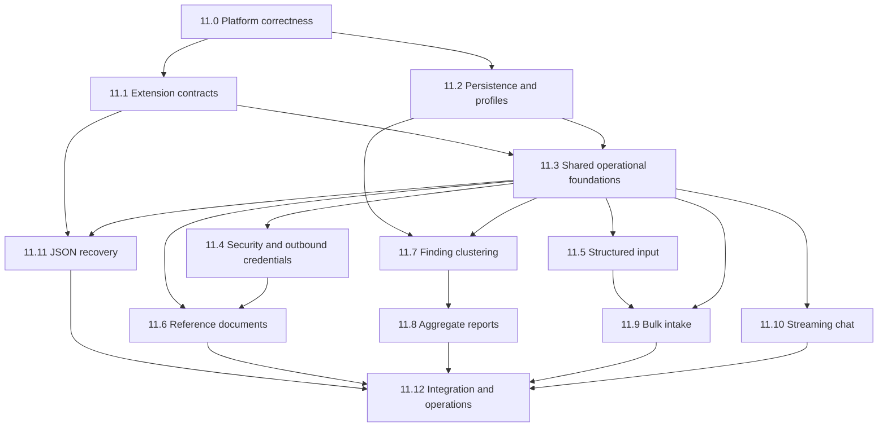

# IAP Implementation Part 11: Plan TODO v1.1 — Knowledge and Extensibility

This plan implements `docs/IAP-implementation-part11-knowledge-v1.1.md` and supersedes `docs/IAP-implementation-part11-plan-todo.md`.

The sequence intentionally puts platform correctness, extension contracts, and shared operational controls before product features. No feature phase should build on an assumed persistence, storage, Kafka subscription, profile revision, or composition capability that does not exist yet.

## Conventions

- Public routes use `/api/v1`.
- Every mutating endpoint uses durable idempotency.
- Every tenant-bound repository uses explicit tenant predicates, tenant-aware keys, and `rls_session`; PostgreSQL integration tests prove the RLS behavior.
- Every persisted polymorphic payload, event, plugin config, and artifact has a contract/schema version.
- Every workflow and activity added by a phase is registered in the production worker and any still-supported alternate worker entrypoint.
- Every owned client/plugin has initialize, health, and close lifecycle handling.
- "Gate" means targeted tests plus:

```text
uv run pytest tests -q -p no:cacheprovider
ruff check src tests scripts
ruff format --check src tests scripts
mypy src
```

The documented pre-existing mypy baseline remains the ceiling; Part 11 may add no new errors.

---

## Dependency graph



---

## Phase 11.0 — Platform correctness prerequisites

### Goal

Create a trustworthy composition and runtime baseline before adding Part 11 capabilities.

### Deliverables

- [ ] Fix FastAPI lifespan composition so a bootstrapped production `AppContext` is never replaced with a default in-memory context.
- [ ] Make `AppContext` explicitly own or reference repositories, registries, broker clients, Temporal clients, artifact stores, and extension lifecycles rather than relying on undeclared `Any` attachments for new Part 11 dependencies.
- [ ] Use the same composition builder for API and Temporal worker processes; environment-specific differences must be explicit arguments, not implicit fallbacks.
- [ ] Define shutdown order for flusher tasks, Kafka subscriber, plugin clients, broker, database engine, and Temporal clients.
- [ ] Inventory and either update or explicitly deprecate alternate/legacy worker entrypoints so workflow registration cannot differ by launcher.
- [ ] Add startup diagnostics showing selected implementations and capability availability without logging secrets or endpoints.

### Tests

- [ ] Lifespan test proves production SQLAlchemy, Kafka, Temporal, and evidence adapters remain installed after API startup.
- [ ] Worker/API composition parity test pins required shared dependencies.
- [ ] Required plugin initialization failure aborts startup; optional plugin failure disables only its declared capability.
- [ ] Shutdown test proves every owned client is closed once.

### Gate

- [ ] Full gate.

---

## Phase 11.1 — Extension contracts, scope, and compatibility

### Goal

Make future adapters and job types addable through typed registration rather than repeated hardcoded wiring.

### Domain and ports

- [ ] Add `CapabilityScope(tenant_id, application_id?)` with `extra="forbid"`.
- [ ] Add `PluginKind`, `PluginManifest`, `PluginHealth`, and `PluginLifecycle`.
- [ ] Add typed registries:
  - [ ] `ReferenceFetcherRegistry`
  - [ ] `CredentialProviderRegistry`
  - [ ] `ReportRendererRegistry`
  - [ ] `CompletionLLMGatewayRegistry` or adapt the existing factory behind the shared manifest contract
  - [ ] `StreamingLLMGatewayRegistry`
  - [ ] `BackgroundJobKindRegistry`
- [ ] Registries accept only platform-installed trusted implementations; profile input cannot import arbitrary code.
- [ ] Add `schema_version`/`contract_version` conventions and upcaster interfaces for persisted polymorphic payloads.
- [ ] Define compatibility ranges between platform contracts and plugin implementations.

### Capability discovery

- [ ] Add authenticated `GET /api/v1/capabilities`.
- [ ] Return capability IDs, contract versions, availability, supported modes, and safe limits only.
- [ ] Make MCP tool registration consume the same capability source while retaining exact contract allowlists/tests.

### Configuration policy

- [ ] Plugin configuration uses discriminated unions, `extra="forbid"`, and config schema versions.
- [ ] Define environment/profile precedence, restart/reload policy, required-vs-optional behavior, serialized-size limits, and secret-reference handling.
- [ ] Add a secret-reference type; tenant profiles cannot name arbitrary environment variables.

### Tests

- [ ] Registry duplicate/unknown/incompatible version failures.
- [ ] Capability discovery does not expose secrets, endpoints, or raw configuration.
- [ ] Older supported contract fixtures parse current additive responses.
- [ ] Unknown persisted schema versions fail closed unless an upcaster exists.

### Gate

- [ ] Full gate.

---

## Phase 11.2 — Persistence completion and profile revisions

### Goal

Complete the durable source data required by clustering/reporting and make application configuration reproducible.

### Findings and conclusions

- [ ] Implement concrete `SqlAlchemyFindingConclusionRepository` and in-memory counterpart.
- [ ] Extend the repository contract with:
  - [ ] Save finding and conclusion.
  - [ ] Get conclusion by investigation.
  - [ ] List findings by investigation.
  - [ ] Fetch findings by IDs.
  - [ ] Paginate findings by tenant/application/status.
- [ ] Wire repositories into API and worker contexts.
- [ ] Update conclusion workflow/activity/service to persist findings and conclusions transactionally or with an explicitly documented outbox/retry strategy.
- [ ] Update conclusion API/read paths to join or hydrate persisted findings/conclusion rather than relying on an aggregate reconstruction that omits them.
- [ ] Define and implement any feasible backfill from checkpoints/knowledge artifacts; document unrecoverable historical gaps.

### Application profiles

- [ ] Replace globally unique profile identity with a tenant-aware immutable revision model, preferably `(tenant_id, application_id, version)` plus a stable internal row ID.
- [ ] Preserve historical revisions rather than overwriting JSONB in place.
- [ ] Record resolved profile revision/snapshot digest on investigations and background jobs.
- [ ] Apply `extra="forbid"` or an explicitly documented preservation strategy to profile configuration.
- [ ] Define profile provisioning through an administrative API/CLI or explicit startup synchronization; YAML files alone are not treated as active production configuration.
- [ ] Correct profile API alias serialization and sanitization before adding new profile sections.

### Migrations

- [ ] Add the next migration revision based on the actual current Alembic head; do not assume a hardcoded revision number until the existing migration filename/revision inconsistency is resolved.
- [ ] Migration covers profile revisions/keys and any missing finding/conclusion constraints/indexes.
- [ ] Migration and rollback strategy preserve existing profile rows.

### Tests

- [ ] End-to-end conclusion workflow persists and returns findings/conclusion after process restart.
- [ ] Two tenants may use the same application ID safely.
- [ ] Old profile revision remains readable after a new revision is activated.
- [ ] Investigation remains bound to its original profile revision.
- [ ] Real-PostgreSQL RLS tests for findings, conclusions, and profiles.

### Gate

- [ ] Full gate.

---

## Phase 11.3 — Shared operational foundations

### 11.3A Artifact storage

- [ ] Add `ArtifactStorePort`: `put`, `get`, `list`, `delete`, `signed_url`.
- [ ] Add versioned `ArtifactRef`, `ArtifactObject`, and cursor-paginated `ArtifactPage`; metadata includes artifact contract version, content digest, provenance reference, and retention class.
- [ ] Implement S3-compatible adapter with tenant/application key construction inside the adapter.
- [ ] Implement a resolved-root-confined local adapter for development.
- [ ] Validate content types, object sizes, metadata sizes, signed-URL TTLs, and key traversal.
- [ ] Wire lifecycle and health into `AppContext`.

### 11.3B Background jobs

- [ ] Add typed `BackgroundJob`, `BackgroundJobStage`, and statuses:

```text
QUEUED | PENDING | RUNNING | CANCEL_REQUESTED | CANCELED | DONE | FAILED
```

- [ ] Include contract version, creator, timestamps, attempt, parent job, workflow/run IDs, quota/retention class, input/result refs, and sanitized error.
- [ ] Define monotonic progress and typed stage sequence IDs.
- [ ] Add `BackgroundJobRepository` with OCC/idempotent updates.
- [ ] Add tenant-RLS migration and indexes for tenant/kind/status/created time.
- [ ] Define Temporal as execution authority and Postgres as read model.
- [ ] Add reconciliation of stale rows from Temporal execution descriptions.
- [ ] Add `BackgroundJobKindRegistry` descriptors for input/result schema, task queue, timeout, retry, cancellation, retention, quota class, and required capability.

### 11.3C Events and streaming progress

- [ ] Add versioned `JobProgressEvent` envelope.
- [ ] Extend the messaging port with topic-aware publication rather than depending on concrete `publish_raw` methods.
- [ ] Add one Kafka subscriber per API replica and replica-local fan-out by authorized tenant/job.
- [ ] Give each replica a stable, replica-unique consumer group so every replica receives every job event; shared consumer groups are prohibited because they load-balance partitions away from sockets connected to other replicas.
- [ ] Define replica identity, consumer-group naming, duplicate-event suppression by event ID, reconnect, offset, and shutdown semantics.
- [ ] WebSocket receives DB snapshot first, then events; reconnect always reconciles from DB.
- [ ] Add:

```text
GET  /api/v1/jobs/{id}
GET  /api/v1/jobs?kind=&status=&cursor=&limit=
POST /api/v1/jobs/{id}/cancel
WS   /api/v1/jobs/{id}/stream
```

### 11.3D Idempotency, quotas, pagination, provenance, and lifecycle

- [ ] Generalize durable idempotency records to `(scope, operation, key, request_hash, response_ref)`.
- [ ] Specify same-key/same-hash response replay, same-key/different-hash `409`, cross-scope and cross-operation isolation, record expiry, purge, and replay after process restart.
- [ ] Add `QuotaPolicy` and atomic pre-dispatch quota checks.
- [ ] Standardize signed cursor envelopes and deterministic ordering.
- [ ] Add `ProvenanceRecord` and repository/serialization support.
- [ ] Add resource lifecycle/retention policy contracts and asynchronous purge-job convention.
- [ ] Add immutable security audit-event contract distinct from diagnostic logs.

### 11.3E Temporal queues, schedules, and workflow-history policy

- [ ] Add investigation, indexing, and analytics task-queue configuration before any Part 11 workflow targets those queues.
- [ ] Add explicit workflow/activity concurrency settings per queue and worker registration helpers.
- [ ] Add the Temporal schedule reconciler foundation: stable IDs, overlap policy, jitter, pause/unpause, backfill/catch-up, task queue, and update/delete reconciliation.
- [ ] Define a shared workflow-history policy: warning/rollover thresholds, `is_continue_as_new_suggested()` handling, and rules prohibiting Continue-As-New while attached children or asynchronous handlers remain active.

### 11.3F Telemetry instrumentation

- [ ] Add common metric/span/log helpers for jobs and plugins with bounded-cardinality labels.
- [ ] Instrument queue latency, execution duration, retries, cancellation, terminal status, plugin health, indexing counts/bytes/chunks, embedding and LLM latency/tokens/cost, credential cache/refresh, stream lifetime, quota rejection, and purge outcomes.
- [ ] Require immutable audit records for configuration activation, credential use, indexing, artifact access/deletion, input fulfillment, and suggested-action execution.

### Tests

- [ ] Artifact adapter conformance suite, including traversal and cross-tenant tests.
- [ ] Job update OCC and retry/idempotency tests.
- [ ] WebSocket authorization, reconnect, snapshot-plus-events, and multi-client fan-out tests.
- [ ] Two API replicas with different consumer groups both receive the same event; each fans out only to its authorized local sockets, and duplicate event IDs are suppressed locally.
- [ ] Idempotency response replay, conflicting hash, expiry/purge, and cross-operation/scope collision tests.
- [ ] Quota race tests under concurrent dispatch.
- [ ] Cursor tampering and deterministic paging tests.
- [ ] Retention/legal-hold/purge tests.
- [ ] Real PostgreSQL and Kafka integration tests.
- [ ] Telemetry tests assert required correlation fields and emissions without high-cardinality tenant labels.

### Gate

- [ ] Full gate.

---

## Phase 11.4 — Security foundation and outbound credentials

### Contracts and adapters

- [ ] Add `OutboundCredentialProvider.get_token(scope, provider_id) -> AccessToken`.
- [ ] Key caches and refresh locks by `(tenant_id, application_id, provider_id)`.
- [ ] Add RFC 6749 OAuth2 client-credentials adapter.
- [ ] Add static secret-reference adapter for development/test.
- [ ] Register adapters through `CredentialProviderRegistry`.
- [ ] Separate token cache from outbound MCP/client connection pooling.

### Security controls

- [ ] HTTPS and explicit hostname allowlists.
- [ ] Block loopback, link-local, metadata, and unapproved private addresses.
- [ ] Validate audience, scope, token type, expiry, TLS, response size, and timeouts.
- [ ] Proactively refresh under a per-key lock and invalidate terminal auth failures.
- [ ] Never log tokens, client secrets, complete auth responses, or secret references.
- [ ] Emit immutable audit records for credential acquisition/use without secret contents.

### Tests

- [ ] Cache hit, proactive refresh, concurrent refresh collapse, expiry, invalid audience/scope, and sanitized failures.
- [ ] Two tenants using the same provider ID never share a token/cache entry.
- [ ] SSRF and TLS validation tests.

### Gate

- [ ] Full gate.

---

## Phase 11.5 — Structured input-required suspension

### Domain and persistence

- [ ] Add `InputRequirement` with UUID, requirement version, JSON Schema, classification, requested/expiry timestamps, resume status, and provenance.
- [ ] Add `InputFulfillment` with immutable audit fields and content digest.
- [ ] Add `InvestigationStatus.AWAITING_INPUT` and explicitly update the lifecycle transition table for every allowed source/resume state.
- [ ] Persist requirements/fulfillments in tenant-RLS tables; do not rely on unserialized investigation metadata.

### Workflow interaction

- [ ] Add a Temporal Update for fulfillment with a validator; use Signals only where fire-and-forget semantics are deliberately acceptable.
- [ ] Implement compare-and-set on requirement ID/version.
- [ ] Carry pending requirements through Continue-As-New.
- [ ] Support cancellation and expiry while waiting.
- [ ] Define whether fulfillment is promoted to evidence and enforce classification policy.

### API

- [ ] `GET /api/v1/investigations/{id}` includes pending requirements safe for the caller.
- [ ] `POST /api/v1/investigations/{id}/input-requirements/{requirement_id}/fulfill` requires `Idempotency-Key`.
- [ ] Validate JSON Schema, request size, authorization, tenant, and requirement version before Temporal Update execution.

### Tests

- [ ] Missing input → durable requirement → process/worker restart → requirement still visible → valid fulfillment resumes correct prior state.
- [ ] Wrong schema, expired version, cross-tenant, conflicting replay, and unauthorized fulfillment fail closed.
- [ ] Identical fulfillment retry is a no-op.
- [ ] Cancellation and Continue-As-New behavior.

### Gate

- [ ] Full gate.

---

## Phase 11.6 — Reference-document indexing and search

### Domain and contracts

- [ ] Add versioned discriminated `ReferenceDocumentSource` and fetch specs (`git`, `local_path`, `s3`).
- [ ] Add `ReferenceDocumentPort` with scope-aware search/index/status and cursor pages.
- [ ] Add `ReferenceFetcherRegistry` implementations for Git, local development path, and artifact/S3 source.
- [ ] Keep reference documents as a dedicated application service; do not implicitly add them to the runtime evidence gateway.

### Storage and retrieval

- [ ] Add platform-owned `reference_document_chunks` and index-generation tables with typed tenant/application/source/document/chunk, content hash, source revision, lifecycle, provenance, lexical vector, embedding model/version, and fixed-dimension vector fields.
- [ ] Add B-tree scope/source indexes, GIN full-text index, and HNSW vector index.
- [ ] Implement hybrid bounded lexical/vector retrieval with reciprocal-rank fusion.
- [ ] Exclude tombstones from both retrieval branches.
- [ ] Add source-generation reconciliation: activate only successful generations and tombstone files missing from the new complete generation.
- [ ] Add blue/green re-embedding workflow and rollback window.
- [ ] Define indexing workflow history/event thresholds, bounded batch size, resumable cursor, and Continue-As-New behavior.

### Security

- [ ] Git/S3/OAuth endpoint allowlists and SSRF controls.
- [ ] Resolved-root and symlink protections for local paths.
- [ ] Clone/object/file/chunk/time/count limits.
- [ ] Immutable source revision provenance.

### Integration

- [ ] Add optional, versioned `ReferenceDocsProfile` to application-profile revisions.
- [ ] Add background-job kind `reference_docs_reindex` on indexing task queue.
- [ ] Add REST status/reindex/search endpoints.
- [ ] Add investigation-scoped MCP `search_reference_docs` tool and update the strict MCP registry/schema/contract tests.
- [ ] Keep pre-investigation MCP search out of scope until MCP scope is generalized; REST may support it subject to authorization.

### Tests

- [ ] Plugin/fetcher conformance suite.
- [ ] Incremental unchanged-file no-op.
- [ ] Changed and deleted file reconciliation.
- [ ] Failed generation leaves previous generation active.
- [ ] Tenant/application isolation with identical source IDs.
- [ ] Hybrid retrieval and embedding-version routing.
- [ ] Recall benchmark against exact retrieval on a golden query set.
- [ ] SSRF, traversal, symlink, oversized input, and secret-redaction tests.

### Gate

- [ ] Full gate.

---

## Phase 11.7 — Cross-investigation finding clustering

### Prerequisites

- [ ] Phase 11.2 finding corpus is populated and queryable.
- [ ] Phase 11.3 background jobs, provenance, quotas, and events are available.

### Domain and persistence

- [ ] Add `FindingCluster`, taxonomy revision, and versioned `FindingClusterAssignment` with confidence, method, validity interval, and provenance.
- [ ] Normalize cluster membership into assignment rows; do not embed unbounded finding-ID arrays in clusters.
- [ ] Add tenant-RLS tables and indexes.
- [ ] Add repository methods for taxonomy revisions, candidate clusters, assignments, unassigned/stale findings, and aggregate queries required by reporting.
- [ ] Add platform-owned finding/cluster embedding-generation tables with typed scope, finding/cluster ID, lexical `tsvector`, fixed-dimension vector, model/version, lifecycle, and provenance; do not depend on reference-document embeddings from Phase 11.6.
- [ ] Add B-tree scope indexes, GIN lexical indexes, HNSW vector indexes, and blue/green generation routing for finding/cluster embeddings.

### Algorithm

- [ ] Retrieve lexical/vector candidates from platform-owned embeddings.
- [ ] Use strict-schema LLM assignment with versioned prompt/schema.
- [ ] Require exactly one result per input finding.
- [ ] Malformed or unsupported results become explicit `UNASSIGNED` with provenance.
- [ ] Persist cluster creation and assignment history transactionally.
- [ ] Add quota and cost controls per run.

### Workflow and schedules

- [ ] Add `FindingClusteringWorkflow` on analytics task queue and register it in workers.
- [ ] Add `finding_clustering` background-job descriptor.
- [ ] Register clustering schedule descriptors with the Phase 11.3 reconciler: stable schedule IDs, tenant enumeration, overlap policy, jitter, pause/unpause, catch-up/backfill, task queue, and update/delete policy.
- [ ] Define bounded clustering batches, resumable cursor, history threshold, and Continue-As-New behavior.
- [ ] Add on-demand `POST /api/v1/clusters/run` with idempotency.

### API

- [ ] Cursor-paginated `GET /api/v1/clusters`.
- [ ] Cursor-paginated `GET /api/v1/clusters/{id}` with assignments/findings.

### Tests

- [ ] Incremental processing, new cluster, existing assignment, malformed output, no-drop invariant, assignment history, schedule overlap, cancellation, quota, and tenant isolation.
- [ ] Model/version migration does not mix embedding spaces.

### Gate

- [ ] Full gate.

---

## Phase 11.8 — Aggregate reporting

### Contracts

- [ ] Add versioned `AggregateReport`, rows, and report input snapshot references.
- [ ] Add `ReportRendererPort` and `ReportRendererRegistry`.
- [ ] Implement initial HTML renderer using Jinja2 only after verifying direct dependency needs; enable autoescape and CSP.

### Service and artifacts

- [ ] Aggregate from exact taxonomy/assignment generations; do not independently regroup findings.
- [ ] Capture renderer version, input digests, cluster/index generations, and provenance.
- [ ] Store latest/history through `ArtifactStorePort` using opaque internal scope IDs.
- [ ] Expose authorized proxy or short-lived signed URL; never raw internal keys.
- [ ] Add `aggregate_report` background-job descriptor on analytics queue.
- [ ] Define bounded report workflow inputs and an explicit history threshold; partition through activities/child jobs or Continue-As-New if a report run can exceed it.
- [ ] Define report-artifact retention, purge, and idempotent regeneration semantics.

### API

- [ ] `POST /api/v1/aggregate-reports` with idempotency.
- [ ] `GET /api/v1/aggregate-reports/latest`.
- [ ] Cursor-paginated `GET /api/v1/aggregate-reports/history`.
- [ ] Tenant-scoped asynchronous deletion/purge endpoint respecting retention/legal hold.

### Tests

- [ ] Exact-generation reproducibility.
- [ ] Tenant isolation and authorized artifact access.
- [ ] Stored-XSS and CSP tests.
- [ ] Empty-data render.
- [ ] Retention, legal hold, and cascade cleanup.

### Gate

- [ ] Full gate.

---

## Phase 11.9 — Bulk investigation intake

### Domain and API

- [ ] Add versioned `BatchIntakeRequest`, `BatchIntakeRecord`, `BatchIntakeResult`, and batch status/read model.
- [ ] Validate record parameters against the resolved application-profile schema.
- [ ] Reject duplicate external keys and enforce payload/record quotas.
- [ ] Add optional CSV adapter using explicit field mapping; workflow input remains structured JSON.
- [ ] `POST /api/v1/batch-intake` requires idempotency.
- [ ] Cursor-paginated `GET /api/v1/batch-intake/{id}`.
- [ ] Cancellation endpoint propagates according to the declared child parent-close/cancellation policy.
- [ ] Define retention and purge for batch records, child mappings, progress events, and idempotency records.

### Workflow

- [ ] Add `BulkIntakeWorkflow` and register it in workers.
- [ ] Use deterministic opaque child IDs.
- [ ] Bound active children by holding permits until child completion or using bounded windows.
- [ ] Declare parent close policy, child timeouts/retries, partial retries, and handling of `AWAITING_INPUT` children.
- [ ] Continue-As-New only when no attached children remain active; carry dispatch cursor/results/idempotency state.
- [ ] Keep initial batch maximum at 500. Larger imports partition into multiple jobs rather than growing one parent history.

### Tests

- [ ] Maximum concurrently active child executions, not merely starts.
- [ ] Deterministic replay and collision-free IDs.
- [ ] Partial failure, cancellation, waiting-input child, restart, Continue-As-New, quota, and cross-tenant status access.

### Gate

- [ ] Full gate.

---

## Phase 11.10 — Conversational investigation chat

### Contracts and persistence

- [ ] Add durable versioned chat sessions/messages with tenant RLS, retention, and purge.
- [ ] Add session-scoped data-policy envelope for pre-investigation chat; do not make existing investigation identity optional.
- [ ] Add `ChatContextBuilderPort` using existing knowledge retrieval for investigation-bound sessions.
- [ ] Add separate `StreamingLLMGateway` protocol and registry; do not change the structural `LLMGateway` requirement.

### Streaming protocol

- [ ] Define versioned SSE events: `token`, `metadata`, `final`, `error`.
- [ ] Final event contains the complete schema-validated response and typed suggested actions.
- [ ] Client disconnect closes/cancels provider stream.
- [ ] Define backpressure, timeout, maximum stream duration, redaction, token/cost accounting, and no-retry-after-emission behavior.

### Actions and API

- [ ] LLM suggested actions are advisory and carry provenance; execution occurs through normal authorized/idempotent APIs.
- [ ] No keyword-sniffing action triggers.
- [ ] Add:

```text
POST /api/v1/chat/sessions
POST /api/v1/chat/sessions/{id}/messages
GET  /api/v1/chat/sessions/{id}/messages?cursor=&limit=
DELETE /api/v1/chat/sessions/{id}
```

### Tests

- [ ] Persistence across restart.
- [ ] Cross-tenant access.
- [ ] Stream event ordering and final schema validation.
- [ ] Disconnect cancellation and no duplicated text after provider failure.
- [ ] Suggested action cannot bypass normal authorization/idempotency.
- [ ] Retention/purge and quota tests.

### Gate

- [ ] Full gate.

---

## Phase 11.11 — Defensive LLM JSON recovery

### Implementation

- [ ] Add pure JSON extraction utility and typed error.
- [ ] Preserve strict provider-native schema enforcement as primary.
- [ ] Recovery requires known schema, truncation/explicit call-site permission, complete schema/domain validation, and non-sensitive/non-destructive use.
- [ ] Record finish reason, parse mode, repair operations, schema version, and digest in provenance.
- [ ] Errors contain no raw response excerpt.
- [ ] Emit parse-success, parse-failure, and repair metrics by provider/model/schema without sensitive content or high-cardinality identifiers.

### Tests

- [ ] Code fences and trailing prose.
- [ ] Provider-confirmed truncation that repairs and validates.
- [ ] Missing required fields, duplicate keys, excessive nesting, altered tool arguments, unterminated strings, and domain-invalid values fail closed.
- [ ] Authorization/tool execution/credential call sites reject repaired output.
- [ ] Property-based/fuzz testing within bounded resource limits.

### Gate

- [ ] Full gate.

---

## Phase 11.12 — Integration, operations, and release readiness

### Worker and schedule registration

- [ ] Register every new workflow/activity in each supported worker launcher.
- [ ] Add investigation, indexing, and analytics task-queue configuration with explicit workflow/activity concurrency limits.
- [ ] Verify Phase 11.3 schedule reconciliation provisions stable IDs with overlap, jitter, pause/unpause, catch-up/backfill, task queue, and update/delete behavior.

### Golden scenarios

- [ ] Extend `scripts/run-golden-scenario.sh` with optional Part 11 scenarios:
  - [ ] Input-required suspend/restart/fulfill/resume.
  - [ ] Reference source index/search/delete/reindex.
  - [ ] Finding persistence → clustering → report artifact.
  - [ ] Batch partial failure and bounded concurrency.
  - [ ] Chat stream and suggested-action authorization.
  - [ ] Job snapshot + Kafka/WebSocket progress and reconnect.
- [ ] Golden scenarios assert durable database/artifact data, not only HTTP shapes.

### Plugin conformance suite

- [ ] Shared tests for manifest/version negotiation, config/secret redaction, lifecycle, scope isolation, idempotency, cancellation, restart, quotas, provenance, and cleanup.

### Operations documentation

- [ ] Add Part 11 operations documentation covering:
  - [ ] Plugin and capability discovery.
  - [ ] Task queues and worker sizing.
  - [ ] Schedule reconciliation.
  - [ ] Kafka subscriber/fan-out topology.
  - [ ] Artifact storage and signed URLs.
  - [ ] Vector index maintenance, recall checks, re-embedding, vacuum/reindex triggers.
  - [ ] Retention, legal hold, purge, and audit procedures.
  - [ ] Quotas and cost controls.
  - [ ] Credential refresh failures and safe diagnostics.
  - [ ] Contract/plugin upgrade and rollback.

### Final gates

- [ ] Full test suite has zero regressions against the repository baseline plus all Part 11 tests.
- [ ] Ruff and formatting clean.
- [ ] No new mypy errors.
- [ ] Migration upgrade and downgrade tested from the current production head.
- [ ] API/MCP/Kafka contract fixtures versioned and pinned.
- [ ] Security test suite covers SSRF, traversal, symlink escape, XSS, cursor tampering, WebSocket authorization, quota races, and cross-tenant identifier collisions.
- [ ] Performance baseline recorded for vector search, clustering batch, bulk child concurrency, report generation, and event fan-out.
- [ ] Mark this plan DONE with date and actual test counts.

---

## Explicitly deferred

- [ ] Bundled operator UI — add only with a committed frontend owner and defined workflows.
- [ ] Runtime third-party code loading — add only when teams must deploy plugins independently of platform releases.
- [ ] Dedicated vector database — add only when pgvector fails measured 10x-scale targets.
- [ ] Microservice split — add only when task-queue and worker isolation cannot contain resource contention.
- [ ] Outbound MCP connection pooling — add only when connection metrics show a material bottleneck.
- [ ] Multi-region deployment — add only for explicit latency, sovereignty, or recovery requirements.
