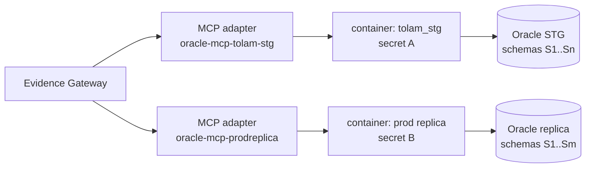

# Addendum to Part 3 v1.0: Oracle SQLcl MCP Registration (Multi-DB, Multi-Schema)

Status: design approved for implementation. Parent: `docs/IAP-implementation-part3-knowledge-v1.0.md` (pointer added there). Source requirements: `docs/scratchpad/oracle-mcpserver.txt` (single-DB POC). This addendum extends that POC to the mandatory scope: **multiple databases, multiple schemas per database**, registered as first-class IAP evidence providers.

## Mandatory scope (beyond the POC)

The POC covers one database (`TOLAM_STG`) and one implicit schema. Production requires: N databases (dev/stage/prod investigation replicas plus distinct application databases), each with M application schemas, all queryable through one gateway with tenant isolation. Single-DB assumptions (one connection file, one secret mount, one provider key) must not leak into the implementation.

## Topology: one image, one running instance per database

Build one container image (Temurin 17 + pinned SQLcl, non-root, no secrets in layers — per POC). Run **one container instance per database**, each mounting its own `connections/<db>.json` files and its own secret, each with its own resource limits and restart lifecycle:

One instance per DB (not one container switching connections) because: credentials never co-reside in one mount namespace; a hung query or restart affects one database only; per-DB timeout/row budgets differ; audit attribution is per-connection by construction. The cost (one small Java process per DB) is negligible next to the isolation gain. A single `docker-compose.yml` with one service per database (or compose profiles per environment) keeps the topology declarative.

## Multi-schema within a database

The read account (`MCP_INVESTIGATION_READ` pattern per DB) holds `SELECT`-only grants on each required application schema — granted schema by schema, never `SELECT ANY TABLE`, never DBA. Discovery is parameterized by `OWNER` (per POC §17: `ALL_TABLES`/`ALL_TAB_COLUMNS`/`ALL_CONSTRAINTS` filtered by bind, never hard-coded schema lists). On the IAP side, one `StateProfile` covers one `(connection, schema)` pair: `provider: oracle-mcp-<dbname>`, `schema_name` the primary schema, `tables` optionally schema-qualified for cross-schema joins the grants permit. An application spanning schemas gets one profile per schema sharing the connection key — explicit and auditable, never implicit search-path tricks.

## IAP adapter work (`McpEvidenceAdapter`)

Today the adapter only speaks a `search_logs` tool (runtime shape). Oracle SQLcl MCP exposes native tools (`run-sql` plus metadata/connection tools). Required:

1. New state-query method (e.g. `search_application_state` via the `run-sql` tool): takes tenant/investigation/request/profile, resolves connection key from `profile.provider` and schema from `profile.schema_name`, calls `run-sql` with `{connection, sql, max_rows}`, maps rows to `Evidence` with provenance (connection key, sanitized SQL hash, row counts).
2. `allowed_tools` per instance: `["run-sql", <metadata tools actually advertised>]` — allow-listed at construction, enforced by the existing `_validate_tool_call` (shape + 8 KB arg cap already present).
3. **Sanctioned dynamic-SQL exception**: IAP Rule 1 (static templates only) cannot hold for agentic investigation — the POC's design goal (§34) is dynamic discovery without a pre-authored catalog. Compensating controls, in order: (a) `QuerySafetyPolicy` sqlglot gate allowing `SELECT`/`WITH ... SELECT` only, applied to every generated statement before dispatch; (b) database read-only grants as the backstop (DB rejects the rest — negative tests prove it); (c) timeout 30 s + 1,000-row cap, configurable; (d) full SQL audit in evidence provenance. No LLM prompt is a security boundary anywhere in this chain.

## Registration wiring (bootstrap)

New config (no secrets — mounts carry those): `config/oracle-mcp-servers.yaml` listing `{name, command, args, allowed_tools, timeout_seconds, max_rows}`, overridable via `IAP_ORACLE_MCP_SERVERS_JSON`. At boot, for each entry construct `McpEvidenceAdapter(server_params=StdioServerParameters(command, args), ...)` and register under key `oracle-mcp-<name>`, then `freeze()` with the rest. Tenant scoping mirrors the git adapter: a tenant→connection-key allowlist (default deny); a tenant may only query databases its profiles name. MCP registers only with explicit entries — same absent-means-unregistered rule as the gateway addendum.

## Security posture (extends POC §§20/26)

Read-only account per database; grants per schema; no `SYS`/`SYSTEM`/DBA/developer credentials; non-root containers; connections + keys mounted read-only, never in image/config/Git/logs (the adapter's 8 KB arg cap and redaction apply to tool arguments; result bodies are sanitized at the gateway like all evidence). Investigation replica preferred over production-direct (POC §27); production-direct only with explicit approval. Negative tests are mandatory per database: `INSERT`/`UPDATE`/`DELETE`/`MERGE`/DDL/PL/SQL must fail **at the database**, never merely filtered in Python.

## Tests

- Container acceptance per database (POC §29 adapted): build, non-root, version checks, connection import + `CONNMGR TEST`, version query, metadata + data reads, MCP tool discovery, iterative queries.
- Negative tests per database per §30 (must fail at the DB).
- Multi-schema: discovery across two schemas with grants on both; revoke one grant → queries against it fail closed with a named error, the other unaffected.
- IAP side (mocked stdio session): allow-list enforcement, arg caps, timeout, tenant-mismatch denial, SELECT-only gate rejection of DML, provenance completeness on mapped evidence.
- Gateway-routed: one end-to-end query through the composed gateway once §1.1 lands (shares its integration test).

## Rollout

Database-by-database: STG first (connection file + secret + grants + compose service + adapter registration), negative tests, then replica/prod connections. Each database is independently shippable; no flag day. Triggers unchanged: DBA views/AWR/ASH stay out (POC §28) until their own threat review.
