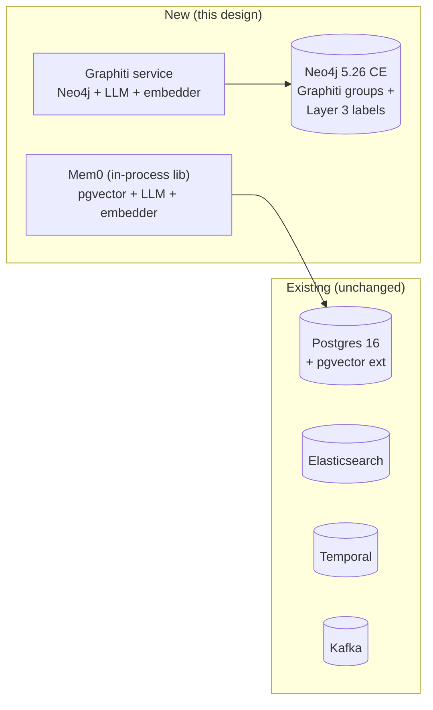
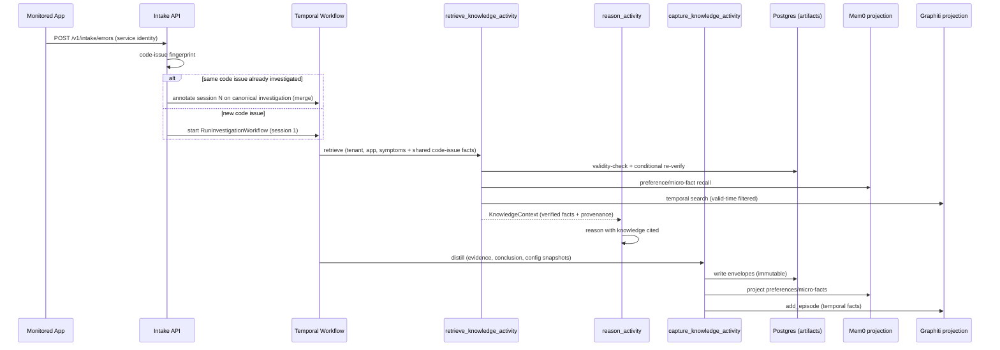

# Design: Execution Knowledge Layer (Mem0 + Graphiti)

## Context

The Investigation Agent Platform investigates incidents by correlating runtime
logs against database context and static code (Layer 3 topology). Today every
investigation re-derives the same dynamic truths from scratch: which feature
flags were evaluated and with what values, what effective configuration and
environment properties were in force, which dynamic rules and policies fired,
and how the analyst or agent interpreted them. That interpreted execution
knowledge evaporates when the investigation closes.

The platform already has the seams this design builds on:

- `AsyncEvidenceGateway` (`application/evidence/gateway.py`) is the mandatory
  enforcement boundary — authorization, sanitization, dedup — in front of all
  evidence providers.
- `RunInvestigationWorkflow` (`application/worker/workflows.py`) is the
  Temporal execution authority; new capture/retrieval steps fit as activities.
- `ApplicationConfig` (`infrastructure/configuration/config.py`) is a frozen
  Pydantic model with `extra="forbid"` — new `KnowledgeConfig` section required.
- `docker/docker-compose.yml` runs postgres:16, elasticsearch:8.12.0,
  temporalio/auto-setup:1.23, bitnami/kafka:3.7. No vector store, no graph
  database, no knowledge service exists yet.
- Identity model is `tenant_id` (security partition), `application_id`
  (target profile), `investigation_id` (case identity). There is no `case_id`
  or `workspace_id` vocabulary in code.

Two stakeholder answers shape every decision below:

1. Errors will soon be **auto-forwarded** into the platform as they happen,
   so investigation volume will grow faster than analyst attention. Knowledge
   must serve **both humans browsing artifacts and agents reasoning in future
   investigations**.
2. **Staleness is dangerous.** Flags flip, env vars change, policies get
   edited. Reusing "flag X was ON" after it flipped produces false-premise
   root causes — worse than no knowledge. Every conditionally-true artifact
   needs identification plus a refresh path.

No `docs/dev/architecture.md` exists in the project. When created, it should
gain a "Knowledge layer" section linking here rather than duplicating this
document.

## References

- [Mem0: How it works](https://docs.mem0.ai/core-concepts/how-it-works) — Extraction/retrieval model; informs preference/micro-fact storage and the ADD-only staleness trap we design around.
- [Mem0 platform vs OSS](https://docs.mem0.ai/platform/platform-vs-oss) — OSS has no `app_id`/org tenancy and no Dream/decay; informs our app-level supersession layer.
- [Mem0 pgvector provider](https://docs.mem0.ai/components/vectordbs/dbs/pgvector) — Validates reusing the existing Postgres 16 for the vector substrate.
- [Mem0 metadata filtering](https://docs.mem0.ai/open-source/features/metadata-filtering) — Filter grammar and per-store caveats; informs our pgvector-only filter matrix.
- [Graphiti overview](https://help.getzep.com/graphiti/getting-started/overview) — Bitemporal context-graph model; informs episode/fact design.
- [Graphiti graph namespacing](https://help.getzep.com/graphiti/core-concepts/graph-namespacing) — `group_id` is namespacing, not authorization; informs server-derived group IDs.
- [Graphiti adding episodes](https://help.getzep.com/v3/graphiti/core-concepts/adding-episodes.md) — Episode types and bulk-ingest invalidation caveat.
- [Graphiti searching](https://help.getzep.com/graphiti/working-with-data/searching.md) — Hybrid search, rerankers, temporal filters; informs read-path design.
- [Zep vs Graphiti](https://help.getzep.com/zep-vs-graphiti.md) — Managed vs self-host trade-offs; informs the self-host decision.
- [Cognee graph stores](https://docs.cognee.ai/setup-configuration/graph-stores) — Shared-Neo4j feasibility and Community Edition limits; informs the shared-graph decision.
- [pgvector README](https://github.com/pgvector/pgvector) — Mature PG16 vector substrate; informs the no-new-vector-DB decision.
- [Temporal workflow execution](https://docs.temporal.io/workflow-execution) — Confirms Temporal as execution/replay authority, which knowledge capture must not duplicate.

## Goals / Non-Goals

**Goals:**

- Preserve interpreted execution knowledge (flag evaluations, effective
  config/env, rule/policy outcomes, analyst/agent interpretations) as
  first-class, tenant-scoped artifacts reusable by agents and humans.
- Make staleness structurally impossible to ignore: every artifact carries
  validity semantics plus a refresh path; reuse re-verifies conditionally
  true artifacts against live sources.
- Keep Mem0 (user/session preferences, micro-facts) and Graphiti
  (temporal/state knowledge) behind ports, mirroring the existing
  authority-vs-projection split.
- Support the auto-forwarded error intake path: error in → investigation →
  knowledge captured → knowledge reused.
- Add the minimum viable infrastructure: pgvector on the existing Postgres,
  one shared Neo4j for Graphiti (+ Layer 3 Cognee later).

**Non-Goals:**

- Replacing PostgreSQL as the source of truth for investigations, evidence,
  hypotheses, timelines, or checkpoints.
- Replacing Temporal as workflow execution/replay authority.
- Storing raw logs, spans, or payloads in Mem0/Graphiti (they stay in
  Elasticsearch/Postgres; knowledge stores hold interpretations with
  pointers).
- Managed Zep (revisit only with a compliance/SLA driver — see Deferred).
- Making either knowledge store the tenant-authorization authority.

## Decisions

### D1: Self-host both stores; no managed dependencies

**Decision:** Run Mem0 OSS (Python library embedded in the worker/API
processes, pgvector on the existing Postgres 16) and self-hosted Graphiti
(`graphiti-core>=0.30.2`, single shared Neo4j 5.26) inside our own
docker-compose and VPC.

Rationale: the platform's threat model already assumes tenant data stays in
operator infrastructure (Postgres RLS, in-cluster Temporal/Kafka). Shipping
investigation content — which routinely contains customer identifiers,
config secrets, and security findings — to Mem0 Platform or Zep Cloud would
introduce a data-control boundary the current architecture never had, plus
per-episode credit burn on bursty forensic ingestion (Graphiti costs 6–10
LLM calls per episode; Zep bills >350-byte episodes in multiples). Self-host
cost is bounded: two stateful additions (pgvector extension, one Neo4j),
both standard operational shapes.

**Alternative considered:** Zep managed + Mem0 Platform (zero graph/vector
ops, built-in RBAC/audit/SOC2). Rejected for now — data-control boundary
change plus unpredictable credit burn on auto-forwarded incident volume.
Revisit trigger is documented under Deferred Items.

---

### D2: Reuse Postgres + pgvector; add exactly one new stateful service

**Decision:** The vector substrate is `pgvector/pgvector:pg16` enabled on the
existing Postgres 16 (`CREATE EXTENSION vector`). The only new stateful
container is one shared **Neo4j 5.26 Community** instance serving both
Graphiti (via `group_id` namespacing on the default database) and the
planned Layer 3 Cognee graph (separate label namespace, same database —
Community allows exactly one).



Mem0 runs as an in-process library (no Mem0 server container): the worker
and API processes already exist, and the OSS server's dashboard/JWT adds
ops surface without tenant-partition semantics we can rely on anyway (see
D7). Graphiti runs as a small internal service (its FastAPI `server/`) or
in-process in the worker; service form is preferred so ingestion can be
throttled independently of workflow workers.

**Alternative considered:** FalkorDB (lighter single container, first-class
Graphiti backend). Rejected — SSPLv1 licensing complicates any future hosted
offering, Cypher is a Redis-protocol subset (Neo4j drivers/tools don't
transfer), and Cognee's FalkorDB adapter is community-only, which would
split the graph backend story in two.

---

### D3: The knowledge artifact envelope is the core abstraction

**Decision:** All reusable knowledge, regardless of backing store, is
modeled as a `KnowledgeArtifact` envelope in Postgres (source of truth for
*what we believe and why*), with Mem0/Graphiti holding indexed projections
for retrieval. Stores never invent validity — the envelope does.

```python
# src/investigation_agent_platform/domain/knowledge/models.py
from datetime import datetime
from enum import StrEnum
from uuid import UUID, uuid4

from pydantic import BaseModel, ConfigDict, Field


class RefreshPolicy(StrEnum):
    IMMUTABLE = "IMMUTABLE"      # code facts, completed interpretations; never re-verify
    CONDITIONAL = "CONDITIONAL"  # flags, config, env, policies; must re-verify before reuse
    TTL = "TTL"                  # preferences, style, working assumptions; expire by clock


class ArtifactStatus(StrEnum):
    ACTIVE = "ACTIVE"
    SUPERSEDED = "SUPERSEDED"    # replaced by a newer artifact; kept for audit
    EXPIRED = "EXPIRED"          # TTL elapsed or re-verification failed
    QUARANTINED = "QUARANTINED"  # contradicted; held out of retrieval pending review


class ReverifySpec(BaseModel):
    """How to re-check a CONDITIONAL artifact against the live source."""

    model_config = ConfigDict(frozen=True, extra="forbid")

    source_kind: str = Field(description="E.g. flag_provider, config_endpoint, policy_bundle")
    source_ref: str = Field(description="Flag key, config path, policy name + version")
    query: dict[str, str] = Field(default_factory=dict, description="Provider-specific lookup")


class ArtifactVisibility(StrEnum):
    """Who may read an artifact. The default is tenant-private; sharing is
    opt-in per artifact class, never per caller."""

    TENANT = "TENANT"  # originating tenant only
    SHARED_CODE_ISSUE = "SHARED_CODE_ISSUE"  # any tenant holding a session on the same code issue


class KnowledgeArtifact(BaseModel):
    """One reusable unit of interpreted execution knowledge."""

    model_config = ConfigDict(frozen=True, extra="forbid")

    id: UUID = Field(default_factory=uuid4)
    tenant_id: str = Field(..., max_length=128)
    application_id: str = Field(..., max_length=128)
    investigation_id: UUID = Field(description="Originating investigation")
    kind: str = Field(description="flag_evaluation | effective_config | policy_outcome | interpretation | preference | micro_fact")
    statement: str = Field(..., max_length=4096, description="Interpreted conclusion, not raw data")
    confidence: float = Field(ge=0.0, le=1.0)
    refresh_policy: RefreshPolicy
    reverify: ReverifySpec | None = None
    valid_from: datetime
    valid_to: datetime | None = Field(default=None, description="Null = open-ended, still subject to policy")
    source_evidence_ids: list[UUID] = Field(default_factory=list, max_length=50)
    source_log_refs: list[str] = Field(default_factory=list, max_length=50, description="Elasticsearch pointers, not payloads")
    code_refs: list[str] = Field(default_factory=list, max_length=50, description="repo@rev:path#line refs into Layer 3")
    supersedes_id: UUID | None = None
    status: ArtifactStatus = ArtifactStatus.ACTIVE
    store_refs: dict[str, str] = Field(default_factory=dict, description="E.g. {mem0_id, graphiti_group, graphiti_uuids}")
    visibility: ArtifactVisibility = ArtifactVisibility.TENANT
    code_issue_fingerprint: str | None = Field(
        default=None,
        description="Tenant-agnostic code-issue key; set only on SHARED_CODE_ISSUE artifacts",
    )
```

Rules enforced at the domain layer, not by convention:

- `CONDITIONAL` **requires** a `reverify` spec (validator rejects otherwise).
- Reverify sources (flag providers, config endpoints) are assumed readable —
  per stakeholder decision there is no "human attested" fallback class. A
  reverify endpoint being down is a transient error: bounded retries, then
  the artifact is `QUARANTINED` and counted, never silently reused.
- `SHARED_CODE_ISSUE` visibility is allowed **only** for static,
  tenant-free content (error signature, code refs, domain attribution,
  failing symbol). Runtime/session content (flag values, env, logs,
  interpretations naming customer systems) is always `TENANT`. A validator
  rejects `SHARED_CODE_ISSUE` on `kind` values classified as runtime.
- Artifacts are **immutable once written**; correction means a new artifact
  with `supersedes_id` set. History is audit, never edited.
- Raw log payloads, spans, secrets, and prompts are forbidden in `statement`
  (validator rejects known secret patterns; sanitization happens before
  construction, mirroring the evidence gateway).

**Alternative considered:** Letting Mem0/Graphiti records be the artifact
(no Postgres envelope). Rejected — Mem0 OSS is ADD-only with no recency
weight (contradictions accumulate silently), and Graphiti invalidation is
LLM-best-effort. Neither can carry our validity contract alone.

---

### D4: Capture is a Temporal activity; reuse is a retrieval gate

**Decision:** Two workflow activities bracket reasoning, plus one intake
endpoint for the auto-forwarded future:



- `retrieve_knowledge_activity` runs **before** `reason_activity` and
  returns a `KnowledgeContext`: only `ACTIVE` artifacts whose validity
  holds *right now*. `CONDITIONAL` artifacts are re-verified inline via
  their `reverify` spec; on mismatch the activity writes a superseding
  artifact (status flip on the old one) and excludes it. TTL-expired items
  are marked `EXPIRED` and excluded. Nothing stale ever reaches the reasoner
  silently.
- `capture_knowledge_activity` runs **after** conclusion (and on
  investigation close): distills interpreted facts from evidence +
  conclusion + effective-config snapshots into envelopes, then projects to
  Mem0/Graphiti. Capture failures never fail the investigation (log +
  metric; the investigation is already concluded).
- Intake endpoint `POST /v1/intake/errors` accepts service-identity auth
  only. It computes a **tenant-agnostic code-issue fingerprint** and merges
  or forks (see D8): same code issue → annotate a new session on the
  canonical investigation instead of forking a duplicate; new code issue →
  create investigation (session 1) and start the workflow — the same path
  analysts use, so auto-forwarded errors get identical knowledge treatment.

**Alternative considered:** Capture inline during reasoning (streaming
facts as the agent works). Rejected — partial/conjectural facts would
pollute the store; capture from concluded, verified state only.

---

### D5: Layer split — Mem0 for slow truths, Graphiti for temporal truth

**Decision:** Map the stakeholder-confirmed layer split to storage by
*rate of change*, which is also the staleness-risk axis:

| Layer | Content | Store | Refresh policy |
|---|---|---|---|
| L1 Mem0 (user/session) | Analyst preferences, persona, style, team micro-facts ("service S pages team T"), working conventions | Mem0 OSS, `user_id` = analyst or `agent_id` = tenant-agent persona, `run_id` = investigation | Mostly `TTL` + `IMMUTABLE` |
| L2 Graphiti (temporal/state) | Flag evaluations with windows, effective config/env snapshots, policy outcomes, hypothesis evolution, state drift | Graphiti, one `group_id` per investigation (`inv_<uuid>`) + one per tenant-application baseline (`base_<tenant>_<app>`) | `CONDITIONAL` + native bitemporal invalidation |
| L3 (existing plan) | Static code/domain topology | Cognee/Neo4j as already designed | `IMMUTABLE` per revision |

`code_refs` on every execution artifact link into Layer 3 (`repo@rev:path#line`),
so "flag X was on AND code path Y reads it" is a join across layers, not a
duplication. Raw excerpts stay in Elasticsearch; artifacts store pointers.

---

### D6: Tenant isolation is enforced in our layer, never delegated

**Decision:** Neither Mem0 OSS nor Graphiti `group_id` is trusted as a
security boundary (both are filter-scoped; official docs warn accordingly).
All store access goes through server-side wrappers that:

- derive `tenant_id` exclusively from the authenticated request/workflow
  context (the existing `VerifiedIdentity` pattern);
- inject tenant scope on every call: Mem0 `user_id` namespaced per tenant
  (`t_<tenant>__analyst_<id>`) **plus** mandatory `tenant_id` metadata
  filter; Graphiti opaque server-derived `group_id`s never accepted from
  callers;
- reject any retrieval whose artifact `tenant_id` mismatches the caller.

Mem0 writes additionally stamp `tenant_id`, `investigation_id`, and
`artifact_id` in metadata so the envelope is always joinable. The sole
exception to strict per-tenant retrieval is D8 merge: `SHARED_CODE_ISSUE`
envelopes readable by session-holding tenants of the same code issue —
Mem0 scopes and Graphiti groups themselves stay per-tenant always.

**Alternative considered:** Mem0 Platform `app_id` + org/project RBAC, or Zep
managed isolation. Rejected per D1; revisit only with a compliance driver.

---

### D7: Budgets bound the LLM-heavy stores

**Decision:** Graphiti costs ~6–10 LLM calls per episode; Mem0 costs ≥1 LLM
call per `add()`. Unbounded capture on auto-forwarded volume would convert
incident spikes into cost spikes. Therefore:

- Per-investigation episode cap (default 50) and per-episode byte cap
  (truncate + pointer to Elastic for the remainder).
- `SEMAPHORE_LIMIT` pinned per deployment tier; per-investigation ingest
  serialized per `group_id` (Graphiti entity-resolution races under
  concurrent same-group writes).
- Capture activity records token/cost telemetry on the existing
  observability port; exceeding the investigation budget degrades capture to
  Postgres-envelopes-only (retrievable, just not indexed) rather than failing.
- Mem0 `infer=False` verbatim path for high-volume mechanical facts
  (flag key=value observations) to skip extraction LLM calls; LLM extraction
  reserved for interpretations.

---

### D8: Same code issue merges across tenants; sessions stay tenant-private

**Decision:** When auto-forwarded errors from different customers
(tenants) trace to the same code issue, they merge into one canonical
investigation annotated with session 1, 2, 3 … rather than forking
duplicate investigations. Sharing is strictly limited to static,
tenant-free code-issue knowledge; every session's runtime data remains
visible only to its own tenant.

**Code-issue fingerprint (tenant-agnostic by construction).**
`SHA-256(normalized_error_class | repo@rev | failing_symbol_qualified_name
| caller_symbol_qualified_name | top_frame_file)`. It is built *only* from
static fields — tenant ID, customer identifiers, timestamps, environment
names, and session data are never inputs. A domain validator plus a
two-tenant determinism test (identical static inputs under different
tenants → identical fingerprint) enforces this; any fingerprint that
varies by tenant is a bug.

**Merge rules (intake).**

1. Compute the fingerprint. Look up the lineage in `code_issue_index`.
2. `merged` is true iff any prior session exists for the fingerprint (any
   tenant); the session number is global across tenants so recurrence
   counts stay truthful.
3. The investigation row is always this tenant's own: reuse this tenant's
   most-recent non-cancelled row for the fingerprint, else create a fresh
   row. Cross-tenant rows are invisible under RLS by design — the merge
   links *lineages* (shared fingerprint + shared static artifacts + global
   session numbering), never rows. Prior conclusions are preserved
   structurally, since no tenant can write another tenant's row.
4. If this tenant's reused row is closed, it reopens via the standard
   lifecycle transition with reason `"recurring code issue"`.
5. Cancelled rows are never resurrected: intake forks a fresh row (still
   `merged=true`, still the next global session number — the lineage is
   joined, only the row is new).

**Visibility model (retrieval).** An artifact is readable iff
`artifact.tenant_id == caller.tenant_id` **or** (`artifact.visibility ==
SHARED_CODE_ISSUE` **and** the caller's session list includes the
artifact's `code_issue_fingerprint`). Graphiti groups and Mem0 scopes stay
strictly per-tenant — cross-tenant sharing flows *only* through `SHARED`
Postgres envelopes, never through shared graph namespaces or memory
scopes. A human browsing a merged investigation sees shared static
attribution plus only their own tenant's sessions; other tenants' sessions
appear as redacted placeholders (`session N, <tenant hidden>, <timestamp>`)
so recurrence counts stay truthful without leaking identity.

**Alternative considered:** Full cross-tenant link analysis/search. Rejected
— that needs a separate threat model and approval workflow (still deferred
below). Merge-on-fingerprint is narrower: one deterministic key, one
direction (static knowledge outward), per-session redaction inward.

---

## Data Storage

- **Postgres (existing DB):** new `knowledge_artifacts` table (envelope
  fields + `store_refs` JSONB + `supersedes_id` self-FK + `visibility` +
  `code_issue_fingerprint`), RLS on `tenant_id`, composite index
  `(tenant_id, application_id, kind, status)`, partial index on `ACTIVE`,
  lookup index on `code_issue_fingerprint` for intake merge. New
  `investigation_sessions` table (session number, tenant, refs, status),
  RLS on `tenant_id`. Alembic migration in the existing `migrations/`
  chain. Plus `CREATE EXTENSION vector` migration for the
  Mem0 pgvector collections.
- **pgvector collections** (Mem0-managed tables): embeddings + metadata;
  treated as disposable index — rebuildable from envelopes at any time.
- **Neo4j (new container, `neo4j:5.26`):** Graphiti-owned nodes/edges
  namespaced by `group_id`; Layer 3 labels coexist in the same database
  (Community single-DB limit) under a distinct label prefix. No cross-label
  queries except the explicit hop design in a future slice.

## Data Structures

- `KnowledgeArtifact` / `ReverifySpec` (above) — write-once envelope.
- `KnowledgeContext` (read model for the reasoner): `verified_facts:
  list[ArtifactView]` (each with `verified_at`, `verification_source`),
  `preferences: list[PreferenceView]`, `temporal_summary:
  list[TemporalFactView]` (each with `valid_at`/`invalid_at`),
  `excluded_stale_count: int` (observable staleness signal, not silent).
- Intake: `ErrorIntakeRequest{tenant_id (from auth, never body),
  application_id, error_fingerprint, severity, occurred_at, log_refs[],
  trace_refs[]}` → `202 Accepted {investigation_id, session_number,
  merged: bool, code_issue_fingerprint}`.
- Sessions: `InvestigationSession{investigation_id, session_number,
  tenant_id, occurred_at, log_refs[], trace_refs[], status}` persisted in a
  `investigation_sessions` table (RLS on `tenant_id`; cross-tenant reads of
  other tenants' rows rejected — the redacted placeholder view is assembled
  server-side from counts only).

## Interfaces

- `POST /v1/intake/errors` — service-identity auth only; computes the
  code-issue fingerprint and merges-or-forks per D8 (response includes
  `session_number`, `merged`, `code_issue_fingerprint`). Rate-limited per
  tenant (intake bursts).
- `GET /v1/investigations/{id}/knowledge` — human-readable artifact list
  for an investigation (tenant-scoped; superseded shown struck-through,
  never hidden). On merged investigations, sessions from other tenants
  render as redacted placeholders; shared static attribution renders fully.
- `GET /v1/knowledge/search?q=&application_id=` — tenant-scoped semantic
  search across own artifacts (agents + analysts).
- Ports (new, beside existing evidence/profile ports):
  `KnowledgeStorePort` (Mem0 adapter), `TemporalKnowledgePort` (Graphiti
  adapter), `KnowledgeCapturePort` (distillation service),
  `ArtifactRepository` (Postgres envelopes). The existing
  `EvidenceProviderSelector` pattern is reused for backend selection.

## Implementation Detail

- **Slice 0 — envelope + Postgres only (no new services):** artifact model
  (including `visibility` + `code_issue_fingerprint`), `knowledge_artifacts`
  + `investigation_sessions` tables with RLS + migration, intake with
  fingerprint merge-or-fork, capture activity writing envelopes only,
  retrieval with validity gating, human artifact APIs. Proves the
  capture→refresh→reuse loop *and* the cross-tenant merge loop end to end
  before any new infrastructure. Mem0/Graphiti adapters land behind the
  same ports with no-op/disabled defaults.
- **Slice 1 — Mem0:** pgvector extension, `KnowledgeStorePort` Mem0 adapter
  (tenant-namespaced IDs + mandatory metadata filters, filter matrix
  integration-tested on pgvector), preference recall in retrieval activity.
- **Slice 2 — Graphiti:** Neo4j container, `TemporalKnowledgePort` adapter
  (pinned `>=0.30.2`, per-group serialized ingest, valid-time-filtered
  reads, `reference_time` set per event — never ingest time), episode caps.
- **Slice 3 — hardening:** supersession janitor (marks `TTL`-elapsed as
  `EXPIRED`), conditional re-verify against live flag/config sources,
  staleness dashboard (`excluded_stale_count` trends), cross-layer join
  (`code_refs` → Layer 3) in the reasoner context.

## Migrations

1. `knowledge_artifacts` table + RLS + indexes (Alembic, same chain).
2. `investigation_sessions` table + RLS + `(investigation_id,
   session_number)` ordering (same chain).
3. `CREATE EXTENSION vector` (separate migration; requires superuser or
   pre-provisioned image — document for operators).
3. Neo4j constraints/indexes for Graphiti (`group_id` composite) via an
   explicit graph-schema migration step, mirroring the Layer 3 approach.
4. Backfill: none (greenfield stores). Existing investigations gain
   knowledge only from new captures forward; no retroactive extraction.

## Testing Philosophy

### Validity and refresh

Property-test the refresh state machine: immutable never re-verified,
conditional re-verified with match/mismatch/endpoint-down outcomes,
TTL expiry boundaries. Mismatch must supersede, never mutate; endpoint-down
must quarantine-or-skip per policy, never silently reuse.

### Tenant isolation

Identical artifacts under two tenants; retrieval, search, Mem0 filter
matrix, and Graphiti `group_id` access all proven partitioned — including
negative tests with omitted/spoofed filters at the wrapper layer. Plus
merge-specific tests: identical static inputs under two tenants produce
identical fingerprints containing zero tenant data; tenant B retrieves
shared static attribution but never tenant A's session artifacts or rows;
redacted placeholders leak no identity.

### Intake merge

Same code issue from two tenants merges into one investigation with
sessions 1 and 2; prior conclusions preserved; closed target reopens via
the standard transition; different code issues fork. Fingerprint stability
test: same static inputs → same key across tenants, codebases, and time.

### Staleness simulation

Time-travel tests: flag flips between capture and reuse; expired TTL;
superseded chains. Assert the reasoner context contains only verified facts
and `excluded_stale_count` accounts for the rest.

### Store contract tests

Mem0 adapter and Graphiti adapter tested against real containers (pgvector +
Neo4j in CI), including the pgvector `get_all` + logic-wrapper trap and
Graphiti concurrent same-group ingest serialization.

### Intake and workflow

Auto-forwarded error → investigation → capture → retrieval-in-next-
investigation end to end; capture failure never fails an investigation.

## Documentation Plan

### `docs/IAP-implementation-part6-knowledge-v1.md`

**Audience:** Architects and implementers. This document — authority for the
knowledge layer; keep validity rules, store choices, and rollout slices
current.

### `docs/dev/knowledge-ops.md`

**Audience:** Operators. Compose services, pgvector extension provisioning,
Neo4j backup/restore, `SEMAPHORE_LIMIT` tuning, budget alerts, rebuilding
indexes from envelopes, supersession janitor schedule.

### `docs/dev/knowledge-artifacts.md`

**Audience:** Analysts and agent developers. Artifact kinds, validity
semantics, how to read provenance, what `INCONCLUSIVE`-vs-stale means, API
examples for search and per-investigation views.

## Risks / Trade-offs

### LLM-extracted knowledge is lossy

**Risk:** Graphiti temporal extraction is best-effort (null timestamps,
missed contradictions); Mem0 extraction quality follows the LLM. False
facts indexed confidently mislead future reasoning worse than no memory.

**Mitigation:** Confidence scores + mandatory source-evidence links on every
artifact; retrieval surfaces provenance so the reasoner can weigh it;
valid-time filters default to currently-valid; evaluation slice measuring
retrieval precision before Slice 3 hardening.

### Two more stateful systems to operate

**Risk:** Neo4j backup, pgvector index tuning, embedder-dimension
consistency, Mem0 history lifecycle, Graphiti version pins.

**Mitigation:** Slice 0 delivers value with zero new services; each store
lands only with its ops doc, health checks, and rebuild-from-envelopes
procedure (both indexes are disposable by design).

### Shared Neo4j database across Graphiti and Layer 3

**Risk:** Community single-DB limit forces label-namespace sharing; a runaway
ingest on either side affects the other; Cognee EBAC cannot isolate per
dataset on CE.

**Mitigation:** Distinct label prefixes, per-group/per-dataset quotas at the
application layer, separate logical backup via label-scoped export; document
the Enterprise/Aura upgrade trigger (per-dataset isolation requirement or
sustained noisy-neighbor pain).

### Auto-forward volume shock

**Risk:** Error floods create investigation storms; capture LLM costs spike;
Graphiti same-group races.

**Mitigation:** Intake rate limits per tenant, code-issue merge (same
fingerprint → annotate a session on the canonical investigation per D8,
don't fork duplicates), episode caps, serialized per-group ingest,
degrade-to-envelopes-only under budget pressure.

### Cross-tenant leakage through shared artifacts

**Risk:** A tenant identifier, customer system name, or session payload
slips into a `SHARED_CODE_ISSUE` artifact or the fingerprint inputs, and a
second tenant reads another customer's data through the merge path.

**Mitigation:** Sharing allowlist is structural, not procedural — only
static code-issue content may carry `SHARED` visibility, enforced by a
domain validator on artifact `kind`; the fingerprint is constructed
exclusively from static fields with a two-tenant determinism test;
per-tenant session rows are never readable cross-tenant (redacted
placeholders assembled from counts); Mem0/Graphiti stay strictly
per-tenant so no shared-namespace query can over-read. Any leakage finding
quarantines the artifact class pending review.

## Deferred Items and Adoption Triggers

### Zep managed (replaces self-hosted Graphiti)

Deferred until a compliance artifact (SOC2/HIPAA), SLA, or freedom-from-ops
requirement appears, or steady-state volume makes credits cheaper than
operating Neo4j + LLM pipelines. Trigger: security/compliance review demands
it, or 3-month ops-cost comparison favors credits.

### Mem0 Platform (replaces OSS)

Deferred until `app_id` scoping, Dream background consolidation, or decay
ranking proves necessary — i.e., measured contradiction-accumulation pain in
OSS that our supersession layer can't handle cheaply. Trigger: staleness
dashboard shows rising superseded-but-uncollected ratio with retrieval
precision impact.

### Cognee as Layer 3 engine

Unchanged from the Part 5 plan: benchmark against the Tree-sitter/rustworkx
pipeline when Layer 3 lands; it would share the Neo4j from this design.

### Cross-tenant link analysis

Ad-hoc cross-tenant search and link analysis remain explicitly out of scope
(separate threat model, approval workflow). The D8 merge-on-code-issue path
is the *only* sanctioned cross-tenant flow: one deterministic key, static
knowledge outward, per-session redaction inward. Do not evolve toward
broader sharing implicitly — each new shared artifact class needs its own
validator rule and threat review.
