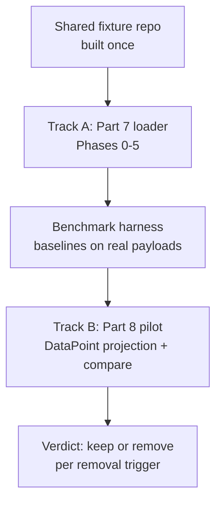

# Plan: Implement Parts 7 + 8 Sequentially (Combined)

## Decisions locked

- Strictly sequential execution (no parallel tracks).
- One shared fixture set for ingest tests, benchmark, and pilot.
- Cognee pilot built regardless of benchmark outcome; removal trigger decides after measured results.
- Track A targets Neo4j end-to-end with full edges and real registry writes.
- Live smoke test uses operator-provided GH_TOKEN + target org/repo.

## Why this order is optimal

Part 8's Cognee pilot consumes `ASTTopologyPayload` envelopes produced by Part 7's loader — there is nothing deterministic to project until the payload builder is real. Strictly sequential execution avoids building the `DataPoint` mapping against a stub dict shape that Phase 1 will replace. The single shared fixture (Part 7 synthetic repo extended with overloads, cross-repo same-name symbols, and SQL-linked symbols) serves ingest tests, benchmark baselines, and pilot comparison, so fixture construction cost is paid once. Building the pilot regardless removes the gate decision from the critical path while keeping the removal trigger as the post-pilot verdict.

## Shared foundation (build once, use twice)

- One fixture repo: Python + JS sources, `CODEOWNERS` catch-all, oversized file, binary file, overloaded function names, same-name symbols across two mock repos, one SQL table with ORM references.
- One `IngestManifestRow` promotion (frozen Pydantic) shared by loader, benchmark, and pilot audit lines (`cognee_projected: bool` per snapshot).

## Track A — Part 7 loader (Phases 0–5)

### Phase 0 — Harness + shared fixture

Add `tests/unit/test_ingest_github.py` plus fixture construction (including benchmark-extension cases: overloads, cross-repo names, SQL links). Add `tests/integration/test_ingest_neo4j.py` for `READY`, idempotent replay, tenant isolation. Acceptance: unit green; integration green locally.

### Phase 1 — Real payload (D5 + D6 input)

`build_payload_for_repo -> ASTTopologyPayload`: CodeSymbol to `ASTNodeIdentity.create` (uuid5, TopologyNodeType, parent linkage, signature_hash), MODULE per file + `SourceFileIdentity` with content_hash, Call/Reference/DatabaseAccess edges (RESOLVED only when both endpoints macro-tier same-payload), macro/micro split, all three caps with truncated + FAILED on breach, SHA-256 payload_hash, real parser_version. Promote manifest dict to frozen `IngestManifestRow`. Acceptance: fixture validates; oversized yields truncated=true.

### Phase 2 — Real registration (D4)

`register_identities()` between fetch and parse: derive_git_organization to upsert GitOrganizationIdentity; RepositoryIdentity (stable id, --repo-type + --repo-types mapping) to register_repository; derive_repository_domain to set domain_id only when resolvable. Acceptance: catch-all sets domain, missing CODEOWNERS leaves unset, re-runs stable.

### Phase 3 — Real ingest (D6)

`TopologyIngestionPort.ingest(payload)` via TopologyConfig-built adapter (Neo4j when enabled, in-memory otherwise); 3 bounded retries on TOPOLOGY_PROVIDER_UNAVAILABLE only; result counts into manifest. Acceptance: fixture ingests, replay stable, cross-tenant invisible.

### Phase 4 — Manifest + resume (D7)

FETCHING rows pre-fetch, SKIPPED rows with reasons, real --resume (skip READY, retry FAILED, new SHAs as new snapshots), 429/403 backoff honoring retry-after (max 5). Acceptance: kill-and-resume zero re-fetch of READY.

### Phase 5 — Start script + live smoke + docs

Temporal :7233 wait loop, IAP_TOPOLOGY_REQUIRED fail-hard, smoke sequence (dry-run to max-repos 2 to full target) on one manifest path, "Batch onboarding" section appended to docs/dev/topology.md. Acceptance: live manifest complete with zero silent drops; no new tables or API surface.

## Crossover — Benchmark harness (needs Track A complete)

`tests/benchmarks/test_topology_enrichment.py` on the shared fixture: exact-ownership, overload, cross-repo, revision-reproducibility, and SQL-hop cases weighted above semantic recall; records precision/latency baselines as results JSON. No `cognee` dependency. Acceptance: baselines recorded against the real Neo4j adapter.

## Track B — Part 8 pilot (starts after crossover)

### Pilot build

`infrastructure/topology/cognee_adapter.py` (TopologySymbolPoint mapping, project_snapshot, drop_projection), `pyproject.toml` pinned `cognee[neo4j]` isolated to the adapter module, --cognee-pilot single-repo flag on the loader, IAP_COGNEE_ENABLED / IAP_COGNEE_DATASET_SALT config. Graph-only, retrieval-only search types, opaque server-derived datasets. Acceptance: pilot projects the smoke-test repo with deterministic point IDs; replay duplicate-free.

### Comparison + verdict

Re-run benchmark queries against both adapters; tenant-isolation, determinism/replay, completion-containment, and failure-behavior tests per Part 8. Either outcome is a clean ending: keep (quotas + janitor hookup + ops doc) or remove (delete adapter + pilot labels, Layer 3 untouched). Docs updated to record the verdict. Acceptance: benchmark comparison report exists; removal or hardening fully executed, nothing left half-wired.

## Out of scope (both parts)

No Temporal ingest workflow, Kafka, multi-branch mining, GitHub App flow, Mem0/Graphiti writes, parallel-repo ingest, Cognee vectors, FalkorDB, multi-user mode, or cross-repo same-dataset paths. Each retains its documented trigger. Future items live in `docs/IAP-implementation-part7-8-issues.md`.

## Dependency chain

Shared fixture to Track A Phases 0–5 to crossover benchmark to Track B pilot to verdict. Strictly sequential; each phase's acceptance gates the next. Live smoke (Track A Phase 5) needs GH_TOKEN + target + tenant at run time; nothing before it needs secrets.
