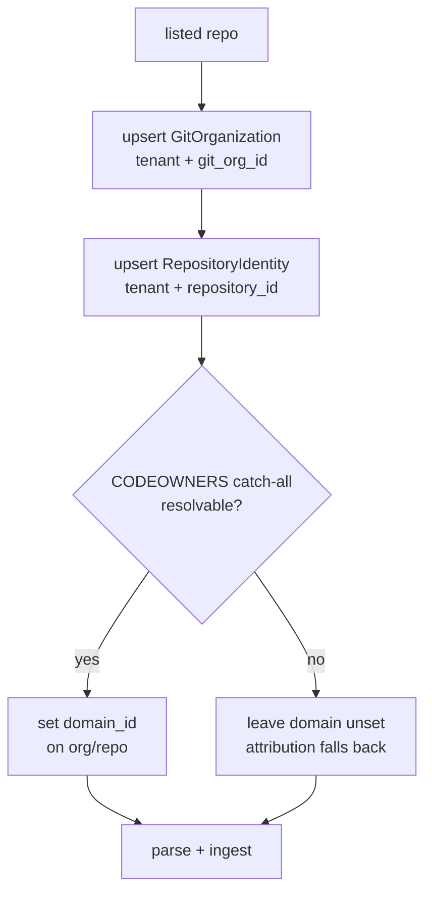
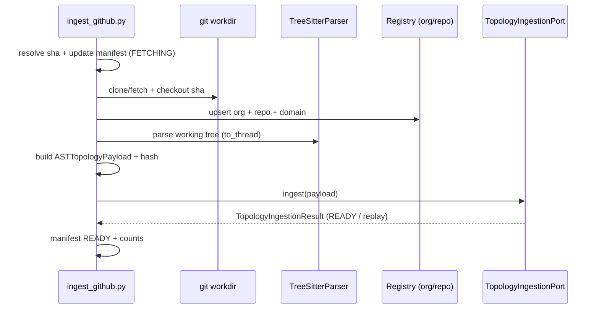

# Design: Batch GitHub Organization / Repository Ingest into Layer 3 Topology (Part 7)

## Context

The Investigation Agent Platform already has the Layer 3 topology bounded context defined in `docs/IAP-implemenation-part5-v1.md` and implemented behind ports:

- `TopologyIngestionPort.ingest(payload: ASTTopologyPayload)` with two adapters: `infrastructure/topology/in_memory.py` (`InMemoryTopologyAdapter`, dev/test) and `infrastructure/topology/neo4j_adapter.py` (durable).
- `CodeTopologyRepository` / `DomainAttributionPort` for reads, `RepositoryRegistryPort` (`infrastructure/topology/profile_repository_registry.py`, `ProfileBackedRepositoryRegistry`) for tenant-owned repository identity.
- Domain identities in `domain/topology/models.py`: `GitOrganizationIdentity`, `RepositoryIdentity`, `SourceFileIdentity`, `ASTNodeIdentity` (deterministic `uuid5` over tenant, repository, revision, path, symbol, range), `ASTTopologyPayload` (caps: 20k files, 200k nodes/edges), `TopologyIngestionResult`, snapshot lifecycle `PENDING → INGESTING → READY | FAILED` (+ `SUPERSEDED`, `COLLECTED`).
- Ownership derivation in `infrastructure/topology/ownership.py`: repository-level domain from the `CODEOWNERS` catch-all rule; unresolvable stays unset, never manufactured.
- Parsing in `infrastructure/evidence/code/parser.py`: `TreeSitterParser` over `tree-sitter==0.26.0` + `tree-sitter-language-pack==1.20.0`, `MAX_CODE_SIZE_BYTES = 524_288`, `asyncio.to_thread()` offload (Part 3 §6, Part 4 §6.1).
- Git access in `infrastructure/evidence/code/git.py`: `pygit2==1.20.1` (libgit2 1.9.7) for local traversal.
- Config in `infrastructure/configuration/config.py`: `TopologyConfig` (`IAP_TOPOLOGY_*`, `IAP_CODE_REPO_BASE`), `ApplicationConfig` requires `IAP_DATABASE_URI` + `IAP_LLM_API_KEY`.
- Startup in `src/investigation_agent_platform/main.py` (`uvicorn ...:app`, `--worker` for Temporal), compose in `docker/docker-compose.yml` (postgres:16, elasticsearch:8.12.0, temporal 1.23, kafka 3.7, neo4j:5.26-community), migrations via `alembic.ini` + `migrations/` keyed off `IAP_DATABASE_URI`.

What is missing is the onboarding ramp: there is no batch path that takes a GitHub organization (or a single repository), pins each repository to an immutable revision, parses it, registers its identity, and calls `ingest()`. Analysts currently hand-wire one repo at a time. This design closes that gap with a proportional, local-first batch loader.

System class for this change: **internal developer / operator tooling** (one engineer onboarding an org, local workstation or dev VM, tens to low-hundreds of repos). Downtime is annoying, not catastrophic. Simplicity and debuggability beat throughput. No new datastores, no Temporal workflows, no Kafka topics for ingest. The loader is a single-process CLI that reuses the existing ports; it must not become a second topology authority.

No `docs/dev/architecture.md` exists in the project. When created, it should gain a "Topology onboarding (batch)" section linking here rather than duplicating this document.

## References

- [GitHub REST: list organization repositories](https://docs.github.com/en/rest/repos/repos?apiversion=2022-11-28) — Pagination (`per_page` max 100, `Link: rel="next"`), `type=all`, `sort=full_name`; informs the listing loop.
- [GitHub REST pagination](https://docs.github.com/en/rest/using-the-rest-api/using-pagination-in-the-rest-api) — `Link`-following requirement; informs no-assumption page counts.
- [GitHub REST rate limits](https://docs.github.com/en/rest/using-the-rest-api/rate-limits-for-the-rest-api) — 5,000/hr PAT, secondary limits (~900 pts/min, 100 concurrent); informs sequential listing + 4–8 clone concurrency cap.
- [GitHub partial vs shallow clone](https://github.blog/open-source/git/get-up-to-speed-with-partial-clone-and-shallow-clone/) — `blob:none` vs `--depth 1` vs `tree:0` trade-offs; informs the clone default.
- [PyGithub releases](https://github.com/PyGithub/PyGithub/releases) — v2.10.0 lazy mode and retry; informs why raw REST is preferred for batch listing.
- [pygit2 docs](https://www.pygit2.org/) — v1.20.1 / libgit2 1.9.7 local traversal; informs the git-CLI-for-network, pygit2-for-local split.
- [tree-sitter-language-pack languages](https://docs.tree-sitter-language-pack.xberg.io/languages/) — 371 grammars, ABI 14/15; informs the ~12-grammar priority set.
- [tree-sitter-language-pack parsing guide](https://docs.tree-sitter-language-pack.xberg.io/guides/parsing/) — `get_parser`, `prefetch`, `detect_language_from_path`; informs parser reuse.
- [tree-sitter-language-pack intelligence guide](https://docs.tree-sitter-language-pack.xberg.io/guides/intelligence/) — `process()` + `StructureItem`/`span` (zero-indexed, byte columns); informs symbol mapping.
- [py-tree-sitter docs](https://tree-sitter.github.io/py-tree-sitter/) — `Parser.parse`, `Query`/`QueryCursor`, `start_point`/`start_byte`; informs the fallback raw-parse path.
- [Temporal workflow execution](https://docs.temporal.io/workflow-execution) — Confirms Temporal stays out of this batch path; ingest calls the port directly.

## Goals / Non-Goals

**Goals:**

- One CLI driver that loads either a whole GitHub organization or a single repository into Layer 3 for one tenant: `scripts/ingest_github.py --org <org>` or `--repo <owner/name>`.
- Immutable revision pinning per repository (`default_branch` resolved once to a commit SHA, stored in a manifest, asserted after fetch).
- Tenant-owned registration (`GitOrganizationIdentity`, `RepositoryIdentity`, CODEOWNERS-derived domain) before any graph write, reusing `ownership.py` and `ProfileBackedRepositoryRegistry` semantics.
- Tree-sitter parsing that reuses `TreeSitterParser` conventions (512 KB cap, skip-lists, macro-only persistence) and emits one `ASTTopologyPayload` per repository revision within existing caps.
- Idempotent ingest: re-running the same org/SHA is a no-op replay (`READY` + same `payload_hash`), never a duplicate graph.
- One platform start script (`scripts/start-platform.sh`) that brings up compose, runs migrations, and launches the API + Temporal worker so the driver has something to ingest into.
- Manifest on disk (`manifest.jsonl`) recording per-repo `{org, repo, default_branch, sha, status, counts}` for audit and resume.

**Non-Goals:**

- No Temporal workflow for ingest, no Kafka events, no new REST endpoints, no new Postgres tables, no new Neo4j constraints.
- No multi-branch / full-history mining (one pinned SHA per repo; history is a deferred trigger).
- No call-graph resolution across repositories (calls persist as same-payload edges; `EXTERNAL` only when explicitly marked; cross-repo hops stay in the ISSUE-5 trace-corroborated path).
- No GitHub App issuance flow, no webhook sync, no incremental watch loop (PAT for dev now; App + scheduled sync deferred with triggers).
- No embedding, LLM extraction, Mem0/Graphiti writes (Layer 3 static topology only; Part 6 knowledge paths untouched).
- No production hardening beyond bounded retries and redacted logs (this is dev/operator tooling, not a customer-facing importer).

## Decisions

### D1: Single-process batch CLI, not a Temporal workflow

**Decision:** Ingest runs as a single-process `asyncio` CLI (`scripts/ingest_github.py`), sequential across repositories with bounded per-file concurrency, calling `TopologyIngestionPort.ingest()` directly in-process. No workflow, no queue, no scheduler.

```mermaid
flowchart LR
    CLI["ingest_github.py<br/>--org | --repo"] --> LIST["GitHub REST list<br/>paginated, PAT auth"]
    LIST --> MAN["manifest.jsonl<br/>sha pin per repo"]
    MAN --> FETCH["git CLI fetch<br/>blob:none, single branch"]
    FETCH --> REG["register org + repo<br/>+ CODEOWNERS domain"]
    REG --> PARSE["Tree-sitter parse<br/>working tree"]
    PARSE --> PAY["ASTTopologyPayload<br/>per repo@sha"]
    PAY --> ING["TopologyIngestionPort.ingest<br/>in-memory | Neo4j"]
    ING --> MAN2["manifest update<br/>READY / FAILED + counts"]
```



Batch-friendly because org onboarding is bursty and operator-supervised: a stuck repo should block visibly with a manifest row, not disappear into a workflow retry queue. Temporal stays the investigation-execution authority; giving it an orthogonal bulk-import workload would couple availability of onboarding to workflow capacity for zero benefit at this scale (tens of repos, one operator).

**Alternative considered:** A `TopologyIngestWorkflow` with per-repo activities. Rejected — adds Temporal coupling, replay/history overhead, and operator indirection for a workload that runs rarely, is already idempotent at the snapshot level, and needs printf-debuggability more than durability.

---

### D2: Raw REST listing with PAT, Link-following, secondary-limit pacing

**Decision:** Listing uses `GET /orgs/{org}/repos?per_page=100&type=all&sort=full_name` with `Authorization: Bearer <token>` (from `GH_TOKEN` / `GITHUB_TOKEN`, never logged), following `Link: rel="next"` until absent. Single-repo mode uses `GET /repos/{owner}/{repo}` and skips listing entirely. Token is fine-grained PAT (`Metadata:read`, plus `Contents:read` only if the contents API is used) for dev; GitHub App installation tokens are accepted identically (same bearer header) with no code change.

```python
# scripts/ingest_github.py (contract — full driver ships beside this design)
from dataclasses import dataclass


@dataclass(frozen=True)
class RepoListing:
    full_name: str  # "owner/name"
    default_branch: str
    clone_url: str
    private: bool
    fork: bool
    archived: bool
    disabled: bool
    size_kb: int
    language: str | None
    pushed_at: str | None


@dataclass(frozen=True)
class LoaderConfig:
    tenant_id: str
    git_org_id: str  # GitHub org login; single-repo mode derives from full_name
    workdir: str  # local checkout root, defaults to IAP_CODE_REPO_BASE or ./tmp/repos
    token_env: str = "GH_TOKEN"
    per_page: int = 100
    include_forks: bool = False
    include_archived: bool = False
    include_private: bool = True
```

Rules: skip `archived`/`disabled`/empty repos at list time (recorded as `skipped` in the manifest, never fetched); forks excluded by default with `--include-forks` opt-in; backoff on `403`/`429` honoring `retry-after` / `x-ratelimit-reset` with exponential backoff (max 5 attempts); conditional requests (`ETag`) on re-list are opportunistic, not required.

**Alternative considered:** PyGithub `PaginatedList` / `gh repo list` subprocess. Rejected — PyGithub adds a dependency and per-object request overhead for identical rate-limit arithmetic; `gh` ties batch behavior to interactive auth state and text scraping. Raw REST is ~30 lines and fully observable.

---

### D3: git CLI for network, pygit2 for local, SHA-pinned blobless fetch

**Decision:** All network operations use the C `git` CLI; all local reads use `pygit2` (already a dependency) or the working tree. Default fetch is blobless single-branch pinned to the recorded SHA:

```text
git clone --filter=blob:none --single-branch --branch <default_branch> <clone_url> <workdir>/<repo>
git -C <workdir>/<repo> fetch origin <sha>
git -C <workdir>/<repo> checkout --detach <sha>
git -C <workdir>/<repo> rev-parse HEAD   # must equal <sha>
```

`default_branch` is resolved once per repo (`GET /repos/{o}/{r}/commits/{default_branch}` or `git ls-remote`) and the SHA is the only revision ever stored in `RepositoryIdentity`-adjacent records, `ASTTopologyPayload.revision`, and the manifest. Re-runs fetch the same SHA; branch movement never silently changes what was analyzed. Full clone (`--no-filter`) is a per-run `--full-clone` flag for fully-offline parses or multi-revision futures; shallow (`--depth 1`) and treeless (`--filter=tree:0`) are refused by the driver with an explanatory error because they break history queries and Tree-sitter working-tree completeness respectively.

Credentials are injected via `https://oauth2:<token>@github.com/...` in a subprocess environment or `http.extraHeader`, never interpolated into logs or the manifest. `pygit2` never touches the network in this path (defensive: libgit2 partial-clone parity lags C git).

**Alternative considered:** pygit2 remote fetch for everything. Rejected — keeps the one component with the weakest partial-clone story on the network path and splits failure modes.

---

### D4: Register org + repository + CODEOWNERS domain before parsing

**Decision:** For each listed repo, in order: (1) upsert `GitOrganizationIdentity(tenant_id, git_org_id=org login, name, provider="github", domain_id=None initially)`; (2) upsert `RepositoryIdentity(tenant_id, repository_id, name, locator=clone_url, git_org_id, repository_type, default_branch)`; (3) derive the repository-level domain via the existing `ownership.resolve_default_domain(repo_path)` (CODEOWNERS catch-all) and set `domain_id` on the org/repo records only when resolvable — otherwise leave unset. `repository_id` defaults to the repo slug (`owner/name` lowercased, `/` → `--` unsafe chars) with `--repository-id-prefix` override; it is stable across runs so re-ingest maps to the same graph namespace.



`repository_type` defaults to `UNKNOWN` with `--repo-type SERVICE|SHARED_LIBRARY|...` override and per-repo `--repo-types owner/name=TYPE` mapping; monorepo detection is out of scope (explicit flag only). No domain is ever manufactured from git identity and no git identity is manufactured from ownership — the ISSUE-7 invariant holds in batch exactly as in single ingest.

**Alternative considered:** Auto-inferring domains from org teams / topics. Rejected — invents ownership the platform explicitly refuses to manufacture; CODEOWNERS-or-unset is the only sanctioned derivation.

---

### D5: Parse the working tree with existing parser conventions and hard caps

**Decision:** Parsing walks the checked-out working tree (not libgit2 blobs), reusing `TreeSitterParser` language dispatch and the `MAX_CODE_SIZE_BYTES` (512 KB) per-file cap. Priority grammars are `python, javascript, typescript, tsx, java, go, rust, ruby, php, c, cpp, csharp, kotlin, swift, bash, sql`; anything else attempts `detect_language_from_path` and falls back to a `MODULE`-only `SourceFileIdentity` entry (file counted, no symbols). Directory skip-list (`node_modules, vendor, third_party, dist, build, target, .venv, __pycache__, .git`, generated/minified/bundle/lock files), NUL-byte binary guard, and per-file `node_count`/`error_rate` degradation flags mirror the research guardrails. One cached parser per language per process; `asyncio.to_thread()` for every parse call (Part 3 FIND-02 rule).

Symbol mapping: one `MODULE` node per file; top-level `CLASS`/`FUNCTION`, nested `METHOD` via `children` recursion; `INTERFACE`/`ENUM`/`ROUTE`/`MESSAGE_HANDLER` per `TopologyNodeType`; everything else skipped or `CLASS`-fallback with a diagnostic. `CALLS` edges persist only when both endpoints are macro-tier nodes in the same payload; otherwise skipped (micro edges never persisted — ISSUE-3). `database_accesses` and `references` are best-effort from imports/string scans, capped like calls.

Payload caps per repository revision: `max_files=20_000`, `max_symbols=200_000`, `max_edges=200_000` (matching `ASTTopologyPayload` limits). On breach the driver stops that repo with `truncated=true` + counts in the manifest and marks the snapshot `FAILED` with an explanatory summary — never silently drops.

**Alternative considered:** Parsing blobs straight from the git object store for speed. Rejected — doubles the code path (object-store reader + working-tree reader for CODEOWNERS/micro tiers) for no correctness gain at this volume; single-process working-tree parsing at ~50–300 files/sec is fast enough for org onboarding.

---

### D6: One payload per repo@sha, idempotent ingest through the existing port

**Decision:** Each repository revision produces exactly one `ASTTopologyPayload(tenant_id, application_id, repository_id, revision=sha, snapshot_id=new UUID, source_files, ast_nodes, calls, references, database_accesses, diagnostics, payload_hash)` where `payload_hash = SHA-256(canonical JSON of files+nodes+edges)`. The driver calls `TopologyIngestionPort.ingest(payload)` — `InMemoryTopologyAdapter` in dev, `Neo4jTopologyAdapter` when `IAP_TOPOLOGY_ENABLED=true`. Snapshot idempotency is inherited: same `(tenant, repo, sha, hash)` + `READY` → replay returns the existing `snapshot_id` with no graph writes. New SHA → new snapshot; retention (`ISSUE-4`) later collects old ones, never the driver.

`application_id` is required because the payload carries it: `--application-id` flag, defaulting to the slug-derived `<tenant>-<repo>` only in dev; production runs must pass it explicitly so `CodeProfile.repository_id` linkage stays meaningful. `parser_version` records `tree-sitter-language-pack==<version>`; `schema_version="v1"`.



**Alternative considered:** Batching multiple repos into one payload. Rejected — violates the one-revision-one-snapshot invariant, destroys idempotency granularity, and exceeds payload caps unpredictably.

---

### D7: Two scripts, explicit env contract, manifest-first operability

**Decision:** Ship exactly two scripts: `scripts/ingest_github.py` (the loader) and `scripts/start-platform.sh` (platform bootstrap). Both are thin glue over existing entrypoints, not new services. Env contract is explicit and minimal:

| Variable | Required | Purpose |
|---|---|---|
| `GH_TOKEN` (fallback `GITHUB_TOKEN`) | yes for `--org` / private repos | GitHub bearer token; never logged |
| `IAP_TENANT_ID` | yes (or `--tenant-id`) | Security partition for all registered identities |
| `IAP_DATABASE_URI` | yes for Neo4j/durable path | Postgres URI for migrations + durable adapters |
| `IAP_LLM_API_KEY` | yes for API/worker start | Existing boot requirement, unchanged |
| `IAP_TOPOLOGY_ENABLED` | no (default `false`) | `true` → Neo4j adapter; `false` → in-memory (dev) |
| `IAP_TOPOLOGY_NEO4J_URI/USERNAME/PASSWORD` | when topology enabled | Existing `TopologyConfig` wiring, unchanged |
| `IAP_CODE_REPO_BASE` | no (default `./tmp/repos`) | Checkout root reused by on-demand tiers |

`start-platform.sh` order: `docker compose -f docker/docker-compose.yml up -d postgres neo4j temporal elasticsearch kafka` → wait for `pg_isready` + Neo4j `:7474` + Temporal `:7233` → `alembic upgrade head` → launch `uvicorn investigation_agent_platform.main:app --port 8000` and `python -m investigation_agent_platform.main --worker` (background, logs to `tmp/`). `ingest_github.py` order: parse args → check token/tenant → list (or single get) → pin SHAs → fetch → register → parse → ingest → manifest. Resume is `re-run with the same manifest path`: `READY` SHAs skip fetch+parse entirely.

**Alternative considered:** Wiring ingest into `scripts/setup.py` or the API. Rejected — `setup.py` is one-time repo scaffolding, not an operator loop; adding ingest endpoints to the API would create an unauthenticated bulk-clone surface with no consumer.

## Data Storage

No new Postgres tables, no new Neo4j constraints in this design. All durable topology state reuses the Part 5 schema:

- Neo4j node keys (`Domain`, `GitOrganization`, `Repository`, `TopologySnapshot`, `Package`, `SourceFile`, `ASTNode`) with tenant-qualified uniqueness, plus `BELONGS_TO` / `DECLARED_IN` / `IN_PACKAGE` / `PARENT_OF` / `CALLS` / `REFERENCES` / `ACCESSES_TABLE` relationships — unchanged.
- Postgres topology audit rows (`knowledge`/snapshot records with `tenant_id`, `repository_id`, `revision`, `payload_hash`, `status`, counts, error summary, RLS) — unchanged.
- The only new persisted artifact is the **loader manifest**, a local JSONL file (default `./tmp/ingest-<org>-<date>.jsonl`), one line per repository. It is operational state, not platform state: safe to delete, rebuildable by re-listing.

```python
# scripts/ingest_github.py — manifest row (operational, not a domain model)
from typing import Literal
from pydantic import BaseModel, ConfigDict, Field


class IngestManifestRow(BaseModel):
    """One line of the loader manifest. Written by the driver, never by the platform."""

    model_config = ConfigDict(frozen=True, extra="forbid")

    tenant_id: str = Field(..., max_length=128)
    git_org: str = Field(..., max_length=128)
    repository_full_name: str = Field(..., max_length=256)
    repository_id: str = Field(..., max_length=128)
    default_branch: str = Field(..., max_length=128)
    revision_sha: str = Field(..., max_length=128)
    status: Literal["LISTED", "FETCHING", "READY", "FAILED", "SKIPPED"] = Field(...)
    node_count: int = Field(default=0, ge=0)
    edge_count: int = Field(default=0, ge=0)
    file_count: int = Field(default=0, ge=0)
    truncated: bool = Field(default=False)
    error_summary: str | None = Field(default=None, max_length=2000)
```

## Data Structures

Input is CLI flags + environment (see D7); there is no new REST input. The single-repo input shape is a strict subset of the org input (one `RepoListing`, no pagination). Output shapes reuse domain models verbatim:

- Registration output: `GitOrganizationIdentity`, `RepositoryIdentity` (existing `domain/topology/models.py` — no new fields).
- Parse output: `SourceFileIdentity`, `ASTNodeIdentity.create(...)`, `CallEdgeInput`, `ReferenceEdgeInput`, `DatabaseAccessEdgeInput`, `ParseDiagnostic` (existing — no new fields).
- Ingest input/output: `ASTTopologyPayload` → `TopologyIngestionResult` (existing — `micro_skipped_count` accounts for ISSUE-3 filtering; driver surfaces it in the manifest log line).
- Driver-only output: `IngestManifestRow` (above) plus a terminal summary table (`repos READY / FAILED / SKIPPED`, total nodes/edges, manifest path).

## Interfaces

### CLI — ingest_github.py

| Command | Arguments | Description |
|---|---|---|
| `ingest_github.py --org <login>` | `--tenant-id`, `--workdir`, `--manifest`, `--application-id`, `--repo-type`, `--include-forks`, `--include-archived/--include-private`, `--full-clone`, `--max-repos`, `--dry-run` | List org, pin SHAs, fetch, register, parse, ingest each repo |
| `ingest_github.py --repo <owner/name>` | Same minus org listing flags | Fetch, register, parse, ingest one repository |
| `ingest_github.py --resume <manifest>` | `--tenant-id` | Re-run manifest: skip `READY` SHAs, retry `FAILED`, honor new SHAs |

Exit codes: `0` all `READY`/`SKIPPED`; `1` any `FAILED`; `2` configuration/auth error (missing token, tenant, or `git` binary). `--dry-run` lists + pins SHAs + writes the manifest with `LISTED` rows and exits before any fetch. `--max-repos N` caps the run for smoke tests.

### CLI — start-platform.sh

| Command | Arguments | Description |
|---|---|---|
| `start-platform.sh` | `--no-worker`, `--no-api`, `--compose-file`, `--timeout` | Compose up, wait, migrate, launch API + worker |
| `start-platform.sh --stop` | — | Stop API/worker processes and `compose stop` (volumes kept) |

### No new REST, MCP, TUI, or GUI surfaces

Deliberately none. The loader is operator-run; the platform API surface is unchanged. A future scheduled-sync service would add its own intake endpoint with service-identity auth — explicitly not this design.

## Implementation Detail

The driver is organized as five small stages in one file (`scripts/ingest_github.py`, stdlib + `httpx` when present, `urllib` fallback, no new dependencies). Each stage is independently re-runnable from the manifest:

1. **List** (`list_org_repos` / `get_single_repo`): paginated REST, skip-rules, SHA resolution per repo, manifest `LISTED` rows. Pure network; no disk writes except the manifest.
2. **Fetch** (`fetch_repo_at_sha`): `git clone --filter=blob:none` or `fetch + checkout --detach`, `rev-parse` assertion, manifest `FETCHING`. Shells out to C `git` only; fails closed on SHA mismatch.
3. **Register** (`register_identities`): upsert org + repo identities, CODEOWNERS catch-all via `infrastructure.topology.ownership.resolve_default_domain`, in-memory or Postgres-backed registry depending on `IAP_TOPOLOGY_ENABLED`. No graph writes.
4. **Parse** (`build_payload_for_repo`): working-tree walk with skip-lists, `TreeSitterParser.parse_symbols` via `asyncio.to_thread`, `ASTNodeIdentity.create` for deterministic IDs, macro/micro split, edge filtering, cap enforcement, `payload_hash`. Pure CPU; no I/O except file reads.
5. **Ingest** (`ingest_payload`): `TopologyIngestionPort.ingest`, result → manifest `READY`/`FAILED` + counts. Single port call per repo; retries only on `TOPOLOGY_PROVIDER_UNAVAILABLE` (bounded, 3 attempts).

`scripts/start-platform.sh` is ~80 lines of bash: `set -euo pipefail`, compose up, `pg_isready` / `curl -sf neo4j:7474` / Temporal health loops, `alembic upgrade head`, then `uv run uvicorn investigation_agent_platform.main:app --host 0.0.0.0 --port 8000` and `uv run python -m investigation_agent_platform.main --worker` with PID files under `tmp/`. It never injects secrets into logs and refuses to start with `IAP_TOPOLOGY_REQUIRED=true` when Neo4j is unreachable (existing F-001 fail-hard preserved).

## Migrations

1. None for Postgres (`migrations/` chain untouched) and none for Neo4j constraints (Part 5 migration already installs tenant-qualified uniqueness).
2. Backfill: none. Repos gain topology only from new batch runs forward; existing investigations without topology keep returning `TOPOLOGY_NOT_CONFIGURED` / `INCONCLUSIVE`, never fabricated ownership.
3. Rollout: run `--dry-run` against the target org first (validates token scope + branch resolution), then `--max-repos 2` smoke ingest into the in-memory adapter, then the full org with Neo4j enabled. Each step appends to the same manifest path for continuity.

## Testing Philosophy

### Tenant isolation

Register the same org login under two tenants and prove the graph namespaces, manifest `repository_id` derivations, and registry lookups never cross: ingestion under tenant A is invisible to tenant B lookups, and CODEOWNERS-derived domains are per-tenant records even when the file bytes are identical.

### SHA pinning and idempotency

Pin a repo, ingest, re-run: second run is a manifest `READY` skip plus a port-level idempotent replay (same `snapshot_id`, stable counts). Move `default_branch` forward, re-run: driver records a new SHA row and creates a new snapshot; the old snapshot is untouched (retention, not the driver, decides collection).

### Skip and cap behavior

Fixtures for archived/disabled/empty/fork repos prove they land as `SKIPPED` with reasons and zero fetches. A synthetic oversized repo (over file/symbol/edge caps) proves `truncated=true`, `FAILED` snapshot status with an explanatory summary, and no partial `READY` snapshot queryable.

### Parser fidelity

Per-language fixtures (the 12 priority grammars) assert `MODULE` per file, `CLASS`/`METHOD`/`FUNCTION` nesting, zero-indexed-to-one-indexed line conversion, and 512 KB rejection. Unknown extensions assert `MODULE`-only fallback. Binary/NUL fixtures assert skip with reason.

### Failure containment

One repo with an unresolvable SHA, one with no CODEOWNERS, one with Neo4j down: each fails its own manifest row (`FAILED` + summary) while the rest of the org completes; exit code `1` with the summary table pointing at the manifest. No partial graph for the failed repo is queryable.

### Start script

Shell dry-run asserts compose file resolution, missing-env refusal (`GH_TOKEN` not required for start, `IAP_DATABASE_URI`/`IAP_LLM_API_KEY` are), wait-loop timeouts, and `alembic upgrade head` invocation order. Never asserts against live containers in unit tests; a single smoke job runs the real compose path in CI.

## Documentation Plan

### `docs/IAP-implementation-part7-knowledge-v1.md`

**Audience:** Architects and implementers

This document — authority for batch GitHub onboarding into Layer 3. Keep the clone strategy, cap table, manifest contract, and deferred triggers current as the loader evolves.

### `docs/dev/topology.md` changes

**Audience:** Developers and operators

Append a "Batch onboarding" section: `GH_TOKEN` scope, `--org` vs `--repo` examples, `--dry-run` + `--max-repos` smoke sequence, manifest resume semantics, `--full-clone` trigger, and the `start-platform.sh` order (compose → wait → migrate → API + worker). Link here for rationale; do not duplicate decision text.

### `docs/dev/architecture.md` changes

No `docs/dev/architecture.md` exists in the project. When created, add the batch-loader swimlane (CLI → GitHub → workdir → registry → parser → `TopologyIngestionPort`) as an operator-side flow distinct from the investigation runtime flow, plus a note that batch ingest never touches Temporal/Kafka.

## Risks / Trade-offs

### Token scope overreach

**Risk:** A classic PAT with broad scopes checked into shell history or logs clones more than intended and leaks via error output.

**Mitigation:** Fine-grained PAT with `Metadata:read` minimum, `GH_TOKEN` from environment only, token redaction in every log line and manifest exclusion, `clone_url` credential injection confined to the subprocess environment.

### Org-scale blowup

**Risk:** A 500-repo org at full clone saturates disk/bandwidth and exceeds payload caps repo after repo, turning a 10-minute onboarding into an overnight run with a manifest full of `FAILED`.

**Mitigation:** Blobless default, `--max-repos` smoke runs, per-repo caps with `truncated` signaling, sequential repos with per-file concurrency only, manifest-first resume so reruns skip `READY`. Document the sharded-schedule trigger (see Deferred) instead of parallelizing now.

### Stale default_branch assumptions

**Risk:** Branch moves between list and fetch, checking out code nobody pinned and attributing against the wrong revision.

**Mitigation:** SHA is resolved, recorded, fetched, checked out, and asserted (`rev-parse HEAD == sha`) as one per-repo transaction; any mismatch fails that repo closed. The manifest is the audit trail of exactly what SHA each snapshot holds.

### CODEOWNERS absence misread as platform failure

**Risk:** Operators interpret unset domains on repos without CODEOWNERS as loader bugs and hand-edit ownership into the graph.

**Mitigation:** Unset is a first-class outcome with a manifest note and the existing `CODEOWNERS`-fallback attribution tier at query time (confidence-capped). The loader never writes synthetic ownership to make the graph look complete.

### GPL-2.0-only pygit2 in the loop

**Risk:** `pygit2` is GPL-2.0-only; embedding its traversal deeper into a future hosted offering needs license review.

**Mitigation:** Confine `pygit2` to local read-only traversal behind the existing git adapter seam (no new imports outside `scripts/` + `infrastructure/evidence/code/git.py`); the network path stays C `git`. Flag for legal review before any hosted-product packaging change — no action for internal tooling.

## Deferred Items and Adoption Triggers

### GitHub App + scheduled sync

Deferred until onboarding repeats often enough that PAT rotation becomes toil. Trigger: second org onboarded or weekly re-ingest requested — then add App issuance + a cron/Temporal schedule that re-lists, pins new SHAs, and ingests deltas from the manifest.

### Full-history / multi-branch mining

Deferred until an investigation needs historical attribution across branches. Trigger: `TOPOLOGY_SNAPSHOT_NOT_READY` on a non-default revision in a real investigation — then add per-repo multi-SHA manifests and retention-window planning.

### Parallel-repo ingest

Deferred until single-process throughput is measured insufficient. Trigger: p95 org ingest exceeds a 2-hour operator window on the runner — then shard by repo across processes (never threads, per the tree-sitter `PARSE_LOCK` finding), one port client per shard.

### Cognee enrichment of batch payloads

Deferred per the Part 5 trigger (benchmark vs Tree-sitter/rustworkx). Batch payloads stay Cognee-free until that evaluation lands; the shared-Neo4j label-namespace decision is unchanged.
