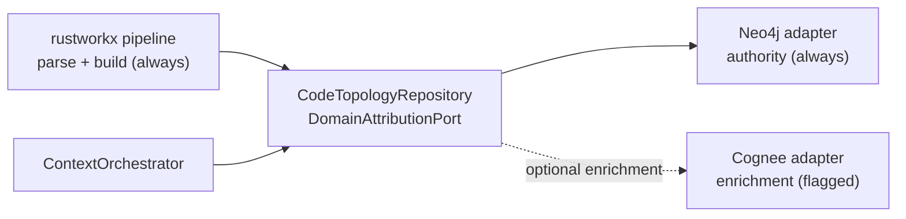
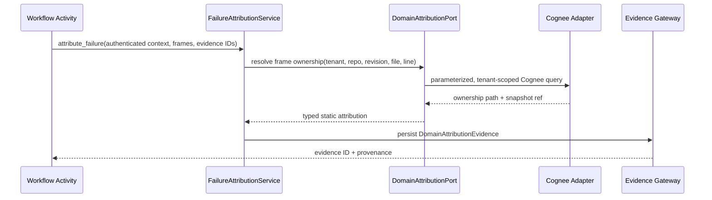

# Design: Optional Cognee Enrichment for Layer 3 Topology (Part 8)

## Context

The platform owns a precise, tenant-isolated static-code pipeline: `TreeSitterParser` (`infrastructure/evidence/code/parser.py`, 512 KB cap, `asyncio.to_thread()` offload) produces symbols; `CodeSymbolGraphBuilder` (`graphify_adapter.py`) builds an in-process `rustworkx` `PyDiGraph` with `DEFINES` / `CONTAINS` / `CALLS` edges; `pipeline.py` (`CodebaseGraphPipeline`) orchestrates per-repository builds plus `ACCESSES_TABLE` linkage from DDL/ORM evidence; `intelligence.py` (`TreeSitterCodeIntelligenceProvider`) enforces tenant allowlists and path-traversal guards; `micro.py` (`MicroSymbolResolver`) resolves sub-macro symbols on demand with deterministic `ASTNodeIdentity.create` IDs; `codeowners.py` + `git.py` (`pygit2`) handle ownership and provenance. Layer 3 persists macro-tier topology to one shared Neo4j 5.26 Community instance behind `TopologyIngestionPort`, with snapshot lifecycle `PENDING → INGESTING → READY | FAILED`, payload caps (20k files / 200k nodes / 200k edges), and all reads routed through the evidence gateway (`docs/IAP-implemenation-part5-v1.md` D5–D9). Part 7 adds the batch GitHub loader that feeds this path. `cognee` is not in `pyproject.toml`; no Cognee code exists in `src/`.

`docs/COGNEE-DESIGN.md` proposes using Cognee as the macro knowledge-graph manager, vector indexer, and query layer, fed by the custom Tree-sitter/Rustworkx pipeline via `call_graph.json`, with a `UnifiedCodeIntelligenceService` splitting macro queries (Cognee) from micro queries (custom engine). Its core insight is correct and adopted here: IAP's parsers stay the AST authority; Cognee must never re-parse raw files. Nearly every integration detail around that insight is rejected below, because the proposal as written would break tenant isolation, revision reproducibility, provenance gating, and the one-new-stateful-service budget that Parts 5–7 established.

No `docs/dev/architecture.md` exists in the project. When created, it should gain a "Cognee enrichment (optional)" section linking here rather than duplicating this document.

## References

- [Cognee ECL architecture](https://www.cognee.ai/how-cognee-builds-ai-memory) — Extract-Cognify-Load model and embedded defaults (SQLite + LanceDB + Ladybug/Kuzu); informs why Cognee is storage-heavy for our needs.
- [Cognee add API](https://docs.cognee.ai/core-concepts/main-operations/legacy-operations/add) — `add()` normalizes to text and hashes for dedup; informs why `add(nodes_payload)` + `cognify()` would LLM-extract our deterministic AST.
- [Cognee cognify API](https://docs.cognee.ai/python-api/cognify) — 6-task pipeline at ~2 LLM calls per chunk; informs the cost rejection of the proposal's ingest path.
- [Cognee search API](https://docs.cognee.ai/core-concepts/main-operations/legacy-operations/search) — 16 `SearchType`s; `*_COMPLETION` returns LLM-written strings while `CODE` reads only enola facts; informs the read-path restrictions.
- [Cognee code graph guide](https://docs.cognee.ai/guides/code-graph) — Deterministic enola-backed `get_code_graph_tasks` pipeline; informs the approved deterministic pattern.
- [Cognee custom data models](https://docs.cognee.ai/guides/custom-data-models) — `DataPoint` subclasses + `add_data_points` as the supported existing-graph import path; informs D2.
- [Cognee custom tasks and pipelines](https://docs.cognee.ai/guides/custom-tasks-pipelines) — `run_custom_pipeline` with "importing an existing graph" support; informs the adapter shape.
- [Cognee graph stores](https://docs.cognee.ai/setup-configuration/graph-stores) — Kuzu default, Neo4j recommended for production, FalkorDB community-only, NetworkX removed from core; informs D1/D4 and the FalkorDB deferral.
- [Cognee FalkorDB adapter](https://docs.cognee.ai/setup-configuration/community-maintained/falkordb) — Community maintenance tier; informs the licensing/ops rejection.
- [FalkorDB license](https://docs.falkordb.com/references/license) — SSPLv1 with a service trigger; informs the hosted-offering deferral.
- [Cognee vector stores](https://docs.cognee.ai/setup-configuration/vector-stores) — LanceDB default, Qdrant community-only; informs why no new vector store ships here.
- [Cognee multi-user mode](https://docs.cognee.ai/core-concepts/multi-user-mode/multi-user-mode-overview) — Datasets as physically-separated namespaces with uneven backend support; informs D3 and the Community-edition limits.
- [Cognee LLM providers](https://docs.cognee.ai/setup-configuration/llm-providers) — Both LLM and embedder default to OpenAI with fail-fast mismatch errors; informs the keyless-operation constraints.
- [Cognee local setup](https://docs.cognee.ai/guides/local-setup) — Ollama/Fastembed keyless paths; informs the pilot configuration.
- [Cognee no-LLM remember/recall](https://docs.cognee.ai/guides/no-llm-remember-recall) — GLiNER + lexical/CYPHER keyless operation; informs D4.

## Goals / Non-Goals

**Goals:**

- Give Cognee a single, narrow, optional role: enrichment queries over already-ingested Layer 3 topology, behind the existing ports, with zero authority over parsing, identity, tenancy, or conclusions.
- Preserve every Part 5 invariant: tenant-qualified identities, revision-pinned snapshots, gateway-routed reads, provenanced evidence, disposable indexes rebuildable from envelopes.
- Define the one supported write path (deterministic `DataPoint` pipeline, never LLM extraction of AST data) and the allowed read path (retrieval-only search types, never LLM completions into reasoning).
- Ship a benchmark gate so adoption is measured, with explicit triggers for full adoption, vector indexing, or removal.

**Non-Goals:**

- Replacing the Neo4j adapter, the `rustworkx` pipeline, `TreeSitterParser`, `MicroSymbolResolver`, CODEOWNERS resolution, or `pygit2` provenance with Cognee equivalents.
- Adding FalkorDB, LanceDB, Qdrant, Kuzu, or any new stateful service in any slice of this design.
- Requiring an LLM key or embedder download for topology ingestion or attribution to keep working.
- Letting Cognee search output reach the reasoner or `ConclusionGate` without a provenance envelope.
- Multi-user Cognee mode, per-dataset Neo4j databases, or cross-repository same-dataset paths.

## Decisions

### D1: One topology authority at a time; Cognee is enrichment-only behind a flag

**Decision:** The Neo4j adapter remains the sole Layer 3 topology authority. Cognee, if adopted, implements the same `CodeTopologyRepository` / `DomainAttributionPort` read contracts as an optional enrichment adapter selected by a capability flag. It never becomes a second write authority: no dual-write of snapshots, no parallel `READY` state, no Cognee-owned revision tracking.



The proposal's "Cognee as macro knowledge-graph manager" inverts this: it makes Cognee the store of record for the exported graph while the platform keeps parsing. That split creates two sources of truth for the same topology with no snapshot lifecycle on the Cognee side, no revision pinning, and no idempotency key — exactly the dual-authority failure Part 5 D9 exists to prevent.

**Alternative considered:** Full replacement of the Neo4j adapter with Cognee-managed storage. Rejected — it surrenders snapshot lifecycle, tenant-qualified constraints, and deterministic replay to a framework whose defaults (Kuzu/LanceDB/SQLite, LLM extraction) contradict all three.

---

### D2: The only supported write path is a deterministic DataPoint pipeline, never add plus cognify

**Decision:** If the pilot proceeds, AST data enters Cognee exclusively through `run_custom_pipeline` with `DataPoint` subclasses mapped from `ASTNodeIdentity` and edge inputs, written via `add_data_points`. The proposal's `await cognee.add(data=nodes_payload)` followed by `await cognee.cognify(dataset_name=...)` is prohibited for topology data: `add()` normalizes dicts toward text extraction and `cognify()` runs LLM graph extraction (~2 calls per chunk), which would probabilistically re-derive the deterministic structure the pipeline already built, at 6–10 LLM calls per episode-equivalent, while discarding deterministic IDs.

```python
# infrastructure/topology/cognee_adapter.py
from uuid import UUID

from cognee.infrastructure.engine import DataPoint
from pydantic import Field


class TopologySymbolPoint(DataPoint):
    """Deterministic projection of one ASTNodeIdentity. Identity is derived,
    never generated: the same (tenant, repo, revision, node_id) always maps
    to the same point, so re-ingest is idempotent by construction."""

    node_id: str = Field(description="ASTNodeIdentity.node_id as string")
    tenant_id: str = Field(description="Security partition, never a dataset name")
    repository_id: str = Field(description="Canonical repository identity")
    revision: str = Field(description="Immutable commit SHA")
    qualified_name: str = Field(description="Symbol qualified name")
    node_type: str = Field(description="TopologyNodeType value")
    file_path: str = Field(description="Normalized repo-relative path")
    start_line: int = Field(description="1-indexed start line")
    end_line: int = Field(description="1-indexed end line")
    ownership_path: list[str] = Field(default_factory=list)

    metadata: dict = {"index_fields": ["qualified_name"], "identity_fields": ["node_id"]}
```

Edges map to `DataPoint`-valued fields (field name as relationship label), mirroring the existing `CALLS` / `REFERENCES` / `ACCESSES_TABLE` vocabulary rather than inventing Cognee-side labels. `SearchType.CODE` is not used for this graph: it reads only enola facts, so custom-AST queries use `CYPHER` / `CHUNKS` / `CHUNKS_LEXICAL` retrieval types (see D5).

**Alternative considered:** The proposal's `add()` + `cognify()` path, and routing our AST through `get_code_graph_tasks`. Rejected — the first destroys determinism at LLM cost; the second is enola's own parser route, which re-parses raw files and bypasses our guards.

---

### D3: Tenancy is enforced in our layer with opaque server-derived datasets, never tenant-stamped payloads

**Decision:** The proposal stamps `ndata["tenant_id"]` / `ndata["repository_id"]` into node payloads and names datasets `f"{tenant_id}_{repository_id}"`. Neither is a security boundary: Cognee datasets are namespaces, not authorization, and string-interpolated tenant IDs in dataset names leak partition keys into logs and let any caller guess another tenant's dataset. Instead the adapter derives opaque dataset names server-side (hash of tenant, repository, revision — same convention as the existing `investigation_group_id` / `baseline_group_id` helpers), injects tenant scope on every call from the authenticated context, and rejects any read whose point `tenant_id` mismatches the caller. Multi-user Cognee mode is not enabled: on Neo4j Community (one database per server) it requires either Enterprise/Aura or one container per dataset (cap 6) — both are adoption triggers, not day-one commitments.



**Alternative considered:** Proposal's payload-stamping + interpolated dataset names, and enabling Cognee multi-user mode now. Rejected — stamping without enforcement is theater, interpolated names leak, and multi-user mode on Community edition cannot deliver per-dataset isolation.

---

### D4: No new stateful service and no mandatory embeddings in any slice

**Decision:** Cognee reuses the existing shared Neo4j (same single-database Community constraint as Graphiti and Layer 3, distinct label prefix) and ships graph-only: `CYPHER` / `CHUNKS_LEXICAL` retrieval with no embedding calls, so topology ingestion and attribution keep working with no LLM key and no model download. The proposal's implied stack (Neo4j-or-FalkorDB graph plus LanceDB-or-Qdrant vectors) would add up to two stateful systems and an embedder (OpenAI default, or ~750 MB GLiNER plus Fastembed locally) for queries the Neo4j adapter already answers. Vector indexing for Cognee content is deferred with a trigger (measured recall-quality gap on enrichment queries), and FalkorDB is deferred independently: SSPLv1 triggers on hosted service offerings, and its adapter is community-maintained outside core release testing.

**Alternative considered:** Adopting Cognee's default embedded stack (Kuzu + LanceDB + SQLite) or FalkorDB now. Rejected — three new stores for an optional enrichment path, plus a license trigger on any future hosted offering.

---

### D5: Reads are gateway-routed and completion-free

**Decision:** The proposal's `UnifiedCodeIntelligenceService` calls `cognee.search()` directly and returns the result to the agent, bypassing the evidence gateway (authorization, sanitization, provenance, persistence) and feeding LLM-written `*_COMPLETION` strings into reasoning. Instead every Cognee read flows through `DomainAttributionPort` into `FailureAttributionService`, then into `DomainAttributionEvidence` via the gateway — the same sequence Part 5 D7 mandates for Neo4j reads. Only retrieval-only search types are allowed (`CHUNKS`, `SUMMARIES`, `CHUNKS_LEXICAL`, `CYPHER`, `CODE` where enola-backed); `*_COMPLETION` output is never evidence and never reaches the reasoner or `ConclusionGate`.

**Alternative considered:** The proposal's facade with direct `cognee.search` for macro questions. Rejected — it bypasses every platform boundary that makes machine-generated graph content safe to reason over.

---

### D6: Cognee writes track snapshot lifecycle or they do not happen

**Decision:** Cognee enrichment is keyed by `(tenant_id, repository_id, revision, payload_hash)` and written only for `READY` snapshots. Re-ingest of the same key is a replay (deterministic point IDs, no duplicates); a new revision is a new dataset version. The `call_graph.json` per-repo artifact in the proposal (written to `repo_root`, no tenant or revision in path, local-disk durability) is replaced by the existing manifest + snapshot audit rows as the only record of what was indexed. Retention collection of old snapshots drops their Cognee projections too; the adapter exposes a `drop_projection()` for the janitor.

**Alternative considered:** Proposal's `export_graphify_format` artifact as the Cognee feed contract. Rejected — undurable, unnamespaced, and disconnected from snapshot state.

---

### D7: Benchmark-gated rollout in three slices with a removal trigger

**Decision:** Slice 0 adds no `cognee` dependency: a benchmark harness comparing Neo4j-adapter answers against expected attribution on a fixed fixture set (nested symbols, overloads, cross-repo calls, `ACCESSES_TABLE` hops), recording precision, latency, and cost. Slice 1 (only if Slice 0 shows a material gap on multi-hop/impact queries) adds the optional adapter behind `IAP_COGNEE_ENABLED=false` default, one pilot repository, graph-only. Slice 2 hardens (janitor hookup, staleness dashboard contribution, ops doc). A removal trigger is defined alongside the adoption triggers: if Slice 1 shows no statistically significant improvement on the benchmark after the pilot window, the adapter is deleted rather than maintained as a second query path.

## Data Storage

No new Postgres tables and no new Neo4j constraints in any slice. Cognee projections live in the existing shared Neo4j, labeled with the `DataPoint` subclass name (`TopologySymbolPoint`) — Cognee's own label, distinct from Layer 3 (`ASTNode`, `SourceFile`) and Graphiti namespaces — in the same single Community database. Verified live (cognee 1.6.1): 13/13 fixture points written graph-only, replay idempotent (same hash, stable count). All projection content is a disposable index: rebuildable from `ASTTopologyPayload` envelopes at any time, dropped on snapshot collection. Postgres audit rows gain no columns; the manifest records a `cognee_projected: bool` per snapshot line operationally (manifest format owned by the Part 7 loader).

## Data Structures

Input and output shapes reuse domain models verbatim: `ASTTopologyPayload` in, `StaticOwnershipResult` / `DomainAttributionResult` out. The only new structures are the `TopologySymbolPoint` `DataPoint` subclass (D2) and a pilot-only adapter result recording `dataset`, `point_count`, `edge_count`, and `projection_hash` for audit parity with `TopologyIngestionResult`. No new API request/response models. The pilot CLI lives in `scripts/cognee_pilot.py` (Part 8 owned) — the Part 7 loader knows nothing about Cognee; the pilot reuses its payload builder as a library.

## Interfaces

### Configuration

| Variable | Default | Purpose |
|---|---|---|
| `IAP_COGNEE_ENABLED` | `false` | Master switch; production startup fails if `true` without a reachable Neo4j and the adapter extra installed |
| `IAP_COGNEE_DATASET_SALT` | empty (dev only) | Salt for opaque dataset derivation; production requires a set value |
| `IAP_COGNEE_ALLOW_COMPLETION` | `false`, non-overridable to `true` in code paths feeding reasoning | Guardrail constant, not an operator knob |

### CLI (`scripts/cognee_pilot.py`, Part 8 owned)

| Command | Arguments | Description |
|---|---|---|
| `cognee_pilot.py --repo <owner/name>` | `--tenant-id`, `--revision` (default: default-branch HEAD), `--checkout` (offline override) | Fetch (or reuse checkout), rebuild the payload with the Part 7 builder, project through the Cognee adapter |
| `cognee_pilot.py --drop` | `--tenant-id`, `--repository-id`, `--revision` | Drop one projection (retention path) |

### No new REST, MCP, TUI, or GUI surfaces

Deliberately none. Enrichment is operator-piloted and read through existing attribution evidence; there is no Cognee query endpoint.

## Implementation Detail

Slice 0 (no new dependency): `tests/benchmarks/test_topology_enrichment.py` with the fixed fixture set, asserting current-adapter precision/latency baselines and recording a results JSON the pilot compares against. Slice 1: `infrastructure/topology/cognee_adapter.py` implementing `CodeTopologyRepository` + `DomainAttributionPort` reads and a `project_snapshot(payload)` write, constructed only when `IAP_COGNEE_ENABLED=true` with `TopologyConfig` Neo4j settings shared; `run_custom_pipeline` tasks map payload nodes/edges to `TopologySymbolPoint` batches bounded by `TopologyConfig.ingestion_batch_size`, each batch in one transaction, retries only on recognized transient Neo4j errors. Slice 2: retention-janitor `drop_projection()` wiring, `excluded_stale_count`-style enrichment accounting in retrieval telemetry, and pilot evaluation report. `pyproject.toml` gains `cognee` with the `neo4j` extra only in Slice 1, pinned, with the import isolated to the adapter module so non-pilot installs never load it.

## Migrations

None for Postgres and none for Neo4j constraints in any slice. The pilot projects into the existing database under its label prefix; no backfill (existing `READY` snapshots gain projections only when explicitly re-piloted); removal means deleting the adapter module plus its label-prefixed nodes for pilot datasets, leaving Layer 3 data untouched.

## Testing Philosophy

### Benchmark fidelity

The Slice 0 fixture set is the contract for every later claim: nested functions, overloaded names, same-name cross-repository symbols, unresolved and external calls, and SQL-linked symbols must each have expected ownership answers recorded before any Cognee code exists, so the pilot cannot grade its own homework.

### Tenant isolation

Identical payloads under two tenants project to different opaque datasets; reads with swapped tenant contexts return nothing; dataset names reveal no tenant or repository strings under inspection.

### Determinism and replay

Projecting the same payload twice yields identical point IDs and counts with no duplicates; projecting a new revision leaves the old projection queryable until retention collects it; a failed projection never marks its snapshot and never becomes readable.

### Completion containment

Negative tests assert that `*_COMPLETION` search types are unreachable from the adapter (unsupported enum raises before any network call) and that gateway rejection of unprovenanced enrichment content is exercised.

### Failure behavior

Neo4j down, missing adapter extra, and `IAP_COGNEE_ENABLED=true` without dataset salt each fail pilot startup loudly; none degrades to unscoped or cross-tenant reads.

## Documentation Plan

### `docs/IAP-implementation-part8-knowledge-v1.md`

**Audience:** Architects and implementers

This document — authority for Cognee's optional enrichment role; keep the write/read path restrictions, benchmark gate, and trigger conditions current.

### `docs/dev/topology.md` changes

**Audience:** Developers and operators

Append a "Cognee pilot" section: enabling the flag, running `scripts/cognee_pilot.py --repo` on one repo, reading the benchmark comparison, and deleting pilot projections. Link here for rationale; do not duplicate decision text.

### `docs/dev/architecture.md` changes

No `docs/dev/architecture.md` exists in the project. When created, show the Cognee adapter as a dashed optional read branch off the topology ports (never on the write path), with a note that enrichment output is gateway-provenanced before reasoning.

## Risks / Trade-offs

### LLM-cost creep through the back door

**Risk:** Cognee's normal `add`/`cognify`/`*_COMPLETION` surface makes it easy for a future contributor to route topology data through LLM extraction or completions, converting deterministic indexing into per-episode-style cost at incident volume.

**Mitigation:** The adapter exposes only the deterministic pipeline and retrieval-only search types; completion types raise by construction; the dependency stays Slice-gated behind the benchmark and the flag default-off.

### Shared-Neo4j noisy neighbors, third tenant

**Risk:** Cognee projections join Graphiti groups and Layer 3 labels in one Community database with no resource isolation; a runaway pilot ingest degrades attribution and knowledge reads together.

**Mitigation:** Per-dataset quotas at the application layer, bounded batch transactions, pilot limited to one repository, and the existing Enterprise/Aura upgrade trigger now covering three consumers instead of two.

### Community-adjacent dependency surface

**Risk:** Even the approved path leans on Cognee-Neo4j integration behavior that upstream may move to community maintenance (as already happened to FalkorDB, Memgraph, Qdrant, and NetworkX), stranding the adapter on unmaintained glue.

**Mitigation:** Isolate all Cognee imports to one adapter module behind ports; pin the version; define the removal trigger up front so abandonment costs one deletion, not a migration.

### Benchmark theater

**Risk:** A pilot benchmark tuned to queries Cognee favors (fuzzy semantic hops) declares victory while line-level attribution precision — the path that actually feeds `ConclusionGate` — regresses silently.

**Mitigation:** The Slice 0 fixture set weights exact-ownership and revision-reproducibility cases above semantic recall, and the adoption rule requires no regression on those before any enrichment win counts.

## Deferred Items and Adoption Triggers

### Full Cognee adoption as enrichment standard

Deferred until Slice 1 shows statistically significant multi-hop/impact-query wins with zero exact-attribution regression across the pilot window. Trigger: benchmark report plus operator sign-off; then enable per-application with quotas.

### Cognee vector indexing

Deferred until a measured recall-quality gap on enrichment queries implicates lexical/CYPHER retrieval specifically. Trigger: benchmark failure analysis naming retrieval (not coverage) as the cause; then add Fastembed-local embeddings only, still no LLM key requirement.

### FalkorDB backend

Deferred indefinitely for platform-operated paths: SSPLv1 service trigger plus community-only adapter status. Trigger: written licensing clearance plus core-tier adapter support; self-hosted customer deployments may revisit sooner.

### Cross-repository same-dataset paths

Deferred until a real investigation needs corroborated cross-repo traversal that per-dataset queries cannot answer. Trigger: `INCONCLUSIVE` attributions on ISSUE-5 trace hops where the missing link is enrichment coverage, not evidence; then design a dedicated cross-repo dataset policy with its own threat review.

### Cognee multi-user mode and per-dataset databases

Deferred until per-dataset isolation is a measured requirement rather than a theoretical one. Trigger: noisy-neighbor pain or an isolation audit finding; then evaluate Enterprise/Aura against the documented cost comparison.
