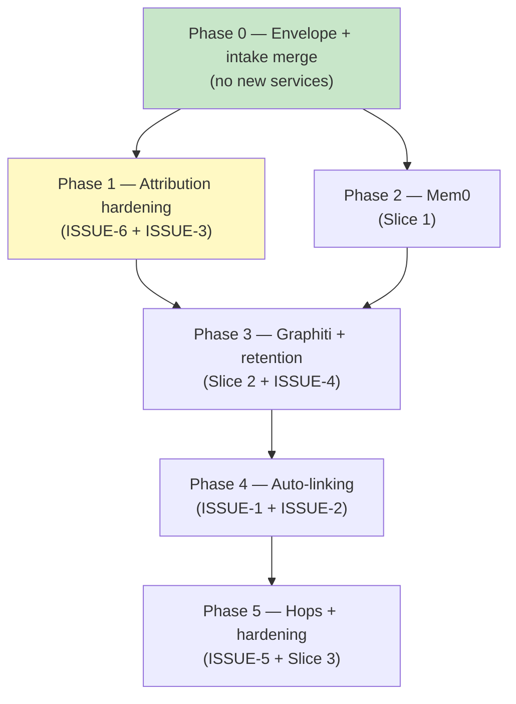

# Implementation Plan: Knowledge Layer (Part 6) + Part 5 Open Issues

Companion to `docs/IAP-implementation-part6-knowledge-v1.md` (design) and
`docs/IAP-implemenation-part5-issues.md` (ISSUE-1…ISSUE-6). This plan orders
all remaining work into six phases by dependency, not by document order.
Each phase is independently shippable and gated.

Reading guide: P0 is the foundation everything needs. P1 and P2 are
independent of each other (different subsystems) and may run in parallel.
P3 needs both (shared-Neo4j load story). P4 needs P3's provenance
conventions; P5 needs everything.

Size key: **S** ≤ 2 days, **M** ≈ 3–5 days, **L** ≈ 1–2 weeks. Sizes assume
one engineer fluent in the codebase; they are ordering aids, not commitments.

---

## Phase 0 — Envelope + intake merge (Slice 0, no new services) · M

**Why first.** Every later phase reads or writes envelopes, sessions, or the
intake merge path. Delivers the cross-tenant merge loop and the
capture→refresh→reuse loop with zero infrastructure.

**Scope.**

1. `domain/knowledge/models.py` (new): `RefreshPolicy`, `ArtifactStatus`,
   `ArtifactVisibility`, `ReverifySpec`, `KnowledgeArtifact` (with
   kind-gated `SHARED_CODE_ISSUE` validator, secret-pattern rejection),
   `InvestigationSession`, `KnowledgeContext` read model.
2. `domain/knowledge/fingerprint.py` (new): canonical code-issue
   fingerprint builder — static fields only, deterministic, with a
   two-tenant determinism unit test beside it.
3. `infrastructure/persistence/models.py`: `KnowledgeArtifactORM`
   (JSONB `store_refs`, `supersedes_id` self-FK, `visibility`,
   `code_issue_fingerprint`) + `InvestigationSessionORM` (session number,
   tenant, refs, status); both RLS on `tenant_id`.
4. Alembic migration: both tables, `(tenant_id, application_id, kind,
   status)` composite, partial `ACTIVE` index, lookup index on
   `code_issue_fingerprint`.
5. `ports/knowledge/` (new): `ArtifactRepository`, `KnowledgeCapturePort`,
   `KnowledgeRetrievalPort`.
6. `application/knowledge/capture.py` + `retrieve.py` (new): distillation
   from evidence/conclusion/config snapshots; validity gating with inline
   conditional re-verify (bounded retries → supersede-or-quarantine).
7. `application/worker/activities.py` + `workflows.py`:
   `retrieve_knowledge_activity` before `reason_activity`,
   `capture_knowledge_activity` after conclude. Capture failure degrades to
   log + metric, never fails the investigation.
8. Intake: `POST /v1/intake/errors` (service-identity auth, per-tenant rate
   limit) with fingerprint merge-or-fork (D8: most-recent match wins, closed
   targets reopen via standard transition); response carries
   `{investigation_id, session_number, merged, code_issue_fingerprint}`.
9. Human APIs: `GET /v1/investigations/{id}/knowledge` (redacted
   placeholders for other tenants' sessions), `GET /v1/knowledge/search`
   (tenant-scoped).
10. `ApplicationConfig`: `KnowledgeConfig` section (all adapters default
    disabled; ports resolve to no-op).

**Acceptance criteria.**

- Two tenants, same static inputs → same fingerprint, merged investigation
  with sessions 1 + 2; prior conclusions untouched; closed target reopens
  with reason recorded.
- Tenant B retrieves shared static attribution but never tenant A's session
  rows/artifacts (negative tests with spoofed/omitted scope).
- Reasoner context contains only validity-holding artifacts;
  `excluded_stale_count` accounts for the rest.
- Fingerprint containing any tenant-derived input is impossible by
  construction (validator + determinism test).

**Tests.** Envelope validators; merge/fork/reopen; session redaction;
validity state machine (match/mismatch/endpoint-down/TTL); intake e2e;
regression: existing 285+ tests stay green.

---

## Phase 1 — Attribution hardening + ingestion diet (ISSUE-6 + ISSUE-3) · M

**Why now.** Both touch the attribution/ingestion code paths while they are
still small, and ISSUE-3 must land *before* Graphiti shares the Neo4j
database (Phase 3) — cutting AST node volume first de-risks the shared-DB
decision. Independent of Phase 2; may run in parallel.

**Scope (ISSUE-6, S).**

1. `CODEOWNERS` (or equivalent ownership-file) tier in both topology
   adapters between repository fallback and `UNATTRIBUTED`, with
   macro-attribution marking and confidence cap (≤ 0.3).
2. Review `FailureAttributionService.attribute_failure` `INCONCLUSIVE`
   sites against "only when no profile or file mapping exists"; convert
   premature ones to fallback tiers with recorded limitations.
3. `ConclusionGate` semantics unchanged (macro evidence still gated).

**Scope (ISSUE-3, M).**

1. Single declarative macro-eligibility mapping over `TopologyNodeType`;
   `granularity` marker on ingested `ASTNode` rows.
2. Ingestion paths (both adapters) persist macro tier only; micro
   line-range resolution moves to on-demand parsing against the checked-out
   revision within the existing tenant-scoped provider path (bounded: file
   size cap, timeout).
3. Attribution tries macro first, drops to micro on insufficient match,
   records resolving tier in provenance.

**Acceptance criteria.**

- Tier-walk test (node → file → CODEOWNERS → repository) with recorded
  fallback levels; macro cap enforced; gate thresholds still apply.
- Fixture revision ingests an order of magnitude fewer nodes with no
  attribution-accuracy regression on the evaluation set.
- Resolving tier present in every attribution provenance record.

---

## Phase 2 — Mem0 (Slice 1) · M

**Why here.** Independent track after Phase 0; needs only the envelope +
retrieval contracts, not Neo4j.

**Scope.**

1. `CREATE EXTENSION vector` migration (separate; document superuser /
   pre-provisioned-image requirement for operators).
2. `KnowledgeConfig.mem0` section (enabled flag, model, embedder, dims,
   `infer` defaults, budget caps).
3. `infrastructure/knowledge/mem0_adapter.py` implementing
   `KnowledgeStorePort`: tenant-namespaced `user_id`
   (`t_<tenant>__analyst_<id>`), mandatory `tenant_id`/`investigation_id`/
   `artifact_id` metadata on every write, `infer=False` verbatim path for
   mechanical flag key=value facts, LLM extraction for interpretations only.
4. Retrieval activity: preference/micro-fact recall merged into
   `KnowledgeContext`.
5. Minimal precision eval: fixture set of preferences + facts, recall@k
   measured before calling the slice done.

**Acceptance criteria.**

- Filter-matrix integration tests pass against real pgvector (including the
  `get_all` + logic-wrapper trap and the `user_id AND agent_id` empty-set
  trap — both documented vendor pitfalls).
- Tenant isolation negatives (omitted/spoofed filters) all denied.
- Recall eval recorded as the baseline future slices must not regress.

---

## Phase 3 — Graphiti + retention ops (Slice 2 + ISSUE-4) · L

**Why together.** Both are Neo4j operations work; retention must exist
before production snapshots accumulate, and Graphiti is the first
production-scale writer to the shared database.

**Scope (Slice 2).**

1. `neo4j:5.26` container in `docker/docker-compose.yml` + health checks +
   backup/restore runbook stub.
2. `KnowledgeConfig.graphiti` section (enabled, endpoint, `SEMAPHORE_LIMIT`,
   per-investigation episode cap default 50, per-episode byte cap).
3. `infrastructure/knowledge/graphiti_adapter.py` implementing
   `TemporalKnowledgePort`: pinned `graphiti-core>=0.30.2`, server-derived
   opaque `group_id`s (`inv_<uuid>`, `base_<tenant>_<app>`), per-group
   serialized ingest, per-event `reference_time` (never ingest time),
   valid-time-filtered reads, episode payload truncation with Elastic
   pointers for the remainder.
4. Graph-schema migration step for `group_id` composite constraints/indexes,
   mirroring the Layer 3 approach.

**Scope (ISSUE-4).**

1. Retention policy in the design doc: pin open/SLA investigations, HEAD +
   bounded window otherwise.
2. Cleanup job as a Temporal scheduled workflow: deletes only unpinned,
   fully-ingested snapshots, marks audit rows collected, idempotent under
   retry.
3. Post-collection readability proof for concluded investigations.

**Acceptance criteria.**

- Contract tests against real Neo4j; concurrent same-group ingest
  serializes without entity-resolution races; point-in-time reads correct.
- Cleanup deletes only collectible snapshots; pinned untouched; concluded
  investigations still interpretable afterward.

---

## Phase 4 — Auto-linking (ISSUE-1 + ISSUE-2) · M

**Why here.** Needs the provenance conventions from Phase 3 (every edge
must carry query fingerprint + adapter version) and benefits from the
Phase 1 ingestion diet (fewer nodes to resolve against).

**Scope.**

1. New pipeline/builder step mapping `find_database_operations`
   `CodeLocation`s to enclosing symbols via graph node ranges, then
   `link_code_to_tables`; unambiguous-only, tenant-scoped, debug-logged
   skips.
2. Wire into the default pipeline path (preferred — single authority for
   edge creation). The evidence-gateway-operation alternative from ISSUE-2
   stays documented but unimplemented unless a per-investigation trigger
   need appears.

**Acceptance criteria.** Per ISSUE-1/ISSUE-2: correct edges on fixture
repo+DDL, no edges for unknown tables or ambiguous names, integration test
on real temp repo.

---

## Phase 5 — Cross-repo hops + hardening (ISSUE-5 + Slice 3) · L

**Why last.** Touches the most moving parts (trace evidence, registry,
attribution policy, janitor, dashboard) and depends on every prior slice's
contracts being stable.

**Scope (ISSUE-5).**

1. `ROUTE`/`MESSAGE_HANDLER`/client-callsite hop in
   `FailureAttributionService` via OTel trace headers + endpoint metadata.
2. Target resolution through `RepositoryRegistryPort` (extend the registry
   with service-name → application → repository mapping if missing).
3. Hop provenance (span IDs, both revisions); no corroboration → no hop,
   single-repository result stands.

**Scope (Slice 3).**

1. Supersession janitor (TTL → `EXPIRED` schedule).
2. Conditional re-verify wiring against live flag/config sources (assumed
   readable — no human-attestation path).
3. Staleness dashboard (`excluded_stale_count` trends, quarantine queue).
4. `code_refs` → Layer 3 join in the reasoner context.
5. Retrieval-precision evaluation gate: hardening is done only when
   measured precision meets the bar set in Phase 2.

**Acceptance criteria.** Per ISSUE-5 and Slice 3: cross-repo attribution
with corroboration, single-repo without, tenant-isolated traces, janitor +
dashboard live, precision gate passed.

---

## Cross-cutting rules (every phase)

- **Contracts first:** ports and domain validators land before adapters in
  each phase; in-memory fakes prove contracts before real backends.
- **Bootstrap discipline:** every new dependency wires through the shared
  production composition root, fails hard when marked required, exposes a
  readiness probe, and shuts down gracefully. An unwired adapter is an
  incomplete phase.
- **Migrations:** Alembic, same chain; RLS on every tenant-owned table;
  upgrade + downgrade round-trip verified on Postgres 16 (as done for 004).
- **Docs:** each phase updates `docs/dev/knowledge-ops.md` and
  `docs/dev/knowledge-artifacts.md` (created in Phase 0) plus the part-6
  design doc's rollout status.
- **Quality gates (all green before phase sign-off):** `uv run ruff check
  src tests migrations` · `uv run ruff format --check src tests migrations`
  · `uv run mypy src/investigation_agent_platform` (strict, 0 errors) ·
  `uv run pytest -q` (no regressions + new phase tests) · `uv run bandit
  -r src -x tests -q -ll` · `uv run pip-audit` · `uv build`.

## Explicitly out of scope

Mem0 Platform, Zep managed, Cognee-as-engine (all deferred with triggers in
the part-6 doc); ad-hoc cross-tenant search (only D8 merge is sanctioned);
raw payload storage in knowledge stores; retroactive extraction of
pre-existing investigations.
