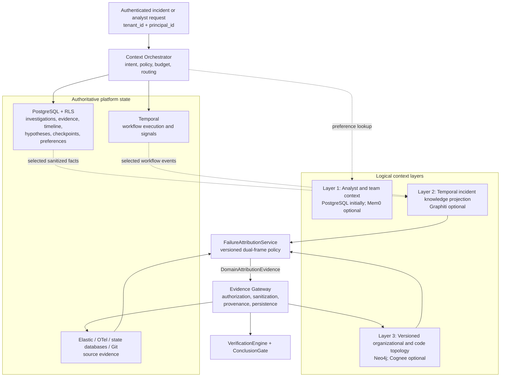
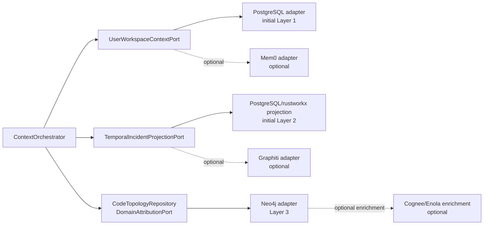
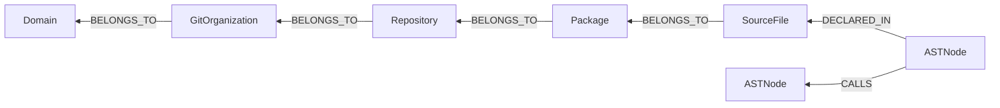
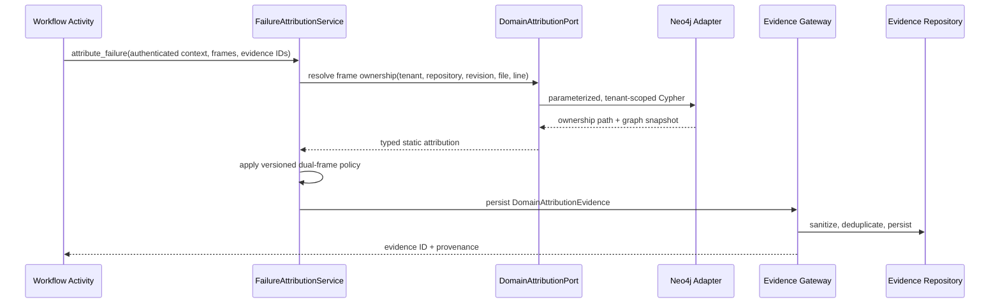
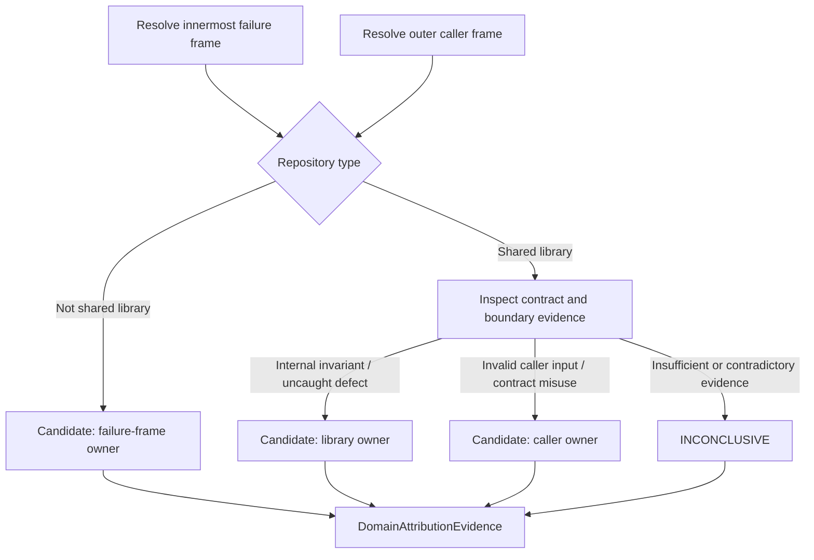

# Design: Context Layers and Domain Attribution

## Context

The Investigation Agent Platform already has authoritative boundaries for identity, orchestration, evidence, and durable state:

- `tenant_id` is the authenticated security partition and is enforced through repository contracts and PostgreSQL row-level security.
- `application_id` selects a tenant-owned application profile and its provider configuration.
- `investigation_id` is the durable case identity used by evidence, hypotheses, timelines, checkpoints, findings, and workflow activities.
- Temporal owns workflow execution history and control signals.
- PostgreSQL owns investigation state, evidence, hypotheses, timelines, relationships, checkpoints, authorization records, and audit records.
- The evidence gateway owns provider routing, action authorization, query policy, sanitization, provenance, persistence, and bounded execution.
- Tree-sitter, Git, and `rustworkx` provide the current static-code and bounded graph-processing capabilities.

Static code structure alone cannot establish root cause. Failures propagate through runtime calls, shared-library boundaries, state changes, queues, and asynchronous workflows. The platform therefore uses three **logical context layers**, but the layers do not imply three mandatory vendor products or three new sources of truth.



The architecture intentionally separates authority from projections. Mem0, Graphiti, Cognee, Neo4j, and FalkorDB must never become implicit authorities for authentication, workflow recovery, raw evidence, or conclusion publication.

## References

- [Mem0: How it works](https://docs.mem0.ai/core-concepts/how-it-works) — Describes persistent extracted memory and retrieval, informing its optional use for analyst and team preferences.
- [Mem0 platform versus OSS](https://docs.mem0.ai/platform/platform-vs-oss) — Clarifies feature and tenancy differences between managed and open-source deployments.
- [Graphiti overview](https://help.getzep.com/graphiti/getting-started/overview) — Defines Graphiti as a dynamic, bitemporal context graph rather than a lossless trace store.
- [Graphiti graph namespacing](https://help.getzep.com/graphiti/core-concepts/graph-namespacing) — Confirms that `group_id` is namespacing and does not replace application authorization.
- [Cognee code graph](https://docs.cognee.ai/guides/code-graph) — Describes Cognee's deterministic code-graph capability and its appropriate role as optional enrichment.
- [Cognee graph stores](https://docs.cognee.ai/setup-configuration/graph-stores) — Describes supported graph backends and operational choices.
- [Neo4j Python driver](https://neo4j.com/docs/python-manual/current/) — Defines async sessions, transaction functions, retries, and parameterized Cypher usage.
- [Temporal workflow execution](https://docs.temporal.io/workflow-execution) — Establishes Temporal as the workflow execution and event-history authority.

## Goals / Non-Goals

**Goals:**

- Preserve `tenant_id` as the only authoritative tenant-security partition.
- Treat `investigation_id` as the platform's case identity and `application_id` as the target profile identity.
- Add a tenant-scoped, revision-aware organizational and static-code topology bounded context.
- Resolve source locations and stack frames to owning domains with reproducible provenance.
- Support dual-frame shared-library attribution using both runtime evidence and static ownership.
- Integrate topology queries through existing authorization, evidence, provenance, and verification boundaries.
- Keep vendor products replaceable behind ports.
- Deliver the capability in vertical slices, proving contracts before adding operational dependencies.

**Non-Goals:**

- Replacing PostgreSQL as the source of truth for investigations, evidence, timelines, hypotheses, checkpoints, or findings.
- Replacing Temporal as the workflow execution authority.
- Storing active hypotheses or conclusion truth in Mem0.
- Treating Graphiti as the raw telemetry, trace, or workflow-history store.
- Running both Cognee and custom AST-to-Neo4j ingestion as independent topology authorities.
- Allowing callers, models, or graph records to supply authoritative tenant identity.
- Implementing a generic enterprise knowledge platform before topology attribution has proven value.

## Decisions

### D1: Preserve the established identifier model

**Decision:** The context architecture uses the platform's current identifiers and introduces only a canonical repository identity.

| Concept | Identifier | Authority |
| --- | --- | --- |
| Tenant security partition | `tenant_id` | Verified JWT and trusted internal workflow context |
| Optional workspace | `workspace_id` under `tenant_id` | Future explicit domain concept; not currently introduced |
| Investigation or case | `investigation_id` | PostgreSQL investigation aggregate |
| Target application | `application_id` | Tenant-owned application profile |
| Workflow execution | persisted `workflow_id` and `run_id` | Temporal |
| Repository | `repository_id` | New tenant-owned repository registry |
| Source revision | immutable `commit_sha` | Git/topology snapshot |

External APIs may call an investigation a "case," but `case_id` must be an alias for `investigation_id`; it must never replace `tenant_id` in authorization or partition keys.

**Alternative considered:** Introduce `case_id` and `workspace_id` as new universal keys. Rejected because it creates competing identities, breaks current repository and RLS contracts, and conflates a tenant with one investigation.

---

### D2: Keep the three layers logical and vendor-neutral

**Decision:** The platform defines three context ports. Vendor products are optional adapters selected only when their measured value justifies their operational cost.



**Alternative considered:** Adopt Mem0, Graphiti, and Cognee simultaneously as mandatory infrastructure. Rejected because it duplicates current state, adds three evolving systems and several data stores, and lacks evidence that current scale or query load requires them.

---

### D3: Limit Layer 1 to non-authoritative analyst and team context

**Decision:** Layer 1 stores presentation preferences, durable team guidance, terminology, ownership hints, and analyst interaction preferences. PostgreSQL is the initial implementation. Mem0 may later implement `UserWorkspaceContextPort` for conversational extraction and semantic recall.

Layer 1 must not own active hypotheses, evidence, authorization decisions, workflow checkpoints, or final conclusions. Preferences may influence routing or presentation but cannot override evidence, policy, or the conclusion gate.

**Alternative considered:** Store active hypotheses in Mem0. Rejected because hypotheses are already durable investigation entities with transitions, evidence references, tenant isolation, and checkpoint behavior.

---

### D4: Treat Layer 2 as a derived temporal knowledge projection

**Decision:** PostgreSQL evidence/timeline records, OpenTelemetry traces, Elasticsearch logs, and Temporal histories remain authoritative. Layer 2 projects selected, sanitized records into a temporal graph for semantic and point-in-time retrieval. Graphiti is an optional implementation of `TemporalIncidentProjectionPort`.

Graphiti `group_id` values must be opaque, server-derived namespaces such as a hash of `(tenant_id, investigation_id)` and must not be accepted from callers. Application authorization remains mandatory before every projection or query.

**Alternative considered:** Make Graphiti the investigation timeline and hypothesis source of truth. Rejected because this would duplicate PostgreSQL and Temporal state and make deterministic workflow replay and recovery dependent on an LLM-extracted graph.

---

### D5: Make Layer 3 a separate topology bounded context

**Decision:** Layer 3 owns versioned organizational and static-code topology only. It is accessed through application ports; Neo4j is the first durable adapter. Cognee Code Graph may later enrich or replace the custom code indexing path after benchmarking, but the platform must have one topology authority at a time.

Ownership relationships point from the owned child to its owning parent:



`SourceFile` is explicit because AST parser output is file-oriented. `Package` is optional and language-aware; a directory is not automatically treated as a package.

**Alternative considered:** Persist the existing `rustworkx` graph directly. Rejected because `rustworkx` is an efficient in-process algorithm library, not a durable, multi-process, revision-aware graph store.

---

### D6: Define stable, tenant-qualified, revision-aware identities

**Decision:** Every tenant-owned topology node includes `tenant_id`. Every source node includes `repository_id` and immutable `revision`. AST node IDs are deterministic over:

```text
tenant_id
repository_id
revision
normalized_file_path
qualified_symbol_name
node_type
start_line/start_column
end_line/end_column
```

Neo4j uniqueness constraints enforce tenant-qualified identities. Every `MATCH` and `MERGE` includes tenant and revision predicates from the first graph operation.

**Alternative considered:** Merge AST nodes on `file_path + symbol name`. Rejected because overloaded, nested, same-name, cross-repository, and historical symbols collide.

---

### D7: Route topology through ports and the evidence gateway

**Decision:** The application layer defines `TopologyIngestionPort`, `CodeTopologyRepository`, `RepositoryRegistryPort`, and `DomainAttributionPort`. Neo4j and Cypher remain infrastructure details. Attribution queries are authorized and normalized through the evidence gateway before their results can influence reasoning.



**Alternative considered:** Construct a Neo4j driver directly inside Temporal activities. Rejected because it bypasses provider routing, authorization, policy, testing seams, and configuration validation.

---

### D8: Implement dual-frame attribution as a versioned application policy

**Decision:** `FailureAttributionService` resolves both the failure frame and caller frame, then applies an explicit, versioned policy. Static ownership identifies candidates; runtime evidence establishes fault semantics.



The result records candidate and alternative domains, attribution classification, confidence, supporting and contradicting evidence IDs, graph snapshot, source revision, matched nodes, and policy version. It cannot itself finalize a conclusion; `ConclusionGate` remains authoritative.

**Alternative considered:** Encode attribution directly in a Cypher query. Rejected because graph topology cannot determine whether a library invariant failed or a caller violated a contract.

---

### D9: Use snapshot ingestion with explicit partial-failure behavior

**Decision:** Ingestion is idempotent by `(tenant_id, repository_id, revision, payload_hash)`. A graph snapshot moves through `PENDING → INGESTING → READY` or `FAILED`. Attribution queries only use `READY` snapshots. Batched writes run in bounded transactions and are retryable only for recognized transient Neo4j failures.

`MERGE` is necessary but not sufficient. The adapter also installs uniqueness constraints, verifies all edge endpoints, records parser and schema versions, detects stale nodes, and stores ingestion error summaries without raw source content.

**Alternative considered:** Merge the payload directly with no snapshot record. Rejected because partial retries can leave mixed revisions and make historical attribution irreproducible.

## Data Storage

Layer 3 uses Neo4j for static topology and PostgreSQL for ingestion/audit metadata. This split allows operational reporting and recovery without querying every tenant graph.

### Neo4j node keys

| Label | Unique tenant-qualified key | Required properties |
| --- | --- | --- |
| `Domain` | `(tenant_id, domain_id)` | `name`, `owner_team_id`, ownership validity |
| `GitOrganization` | `(tenant_id, git_org_id)` | `name`, provider |
| `Repository` | `(tenant_id, repository_id)` | locator, type, default branch |
| `TopologySnapshot` | `(tenant_id, repository_id, revision)` | status, schema/parser version, payload hash |
| `Package` | `(tenant_id, repository_id, revision, path)` | language/package type |
| `SourceFile` | `(tenant_id, repository_id, revision, path)` | content hash, language |
| `ASTNode` | `(tenant_id, repository_id, revision, node_id)` | qualified name, type, range, signature hash |

### Neo4j relationships

| Relationship | Direction | Required metadata |
| --- | --- | --- |
| `BELONGS_TO` | child → owner | ownership source, effective timestamps |
| `DECLARED_IN` | AST node → source file | revision |
| `IN_PACKAGE` | source file → package | revision |
| `PARENT_OF` | parent AST node → child AST node | revision |
| `CALLS` | caller AST node → callee AST node | call-site file/line, resolution status, confidence |
| `REFERENCES` | AST node → referenced node | reference type, location, confidence |
| `ACCESSES_TABLE` | AST node → database-resource node | operation type, sanitized query fingerprint |

### PostgreSQL topology audit records

The implementation should add a tenant-scoped topology snapshot record containing:

- `id: UUID`
- `tenant_id: str`
- `application_id: str`
- `repository_id: str`
- `revision: str`
- `schema_version: str`
- `parser_version: str`
- `payload_hash: str`
- `status: PENDING | INGESTING | READY | FAILED`
- node and edge counts
- bounded error summary
- `created_at`, `started_at`, and `completed_at`

No raw source, AST payload, secrets, or credentials are stored in the audit row.

## Data Structures

### Ingestion input

`ASTTopologyPayload` is a Pydantic v2 model with `frozen=True` and `extra="forbid"`. It contains:

- schema and parser versions;
- tenant, application, repository, and immutable revision identifiers;
- graph snapshot ID;
- validated source files;
- validated AST symbols;
- call and reference edges;
- bounded parse diagnostics;
- a payload checksum.

Separate input and output models are required. The adapter must not accept a raw unvalidated dictionary.

### Canonical node types

The canonical node type extends the current `SymbolType` rather than introducing a fourth incompatible symbol vocabulary. It supports at least `MODULE`, `CLASS`, `INTERFACE`, `METHOD`, `FUNCTION`, `CONSTRUCTOR`, `FIELD`, `ENUM`, `ROUTE`, and `MESSAGE_HANDLER`.

### Attribution result

`DomainAttributionResult` contains:

- tenant, application, investigation, repository, and revision identity;
- graph snapshot and matched AST node identity;
- exact source range and ownership path;
- repository type;
- failure-frame and caller-frame domains;
- proposed culprit and victim domains;
- `LIBRARY_DEFECT | CALLER_MISUSE | NON_LIBRARY_DEFECT | INCONCLUSIVE` classification;
- confidence and alternatives;
- supporting and contradicting evidence IDs;
- attribution rule version;
- fallback level and limitations.

The result is converted to a standard `Evidence` record with `EvidenceProvenance` before use by reasoning or verification.

## Interfaces

### Application ports

| Port | Operation | Purpose |
| --- | --- | --- |
| `TopologyIngestionPort` | `ingest(payload)` | Validate and ingest one immutable repository revision |
| `CodeTopologyRepository` | `get_snapshot(...)` | Resolve ready topology snapshots |
| `DomainAttributionPort` | `resolve_source_location(...)` | Resolve one source location to its ownership path |
| `RepositoryRegistryPort` | `resolve_for_application(...)` | Map tenant/application profile to canonical repository identity |
| `TemporalIncidentProjectionPort` | `project_episode(...)`, `search(...)` | Optional Layer 2 projection |
| `UserWorkspaceContextPort` | `get_preferences(...)`, `record_preference(...)` | Optional Layer 1 preference context |

### Evidence gateway additions

| Operation | Required scope | Result |
| --- | --- | --- |
| `resolve_code_ownership` | tenant, investigation, application, repository, revision, file, line | Provenanced ownership evidence |
| `attribute_failure_frames` | tenant, investigation, application, failure frame, caller frame, runtime evidence IDs | Provenanced dual-frame attribution evidence |

### Error contract

| Error code | Meaning | Retryable |
| --- | --- | --- |
| `TOPOLOGY_NOT_CONFIGURED` | Tenant/application has no topology provider | No |
| `TOPOLOGY_SNAPSHOT_NOT_READY` | Revision is ingesting or failed | Conditional |
| `TOPOLOGY_NODE_NOT_FOUND` | No source node contains the requested location | No |
| `TOPOLOGY_AMBIGUOUS_MATCH` | Multiple equally specific nodes match | No |
| `TOPOLOGY_ACCESS_DENIED` | Tenant lacks repository capability | No |
| `TOPOLOGY_PROVIDER_UNAVAILABLE` | Transient Neo4j/provider failure | Yes, bounded |
| `ATTRIBUTION_INCONCLUSIVE` | Evidence cannot distinguish defect from misuse | No |

## Implementation Detail

### Context orchestrator

The orchestrator classifies intent and selects only required context layers. It does not fan out to all layers by default. Every request carries an immutable execution budget covering graph queries, maximum nodes/edges, provider calls, wall-clock time, and output size.

As built: no `ContextOrchestrator` exists in `src/` — layer selection happens at the call sites (workflow activities, gateway methods), and the unified budget object was never created (`TopologyConfig.max_lookup_nodes/edges` exist but nothing consumes them as one budget). Likewise `UserWorkspaceContextPort` and `TemporalIncidentProjectionPort` were never created as named; Part 6 implemented the same L1/L2 roles as `KnowledgeStorePort` (Mem0) and `TemporalKnowledgePort` (Graphiti) instead. Deferred: introduce the orchestrator plus unified budget when layer fan-out becomes a measured problem (three or more selectable enrichment adapters); until then this section is intent, not contract.

### Neo4j adapter

The Neo4j adapter uses the async official driver, parameterized Cypher, bounded transactions, TLS configuration, explicit database selection, connection pooling, and recognized transient-error retries. Credentials remain `SecretStr` configuration values and never appear in logs.

The adapter installs or verifies tenant-qualified uniqueness constraints during an explicit administration/migration step, not at request time. Ingestion uses transaction functions and bounded `UNWIND` batches. Lookup chooses the most specific enclosing AST node by smallest source range, greatest nesting depth, then stable node ID.

### Provider selection

Topology providers register through the existing selector/composition-root pattern, keyed by `(tenant_id, repository_id)` or `(tenant_id, application_id)`. Production startup fails if topology is marked required but the driver, schema, registry, or health check is unavailable. Development may use an explicit in-memory topology adapter.

### Optional vendor adapters

Mem0, Graphiti, and Cognee adapters are separately deployable. Each has its own capability flag, health check, timeout, budget, and fallback policy. No adapter silently becomes authoritative when another dependency fails.

## Migrations

1. Fix the existing investigation/workflow identity mismatch so the API investigation ID, workflow input, activity ID, evidence ID scope, and checkpoint scope refer to one investigation.
2. Add canonical repository identity to `CodeProfile` and a tenant-scoped repository registry.
3. Add topology snapshot/audit tables with PostgreSQL RLS.
4. Add Neo4j constraints and indexes in a versioned graph-schema migration.
5. Backfill repository identities from application profiles without changing existing `application_id` semantics.
6. Ingest a fresh immutable graph snapshot for each supported repository revision.
7. Enable read-only attribution behind a feature flag.
8. Enable dual-frame attribution only after runtime evidence integration and evaluation.

Backward compatibility requires existing investigations to continue without topology. Missing topology produces explicit `TOPOLOGY_NOT_CONFIGURED` or `ATTRIBUTION_INCONCLUSIVE` states; it must not manufacture ownership.

## Testing Philosophy

### Tenant isolation

Create identical domain, repository, file, and symbol IDs under two tenants and prove that ingestion, lookup, call traversal, cache keys, and provider health cannot cross tenant boundaries. Attempt direct Cypher and adapter calls with mismatched tenant/repository pairs. Graph namespace values must always be server-derived.

### Ingestion idempotency and recovery

Ingest the same payload repeatedly and verify stable counts and IDs. Inject failures after each batch, retry, and prove no mixed or partially `READY` snapshot is queryable. Verify stale nodes are superseded or removed according to the snapshot policy.

### Revision reproducibility

Ingest two revisions where the same file and line map to different symbols or owners. Verify historical attribution uses the requested revision and never falls through to the latest graph silently.

### Symbol resolution

Test nested functions, classes containing methods, decorators, overloaded names, generated files, renamed files, unresolved calls, and cross-repository calls. Line lookup must select the smallest enclosing range deterministically or return an ambiguity error.

### Dual-frame attribution

Test library invariant failures, caller contract violations, wrappers, framework frames, contradictory evidence, missing boundary payloads, monorepos, and shared ownership. Insufficient evidence must produce `INCONCLUSIVE`, never a confident domain assignment.

### Provenance and conclusion safety

Verify every attribution evidence record includes graph snapshot, source revision, parser version, matched node, traversed ownership path, rule version, and supporting evidence IDs. `ConclusionGate` must reject stale, unprovenanced, or contradictory attribution evidence.

### Provider failures

Inject Neo4j timeouts, authentication failures, constraint violations, and unavailable snapshots. Only recognized transient failures retry, with bounded attempts. Security, validation, and schema errors are non-retryable.

## Documentation Plan

### `docs/IAP-implemenation-part5-v1.md`

**Audience:** Architects and implementers

This document is the authoritative design for context layers and domain attribution. Keep identifier rules, system-of-record boundaries, graph schema, rollout phases, and deferred triggers current as implementation evolves.

### `docs/dev/architecture.md`

No `docs/dev/architecture.md` currently exists. When created, add the authoritative-state versus optional-projection diagram, topology bounded context, evidence-gateway integration, and deployment topology. Do not duplicate detailed graph schemas there; link back to this design.

### `docs/dev/topology.md`

**Audience:** Developers and operators

Document topology configuration, Neo4j constraints, repository registration, snapshot lifecycle, rebuild procedures, health checks, backup/restore, graph-query limits, and troubleshooting.

### `docs/dev/domain-attribution.md`

**Audience:** Investigation and platform developers

Document the dual-frame attribution policy, classifications, confidence semantics, evidence requirements, limitations, and examples of `LIBRARY_DEFECT`, `CALLER_MISUSE`, and `INCONCLUSIVE` outcomes.

## Deferred Items and Adoption Triggers

### Mem0 adapter

Deferred until analyst/team preference volume or semantic-recall requirements exceed structured PostgreSQL fields. Trigger: measured preference retrieval quality or maintenance burden demonstrates a material advantage over Postgres/pgvector.

### Graphiti projection

Deferred until investigations require temporal semantic queries that current timeline, evidence relationships, and `rustworkx` cannot answer acceptably. Trigger: representative evaluations show improved root-cause quality or time-to-resolution without compromising deterministic auditability.

### Cognee enrichment

Deferred pending benchmark against the existing Tree-sitter and `rustworkx` pipeline. Trigger: Cognee materially improves language coverage, incremental indexing, cross-repository impact analysis, or operator cost.

### Shared graph backend

Graphiti and Cognee may both support Neo4j, but sharing a physical graph does not imply schema compatibility or safe tenancy. Use separate databases or namespaces until operational evidence justifies consolidation.

## Risks / Trade-offs

### Additional operational datastore

**Risk:** Neo4j adds deployment, backup, monitoring, patching, schema migration, and incident-response responsibilities.

**Mitigation:** Adopt it only for static topology, behind ports and a feature flag. Start with an in-memory topology adapter to validate contracts and queries before deploying Neo4j.

### Cross-store consistency

**Risk:** PostgreSQL investigations may reference a graph snapshot that is unavailable, stale, or partially ingested.

**Mitigation:** Use immutable revision snapshots and explicit lifecycle states. Attribution only queries `READY` snapshots and records snapshot identity in evidence provenance.

### Ownership data staleness

**Risk:** Team and domain ownership changes independently of source code, producing historically incorrect attribution.

**Mitigation:** Version ownership relationships with effective timestamps and preserve historical graph snapshots. Never overwrite ownership history in place.

### False culprit attribution

**Risk:** A shared-library failure may be caused by caller misuse, library defects, wrappers, or multiple contributing domains.

**Mitigation:** Keep static ownership separate from fault attribution. Require runtime boundary evidence, record alternatives and contradictions, and return `INCONCLUSIVE` when evidence is insufficient.

### Vendor overlap

**Risk:** Mem0, Graphiti, and Cognee can duplicate platform state and each other's functionality.

**Mitigation:** Preserve logical ports, adopt products independently through measured pilots, and maintain one authority for each data category.

### Current workflow identity mismatch

**Risk:** The API starts a workflow for an existing investigation, while the workflow currently creates a second investigation and uses its ID for activities. Adding graph namespaces would propagate this inconsistency.

**Mitigation:** Correct the workflow contract before Layer 3 integration: pass the existing `investigation_id` into the workflow and load it rather than creating another aggregate.

### Production composition gaps

**Risk:** A topology adapter can be implemented but remain unreachable if the shared composition root does not construct the evidence gateway, provider selector, authorization policy, and topology provider.

**Mitigation:** Include production bootstrap and readiness wiring in the same vertical slice as the adapter. Production startup fails when a required topology dependency is absent.
