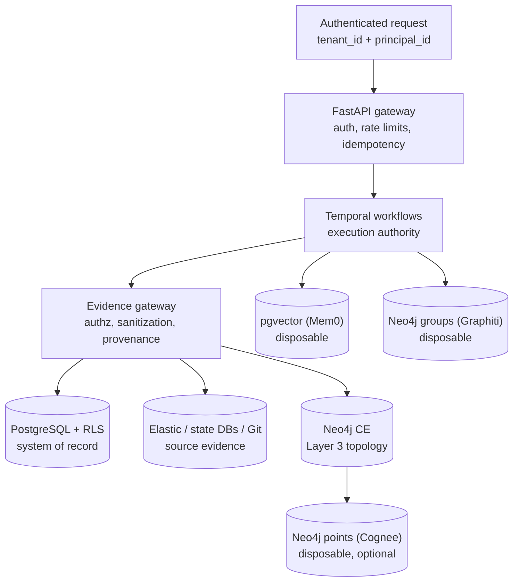

# Architecture (authoritative state vs projections)

Audience: architects and implementers. This is the system map the Part 5–8 designs link to instead of duplicating. Design docs remain authoritative for their own decisions; this file records how the pieces fit.

## Authority vs projection

The platform separates what it owns from what it indexes. PostgreSQL owns investigations, evidence, hypotheses, timelines, checkpoints, findings, knowledge envelopes, and topology audit rows. Temporal owns workflow execution and signals. Elasticsearch, state databases, and Git hold source evidence. Everything else is a disposable projection, rebuildable from an authority at any time: `rustworkx` graphs (hydrated per activity), Mem0/Graphiti indexes (rebuilt from envelopes), Cognee points (rebuilt from payloads).

## Topology bounded context (Layer 3)

Tenant-owned, revision-pinned static-code topology behind `TopologyIngestionPort` / `CodeTopologyRepository` / `DomainAttributionPort` / `RepositoryRegistryPort`. One shared Neo4j 5.26 Community database holds Layer 3 labels, Graphiti groups, and Cognee points under separate namespaces (Community allows exactly one database; Enterprise/Aura is the documented upgrade trigger). Snapshots move `PENDING → INGESTING → READY | FAILED` with `SUPERSEDED`/`COLLECTED` retention states; attribution reads only `READY` snapshots and routes through the evidence gateway into `DomainAttributionEvidence`. No caller, model, or graph record supplies tenant identity — it comes from the authenticated context (or trusted workflow context) only.

## Batch-loader swimlane (Part 7, operator side)

The loader is operator tooling, not runtime: CLI → GitHub REST (list, SHA-pin) → C `git` fetch (blobless, SHA-asserted) → identity registration → Tree-sitter parse → one `ASTTopologyPayload` per repo revision → `TopologyIngestionPort.ingest()` → manifest JSONL. It never touches Temporal or Kafka, adds no endpoints, and knows nothing about Cognee (Part 8 consumes its payload builder as a library).

## Cognee enrichment (optional, Part 8)

Dashed optional read branch off the topology ports, never on the write path: our payloads map deterministically to `TopologySymbolPoint` nodes plus exact-label CALLS/REFERENCES edges, written graph-only (no vectors, no LLM). Enrichment output is gateway-provenanced before reasoning; completion search types are unreachable by construction (`ALLOW_COMPLETION=false`).

## Contradiction model decision (B7)

Parts 1–2 diagram a Contradiction entity, but no `domain/contradiction` module was ever built and activities thread empty contradiction lists. Decision: downgraded, not implemented. Contradiction is modeled where it is already expressed — `HypothesisEvidenceAssessment` (`CONTRADICTS` + strength), `EvidenceRelationship` (`CONTRADICTS` edges), and `DomainAttributionResult.contradicting_evidence_ids`. A standalone aggregate would duplicate these without adding query power; revisit only if a consumer needs contradiction-first reads.

## Deployment topology (local)

`docker/docker-compose.yml`: `postgres:16` + pgvector (Mem0 substrate), `elasticsearch:8.12.0`, `temporalio/auto-setup:1.23`, `bitnami/kafka:3.7`, `neo4j:5.26-community`. `scripts/start-platform.sh` brings them up, waits, migrates (`alembic upgrade head`), and launches the API plus the Temporal worker. Production replaces compose networking and secrets handling; the service set is unchanged.
